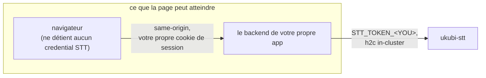
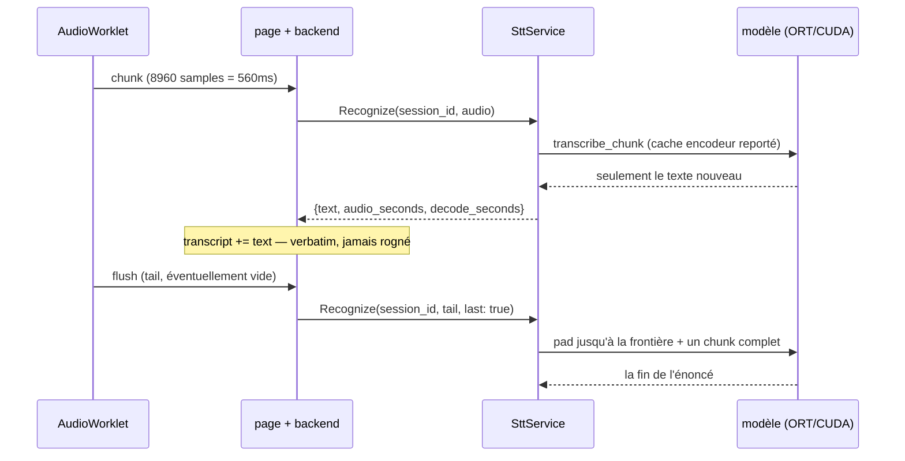

## Introduction

Le cluster [que je n'arrête pas de reconstruire](/blog/rebuilding-my-cluster-on-proxmox) a gagné un node GPU cet été : une machine avec une RTX 2070 SUPER, qui est aussi celle sur laquelle je joue. `ukubi-stt` est le premier workload qui en avait besoin.

C'est un seul binaire Rust. Il expose une unique méthode gRPC, prend de l'audio 16 kHz brut, et renvoie du texte environ 560 ms derrière la voix. Deux de mes applications l'utilisent en production : `dream-analyst`, où l'on dicte un rêve au lieu de le taper, et la console `agent-fleet`, où je dicte mes prompts aux agents plutôt que de les taper non plus. Du repo vide aux deux consumers servis : trois jours.

Le premier commit ne contient aucun service. C'est une fonction qui charge le modèle, lit la mémoire GPU avant et après, et refuse de continuer si le chiffre n'a pas bougé.

Ça ressemble à de la paranoïa tant qu'on ne sait pas ce que fait la librairie. `parakeet-rs` enregistre les execution providers d'ONNX Runtime comme ceci :

```rust
ExecutionProvider::Cuda => builder.with_execution_providers([
    ort::ep::CUDA::default().build(),
    CPUExecutionProvider::default().build().error_on_failure(),
])?
```

`error_on_failure()` est sur le provider **CPU**. Si CUDA n'arrive pas à s'initialiser, ONNX Runtime retombe sur le CPU, et le modèle se charge, transcrit et renvoie un texte entièrement correct — environ trente fois plus lentement, sans rien dans les logs qui se lise comme une erreur.

Donc à la première exécution réelle, sur du vrai matériel, l'assertion a fait son travail :

```
gpu.used before load : 1 MiB
model loaded in      : 2.4s
gpu.used after warmup: 1 MiB (delta 0 MiB)
real-time factor     : 0.081
GATE FAILED: GPU memory grew by only 0 MiB (< 128 MiB)
```

Un real-time factor de 0,081, c'est douze fois plus rapide que la parole. Les transcriptions étaient justes. `nvidia-smi` répondait depuis le conteneur, donc la RuntimeClass, le device plugin et la resource request GPU étaient tous corrects. Tous les signaux disponibles disaient que le service était sain. Il décodait sur le CPU, et je l'aurais livré comme ça.

C'est la panne contre laquelle tout ce système est construit, et ce n'est pas un crash. Les crashes sont faciles : quelque chose passe au rouge et on va voir. Là, c'est l'autre chose : l'exécution qui renvoie la bonne réponse, dans la bonne forme, avec tous les voyants au vert, par le mauvais chemin. La suite de ce billet, c'est ce qu'il faut pour attraper ça, en Rust, sur un seul GPU, et ce que ça m'a coûté d'apprendre.

## Le contrat

Le service est petit vu de l'extérieur, et c'est délibéré. Une seule méthode gRPC :

```proto
service Stt { rpc Recognize(RecognizeRequest) returns (RecognizeResponse); }
```

L'audio en entrée est du PCM s16 brut, 16 kHz, mono, little-endian. Pas de conteneur, pas d'enum d'encodage — l'appelant a déjà décidé de ce qu'il envoie, et un champ format dont la seule valeur légale est unique est un champ qui ment. Tout ce qui n'est pas en 16 kHz est rejeté plutôt que resamplé, parce qu'une requête resamplée en silence revient avec une transcription plausible et un real-time factor qui ne veut rien dire. Même raisonnement pour un nombre d'octets impair : c'est une frame tronquée, donc le framing de l'appelant est faux, et jeter la demi-frame corromprait la fin de la transcription sans rien laisser voir.

Le texte en sortie est un fragment, plus deux floats : `audio_seconds` et `decode_seconds`. Ils sont dans le wire format exprès. La panne à laquelle ce service est le plus exposé ressemble à un succès sur tous les plans sauf la vitesse — donc le chiffre qui la révèle fait partie du contrat, disponible pour chaque appelant, plutôt que d'être une ligne de log côté serveur.

Il y a une méthode et pas deux parce que c'est `session_id` qui choisit le mode. Vide : un decode offline one-shot d'un énoncé complet. Non vide : realtime, et le serveur garde un recognizer streaming pour cet id.

Je n'ai jamais déclaré de `StreamingRecognize`. Un navigateur ne peut streamer _vers le haut_ avec aucun des transports que gRPC propose — gRPC-Web donne de l'unary et du server-streaming, et le `fetch` full-duplex n'est stable dans aucun navigateur — donc l'audio arrive en requêtes discrètes quoi qu'en dise le proto. Une méthode streaming n'aurait rien apporté et aurait coûté un second chemin de code, une seconde surface d'auth et une histoire de reconnexion. Un RPC qui existe et renvoie `UNIMPLEMENTED` est un échafaudage qui se fait passer pour une interface.

L'autre forme qui n'est pas optionnelle, et à laquelle les deux consumers sont arrivés indépendamment :



Aucun navigateur ne détient jamais de credential STT. En donner un à la page donne à chaque utilisateur de cette app un credential pour mon GPU, récupérable depuis les devtools — et `stt.bnei.dev` apparaît dans les logs de Certificate Transparency quelques minutes après l'émission du certificat, donc l'endpoint n'a rien d'obscur.

C'est aussi la seule forme qui marche. Les deux consumers n'autorisent aucun CORS et leurs cookies de session sont en `SameSite=Lax`, donc un appel cross-origin depuis la page ne porte aucune identité. Il n'y avait rien à assouplir ; le proxy _est_ le design. Le bénéfice au-delà des credentials, c'est que `session_id` cesse d'être choisi par le client — on le dérive côté serveur depuis l'utilisateur authentifié, et un utilisateur ne peut plus intercaler son audio dans le recognizer d'un autre.

## Obliger le GPU à faire ses preuves

Retour à l'assertion, parce que le raisonnement derrière est celui de tout le reste.

Il y a deux pièges empilés devant une session CUDA qui marche, et le second cache le premier. La feature cargo `cuda` _active_ le provider ; elle ne le _sélectionne_ pas. `from_pretrained(path, None)` rend une session CPU quoi qu'on ait compilé. Les deux moitiés sont nécessaires : la feature dans `Cargo.toml`, et un `ExecutionConfig` explicite au chargement. Et `docs.rs` masque ça, parce qu'il build avec les features par défaut : la variante `Cuda` de l'enum de provider n'est donc jamais rendue, et le type a l'air CPU-only.

Le check est donc un delta de mémoire : lire `nvidia-smi`, charger le modèle, lancer un decode de warmup, relire, et refuser de démarrer si la différence est sous 128 MiB. Pas zéro — `nvidia-smi` rapporte l'usage de tout le GPU, et quelques MiB de bruit venus d'autre chose sur la carte ne doivent pas compter comme un succès. Un vrai chargement fait environ 3,4 GiB : le seuil a une marge énorme.

En cas d'échec, ça crashe le process. C'était une décision, pas de la paresse : un CrashLoopBackOff est bruyant et attribuable, alors qu'un pod Ready qui décode trente fois trop lentement est la panne la plus probable de ce service et la moins susceptible d'être remarquée. L'indisponibilité était déjà acceptée ici — un seul replica, un seul node — donc crasher ne coûte rien qui ait jamais été promis.

Le warmup ne sert pas qu'à l'assertion. Le premier decode paie la création paresseuse du contexte CUDA et la sélection d'algorithme cuDNN ; le faire au démarrage, c'est aussi ce qui évite au premier vrai utilisateur de la payer.

### Ce que la panne était réellement

Deux bugs indépendants, chacun suffisant à lui seul, et tous les deux dans le Dockerfile.

Les trouver a été plus dur que ça n'aurait dû, et cette partie-là se généralise. ONNX Runtime s'explique en niveau `debug` : quel provider il a enregistré, lequel il a refusé, et pourquoi. `ort` fait passer ces lignes par `tracing`, `parakeet-rs` n'installe aucun subscriber, et moi non plus. Le diagnostic a donc dû se faire en lisant le build script d'`ort-sys` au lieu de lire mes propres logs. Installer un subscriber, avec un filtre par défaut `info,ort=debug`, fait partie du correctif.

C'est ce build script qui contenait le premier bug. `ort-sys` ne compile pas ONNX Runtime : il télécharge une version prébuildée choisie dans une table en dur. Pour `x86_64-unknown-linux-gnu`, cette table a quatre lignes, et **aucune n'est en CUDA 12**. Son propre resolver le dit à voix haute :

```rust
_ => { log::debug!("couldn't determine CUDA version, guessing 13");
       "cuda13" } // "fallback" to the lowest version we ship
```

Je buildais dans une image CUDA 12.6, ce qui produisait un binaire réclamant `libcudart.so.13`. L'image de base est en CUDA 13 maintenant, et `ORT_CUDA_VERSION=13` est posé explicitement dans le builder pour que la résolution soit lue plutôt que devinée.

Le second bug : `libonnxruntime_providers_cuda.so` n'était tout simplement pas dans l'image. ONNX Runtime est linké statiquement — `ldd` sur le binaire ne montre aucun `libonnxruntime` — mais le provider CUDA ne fait pas partie de cette archive. C'est un shared object séparé de 79 Mo qu'ORT `dlopen` _à côté du module appelant_, ce qui, pour un link statique, veut dire à côté de l'exécutable. Je n'avais copié que le binaire depuis le builder.

Le détail qui aggrave est le bon. `ort-sys` ne copie pas ces fichiers sous Unix, il les **symlinke** dans `target/release/` depuis un répertoire de cache. Donc le correctif évident — `COPY --from=build target/release/*.so` — pose un symlink cassé dans l'image et échoue _à l'identique_, avec le même fallback CPU silencieux. D'où `cp -L`, et les noms de fichiers écrits explicitement, pour qu'un renommage upstream casse le build au lieu de dégrader le service en silence.

Avant tout ça, trois builds sont morts d'affilée, chacun parce que j'avais corrigé le précédent : un `libssl-dev` manquant, puis un mismatch de glibc en voulant le corriger, puis PEP 668 qui refuse `pip3 install` sur la base plus récente. La seule leçon transférable est la première : `cargo clippy` était vert en CI depuis le début, parce que l'image de runner GitHub embarque `libssl-dev`. Un check de compilation hébergé ne peut pas vérifier l'environnement de build de l'image. Il ne vérifie que le code.

Les deux bugs de provider corrigés :

```
gpu.used before load : 4 MiB
model loaded in      : 6.2s
gpu.used after warmup: 1843 MiB (delta 1839 MiB)
real-time factor     : 0.041
GATE PASSED: CUDA engaged (1839 MiB resident), RTF 0.041
```

C'est seulement là que j'ai écrit le proto. Le moteur était la seule hypothèse non vérifiée du design, et le wire format streaming est précisément l'artefact qu'un changement de moteur invalide.

## Ce que Rust a réellement apporté

Je n'ai pas choisi Rust pour la vitesse. C'est le GPU qui fait l'arithmétique ; le langage hôte ne fait guère que déplacer des buffers. Je l'ai choisi pour deux choses, et l'une des deux m'a surpris.

**Une réponse à la compilation à une question de concurrence.** Le design portait un risque ouvert et documenté : le serveur gRPC veut tenir le modèle derrière un mutex et le passer à `spawn_blocking`, ce qui exige que `ParakeetTDT` soit `Send`. S'il ne l'était pas, le modèle aurait eu besoin d'un thread dédié et d'un channel — une autre architecture, découverte tard. Le README l'a porté comme inconnue ouverte pendant deux jours. C'est maintenant ceci :

```rust
const _: () = {
    const fn assert_send<T: Send>() {}
    assert_send::<ParakeetTDT>();
    assert_send::<Nemotron>();
    assert_send::<NemotronHandle>();
};
```

C'est la partie que je défendrais le plus fort. Une question de design ouverte est devenue une erreur de build le jour où elle cesse d'être vraie, en cinq lignes, sans coût à l'exécution et sans test à maintenir. En Python, ç'aurait été une race qui apparaît sous charge ; en Go, un commentaire.

**Le matching exhaustif comme outil de design.** Il y a trois modèles maintenant — batch, streaming, et un persan — et le routage entre eux est un `enum`, pas un trait. Les deux moteurs ne tiennent pas honnêtement derrière une seule interface : état différent, cycle de vie différent, device différent. Un enum le dit, et un `match` exhaustif fait d'un quatrième modèle une erreur de compilation _à chaque point de décision_, plutôt qu'une branche silencieusement manquante dans l'un d'eux.

**L'honnêteté sur les dépendances, qui est une discipline propre à Rust.** `ort` est pinné en `=2.0.0-rc.13`, pas en caret. Une plage caret sur une release candidate pré-1.0, c'est la façon dont un build glisse en silence vers un autre ABI ONNX Runtime — et cet ABI décide de l'image de base, donc ce n'est pas à moi de le laisser flotter. Par ailleurs, `Cargo.toml` nomme la feature `cuda` pour `ort` alors qu'elle est déjà résolue par l'unification de features de `parakeet-rs`. Disponibilité transitive n'est pas importabilité, et une version transitive n'est pas une promesse. Déclarer ce qu'on utilise vraiment transforme une future casse mystérieuse en casse ordinaire.

Là où ça a fait mal, honnêtement :

- **Un type d'erreur n'a pas pu être wrappé.** `ort::Error<SessionBuilder>` ramène le builder avec lui et n'est pas `Send + Sync`, donc le `.context` d'`anyhow` n'en veut pas. Ce message est attaché à la main, avec un commentaire qui dit pourquoi, parce que ça ressemble à de la négligence sinon.
- **L'empoisonnement de mutex est un vrai risque, avec un vrai coût.** Un panic en tenant le lock du modèle l'empoisonnerait, et toutes les requêtes suivantes échoueraient avec le même panic, sur un pod toujours Ready. Les locks empoisonnés sont récupérés plutôt que propagés — une mauvaise requête ne doit pas briquer le service.
- **Clippy a eu tort une fois, et j'ai dû faire l'arithmétique pour le prouver.** Il voulait boxer la grande variante d'enum. Huit sessions à environ 320 octets de rab, ça fait 2,5 Ko pour tout le process, contre une allocation et un déréférencement de pointeur à chaque decode. L'`allow` porte le calcul.

Et ce qui n'a pas fait mal du tout : l'async. Chaque appel d'inférence est synchrone et poussé dans `spawn_blocking`, donc pas d'async-in-trait nulle part, pas de `Pin`, pas de casse-tête de lifetime dans une fonction poll. La concurrence intéressante n'est pas dans les futures ; elle est dans ce qui partage la carte.

## Concevoir pour exactement un GPU

Il y a une carte, elle n'est pas à moi seul, et elle disparaît quand je reboote pour jouer. L'essentiel du design du serveur découle de là.

**Les decodes offline rejettent au lieu de mettre en queue.** Le chemin batch tient un `Semaphore(1)`, et un second appelant concurrent reçoit `RESOURCE_EXHAUSTED` immédiatement. Il n'y a pas de queue, délibérément : une queue devant un seul GPU convertit la surcharge en latence non bornée, et un appelant qui attend quatre-vingt-dix secondes une transcription aurait préféré s'entendre dire non en dix millisecondes. `RESOURCE_EXHAUSTED` veut dire « réessaie plus tard », et les deux consumers le mappent exactement là-dessus.

**Le streaming est plafonné à la place, parce que c'est une autre ressource.** Une session streaming occupe le GPU 20 à 50 ms sur chaque chunk de 560 ms, donc huit sessions concurrentes, c'est une part plausible de la carte, pas huit decodes simultanés. C'est un seul cap et une seule session map, pas deux — la ressource protégée est une machine, et deux caps séparés laisseraient seize sessions la surcharger pendant que chaque map a l'air saine de son côté.

À dire clairement : huit est une estimation. C'est à peu près la moitié du duty cycle de la carte, en gardant de la place pour le chemin batch, et le bon chiffre est celui que la carte tient réellement une fois de vrais consumers dessus. Personne ne l'a mesuré.

**Le modèle streaming se charge paresseusement, à la première utilisation.** Les deux modèles résidents font 6880 MiB sur une carte de 8192 MiB. Ça tient — mais c'était une _estimation_ au moment de la décision, et charger au démarrage transforme un ajustement serré en panne du service batch qui, lui, marchait, parce que la stratégie de déploiement est `Recreate` et que l'ancien pod est déjà parti. Charger à la première requête transforme la même panne en un seul RPC échoué. L'assertion CUDA n'est pas sautée pour autant, seulement différée : deux modèles, ça fait deux surfaces de fallback CPU silencieux, et n'en couvrir qu'une diviserait discrètement par deux ce que le gate garantit.

**Les sessions sont balayées sur inactivité, pas seulement à la fermeture.** Les navigateurs ferment les onglets sans dire au revoir ; c'est le cas normal, pas le cas limite. Tout ce qui n'a pas été touché depuis 120 secondes est récupéré.

## Du temps réel sans sliding window

Tout le monde suppose que la speech-to-text temps réel veut dire une sliding window, un détecteur d'activité vocale, et des hypothèses partielles révisées à mesure que l'audio arrive. C'est ce qu'on construit quand le modèle veut trente secondes d'audio d'un coup.

Ici, rien de tout ça. Le modèle streaming est _cache-aware_ : l'encodeur porte son propre état d'un chunk au suivant, donc chaque chunk est décodé une fois, en contexte, et le modèle n'émet que le texte nouveau.



Trois choses découlent de cette seule propriété, et les trois sont porteuses.

**Il n'y a pas de champ `is_final`.** Le modèle ne révise jamais ce qu'il a déjà émis, donc le client concatène et n'a jamais à remplacer une fin. Un moteur qui réviserait aurait besoin de ce champ, plus du remplacement de fin, plus d'un client très différent.

**L'ordre est un contrat, pas un détail d'implémentation.** Le cache fait qu'un chunk réordonné ou rejoué corrompt tout ce qui suit. Le module navigateur sérialise chaque envoi dans une seule chaîne de promesses — exactement une requête en vol, toujours — et en cas d'erreur il abandonne le stream au lieu de réessayer. Un consumer qui « optimiserait » ça en envois parallèles corrompt toutes les transcriptions après le premier réordonnancement, donc c'est documenté comme un contrat dans le module qui l'implémente.

**La taille du chunk n'est pas à moi de la choisir.** 8960 samples, c'est 560 ms, la granularité propre de l'encodeur. Des chunks plus petits ajoutent des requêtes sans baisser la latence ; des plus grands ajoutent de la latence pour rien.

Le texte arrive environ 560 ms derrière la parole : le chunk, plus 20 à 50 ms de GPU, plus environ une milliseconde de réseau in-cluster. C'est un budget de design lu sur ces trois chiffres, pas une étude de percentiles — il n'y a pas d'endpoint de métriques ici, et je n'ai agrégé les timings par requête dans rien du tout.

À la place d'un détecteur d'activité vocale, la fin d'un énoncé est traitée arithmétiquement. Sur `last`, le serveur pad avec du silence jusqu'à la prochaine frontière de chunk, puis ajoute un chunk complet de plus, ce qui pousse la fenêtre de right-context du modèle au-delà de la parole réelle. Le silence se décode en rien : ça coûte un decode de plus, environ 25 ms, et ça ne produit aucun texte parasite.

## Le persan, et la ligne qui efface la transcription

Le modèle multilingue couvre vingt-cinq langues, et le persan n'en fait pas partie. Donnez-lui du persan et il crache du `<unk>` en rafale. Le service les compte et warn plutôt que de les filtrer, parce que filtrer transforme discrètement une panne visible en une sortie courte et plausible — la même maladie que le fallback CPU, dans un autre organe.

Corriger ça voulait dire un troisième modèle, un export FastConformer CTC cache-aware. `parakeet-rs` n'a pas de type CTC, il est donc piloté directement par `ort`. Ce qui voulait dire écrire le front end de features à la main, parce que `parakeet-rs` calcule le log-mel en interne et n'en expose rien. Un filterbank streaming compatible NeMo, en Rust, avec toutes les occasions de se tromper en silence que ça implique.

Les paramètres ne sont pas devinés. Ils viennent du `model_config.yaml` à l'intérieur du `.nemo` source, et une de ses lignes décide de tout :

```text
normalize: NA
```

`NA` veut dire **aucune normalisation par feature**. Le défaut habituel de NeMo est le CMVN par feature, et la pipeline de `parakeet-rs` l'applique — donc la chose évidente à copier est la mauvaise. Mesuré contre le vrai modèle, appliquer le CMVN fait passer le character error rate de 0,033 à **1,000, avec une sortie vide** : des features normalisées atterrissent dans une plage que l'encodeur n'a jamais vue à l'entraînement, et le decode CTC s'effondre en tout-blank.

Deux choses que j'_attendais_ comme des pièges n'en sont mesurablement pas. Placer la fenêtre de 400 taps à l'offset 0 au lieu de la centrer dans la FFT à 512 points donne 0,042. Retirer complètement la preemphasis donne 0,056. Les deux sont implémentées correctement quand même, parce que coller à NeMo est gratuit — mais ni l'une ni l'autre n'est porteuse, et un futur lecteur ne doit pas les traiter comme si elles l'étaient. Seule la normalisation compte, et elle est maintenant tenue par un test unitaire qui vérifie que la moyenne globale reste sous -2,0.

### Un test qui n'aurait rien testé

Le filterbank est vérifié contre des golden mel frames, et leur provenance est la partie qui mérite d'être copiée.

Elles n'ont **pas** été générées depuis l'implémentation Rust. Une fixture dérivée de la même description que le code prouve seulement que les deux sont d'accord. À la place, il y a une implémentation numpy indépendante, et elle a été validée de bout en bout _d'abord_ — en décodant six vrais clips persans à travers le vrai modèle ONNX, avec un character error rate moyen de 0,022, cinq des six exacts au caractère près, ponctuation comprise. C'est seulement après qu'elle a démontrablement marché que ses frames ont été gelées en fixture. Régénérez-les depuis le fichier Rust et vous avez supprimé le test.

La fixture utilise du bruit pseudo-aléatoire déterministe plutôt qu'un balayage sinusoïdal, et ça s'est appris en voyant la fixture échouer : un sweep laisse les bins mel hauts ne contenir que de la fuite spectrale, où f32 et f64 divergent jusqu'à 0,24 unité de log. Les comparer, c'est tester le bruit des flottants, pas la pipeline.

Deux bugs de frontière en sont sortis, silencieux tous les deux, attrapés par des checks et non par des utilisateurs. Le report entre chunks doit être de `N_FFT - HOP = 352` samples, pas l'intuitif `WIN_LEN - HOP = 240` : une frame consomme 512 samples même si seulement 400 sont pondérés par la fenêtre, donc 240 jette de l'audio en silence. Et le pad central était construit depuis le premier chunk plutôt que depuis l'énoncé — le reflect padding a besoin de n+1 samples pour se refléter, donc un premier chunk de moins de 256 samples dégradait en remplissage par zéros et corrompait les deux premières frames jusqu'à 3,57 unités de log. Celui-là a été trouvé en review, n'est atteignable depuis aucun des deux consumers aujourd'hui, et le devient dès que le chemin offline lui enverra des tranches à la taille du moteur. Le test de régression tourne maintenant sur douze tailles de chunk, de 1 sample à 99 999.

Le gate de ce modèle passe sur le vrai node avec un character error rate de 0,000 sur un clip de quatre secondes, 44,8 ms par step de modèle, aucun `<unk>`. Un step, c'est 1,12 seconde d'audio, donc environ 4 % de duty par stream — ce qui a répondu à la question ouverte de savoir si le persan avait besoin du GPU. Non. Il tourne sur le provider CPU d'ORT, ce qui supprime d'un coup le problème de VRAM du troisième modèle, la question de l'éviction, et une troisième surface de fallback CUDA silencieux.

## Cinq bugs, une seule forme

Voici le motif que je n'ai pas vu avant qu'il se soit produit cinq fois. Chacun s'est présenté comme _le modèle se trompe un peu_, et aucun n'était le modèle.

Les deux qui valent d'être racontés en entier :

**L'énoncé a perdu sa fin.** Mesuré en direct, un énoncé de 9,23 secondes est revenu en `"...on an NVIDIA G"`, perdant ses 270 dernières ms. L'encodeur n'émet que sur un chunk _complet_, donc le dernier chunk partiel était bufferisé et jamais décodé. Côté client, il n'y a aucun symptôme au-delà d'une transcription un peu courte — ce qui se lit comme un modèle qui s'éteint, pas comme de l'arithmétique. C'est à ça que sert le padding de fin décrit plus haut. ([#8](https://github.com/MohammadBnei/ukubi-stt/pull/8))

**Le mot coupé en deux.** La dictée rendait « bonjour » en « bon jour » dès qu'un mot était à cheval sur une frontière de chunk, et le serveur avait raison depuis le début. SentencePiece marque un morceau _initial_ de mot, et le détokeniseur rend cette marque par une espace en tête. **L'espace en tête est la frontière de mot.** Un chunk qui continue un mot arrive donc sans — correctement. La page de référence faisait ça :

```js
if (r.text.trim()) transcript += ((transcript && ' ') || '') + r.text.trim();
```

ce qui supprime le vrai signal et en fabrique un faux entre chaque paire de chunks. Trois choses devaient sauter, pas deux : le garde `if` est la troisième, parce qu'un chunk dont tout le texte est un séparateur doit survivre, sinon il colle ensemble les mots de part et d'autre. Le protocole complet, c'est `transcript += r.text`, sans garde.

Deux détails le rendent pire qu'un bug ordinaire. Le consumer qui n'a jamais eu le problème est celui qui avait toujours concaténé verbatim — donc l'implémentation cassée était la _référence_, c'est-à-dire l'artefact que les gens copient. Et le correctif tentant était un modèle de correction pour réparer la sortie, que j'ai rejeté : il paie de la latence sur un chemin à 560 ms pour corriger un bug qui était gratuit à corriger à la source. ([#24](https://github.com/MohammadBnei/ukubi-stt/pull/24))

Les trois autres, brièvement, parce que le motif est le sujet, pas le défilé :

- **Les chunks faisaient 768 ms, pas 560.** Le client envoyait tout son buffer, qui franchissait le seuil à 12288 samples — pas un multiple du chunk de l'encodeur, donc le serveur gardait lui aussi un reste jusqu'à la requête suivante. Environ 1,4 seconde, et irrégulier, contre 650 ms bien lisses. Ça avait l'air de « le streaming est juste plus lent qu'il ne devrait », et ça a été trouvé en mesurant, pas en lisant. ([#9](https://github.com/MohammadBnei/ukubi-stt/pull/9))
- **Un Stop sur trente-cinq perdait sa fin**, plus tous les Stop pressés avant d'avoir parlé. Le flush de fin peut légitimement porter zéro sample, et le serveur rejetait l'audio vide avant de regarder `last` — donc la fermeture échouait, le recognizer fuyait jusqu'au balayage d'inactivité, et la fin n'était jamais flushée. Un sur trente-cinq, c'est exactement la fréquence qu'on balaie d'un « le modèle a sauté un mot ». Un dernier chunk vide est une fermeture valide. ([#9](https://github.com/MohammadBnei/ukubi-stt/pull/9))
- **Les premiers mots de chaque phrase manquaient.** Celui-là est arrivé par un retour utilisateur, pas par l'instrumentation. Cliquer sur Record allait chercher le module, construisait un `AudioContext`, compilait un worklet et _seulement ensuite_ ouvrait le micro ; le début de la phrase tombait dans ce trou. Le piège est dans le correctif évident : un contexte construit hors d'un geste utilisateur démarre **suspendu**, et un contexte suspendu ne fait tourner aucun worklet — donc un prewarm naïf a l'air vivant et enregistre du silence pur, ce qui est strictement pire, parce que rien n'émet d'erreur. ([#15](https://github.com/MohammadBnei/ukubi-stt/pull/15))

Un sixième appartient à la même famille, même si ce n'est pas un bug de chunk. La page de test navigateur a été complètement inerte pendant quatre releases consécutives : un `import` a été ajouté sans supprimer la copie locale, octet pour octet identique, qu'il dupliquait — et une déclaration en double est une erreur de _parse_, donc le module est mort avant d'exécuter une seule ligne. Ça a survécu parce que le seul check contre cette page était que `/` renvoie 200, ce qu'elle a fait tout du long. Le HTML était servi parfaitement ; le JavaScript à l'intérieur n'a jamais parsé. Il y a un check de syntaxe en CI maintenant, parce que le fichier est `include_str!` dans le binaire et qu'une erreur de syntaxe compile et part en prod sinon. ([#23](https://github.com/MohammadBnei/ukubi-stt/pull/23))

Ça fait six, en comptant l'erreur de parsing — et chacun était invisible pour
le check censé le couvrir.

## Ce qui a été supprimé

La suppression est la partie dont je suis le plus content, donc elle a droit à sa propre liste.

`StreamingRecognize`, jamais écrit. `offset_ms`, conçu, doté d'un numéro de champ, puis retiré quand l'état de session côté serveur a rendu le recollage stateless inutile — et le numéro est brûlé plutôt que réutilisé, pour que le champ 4 d'un vieux client ne puisse jamais être réinterprété en silence. `is_final`, délibérément jamais ajouté. Le modèle de correction, rejeté.

L'image de build était `nvidia/cuda:*-cudnn-devel`, 8,23 Go, choisie sur une hypothèse que j'avais notée et jamais vérifiée : que la feature CUDA d'`ort` voudrait peut-être des headers au build. Non — rien dans la compilation ne touche CUDA. C'est un simple `ubuntu:24.04` maintenant, et j'ai traîné ces 8 Go pendant toute la saga de debug du Gate 0 avant de tester l'hypothèse.

Python est parti avec, avec le CLI HuggingFace et environ 150 Mo d'interpréteur, remplacés par quatre appels `curl`. `ScriptProcessorNode` est parti aussi, emportant le gain node muet dont il a besoin pour rester en vie et toutes les lignes d'arithmétique de buffer sur le main thread — exactement là où deux des bugs de latence avaient vécu.

Et une librairie a été rejetée sur inspection plutôt qu'à l'usage : le build script de `sherpa-onnx` ne contient aucune occurrence de `cuda` ni de `gpu` et ne télécharge jamais que le tarball CPU, donc lui demander le provider CUDA linke un runtime CPU-only et décode sur CPU. Le même piège que celui qui m'a coûté une journée, sans échappatoire.

## Ce qui ne va toujours pas

Le registre honnête, écrit en entier dans le repo plutôt que découvert plus tard par quelqu'un d'autre.

Le cap de sessions est une estimation, pas une mesure. Faire tourner le token d'un consumer redémarre le pod, et comme les sessions sont en mémoire dans un replica unique, chaque dictée en cours perd son cache encodeur et reprend au milieu d'une phrase, sans erreur visible pour l'utilisateur — donc ajouter un consumer est une opération de maintenance, pas une routine. Le `session_id` choisi par le client reste un risque que le wire format autorise ; des tokens par client et des ids dérivés côté serveur dans les consumers l'atténuent, mais il est accepté, pas corrigé. `cargo audit` n'est jamais clean par construction, parce que ce service dépend d'une release candidate volontairement : c'est donc consultatif — un check rouge en permanence apprend aux gens à l'ignorer. La taille de PVC déclarée est une fiction à deux titres : le claim bound est plus petit, et la storage class ne peut pas l'étendre.

La précision du streaming est aussi visiblement en dessous de celle du modèle offline. Il rend « Yukie cluster » en « UQB cluster ». C'est très bien pour dicter dans un champ qu'on va éditer juste après, et pas bien du tout pour quoi que ce soit qui agirait sur la transcription sans relecture — c'est pourquoi les deux consumers mettent le texte dans un champ éditable et qu'aucun n'agit dessus directement.

Et le service est en replica unique, épinglé à un node, sans HA et sans fallback CPU, sur une machine qui reboote quand j'ai envie de jouer. `UNAVAILABLE` est une réponse normale, pas un incident. Les deux consumers la loggent, désactivent la fonctionnalité et continuent — parce qu'un service qui refuse de démarrer sans speech-to-text échange un produit qui marche contre un déploiement cassé.

## Ce que je garderais

Chaque décision structurelle ici s'est révélée être un instrument différent pointé sur la même panne. L'assertion mémoire au démarrage. `audio_seconds` et `decode_seconds` dans le wire format au lieu d'une ligne de log. Crasher au boot plutôt que dégrader. Rejeter le mauvais sample rate au lieu de le resampler. Rejeter un nombre d'octets impair au lieu de jeter la demi-frame. `assert_send` en const block au lieu d'une phrase dans un README. Une table d'ablation de character error rate au lieu d'un paragraphe expliquant pourquoi la normalisation est la bonne.

Aucun ne rattrape un crash. Les crashes s'annoncent tout seuls. Ils rattrapent l'autre chose — l'exécution qui renvoie la bonne réponse, dans la bonne forme, avec tous les voyants au vert, par le mauvais chemin. Douze fois plus rapide que le temps réel, entièrement sur le CPU, et parfaitement contente d'elle.

_(Intendance, puisque c'est visible dans le `git log` de toute façon : ce repo a été construit avec des agents de [la flotte](/blog/running-a-fleet-of-claude-agents-on-my-cluster), et chaque commit est co-signé en conséquence. Les gates, les mesures et les échecs sont réels ; la densité des commentaires est la leur.)_
