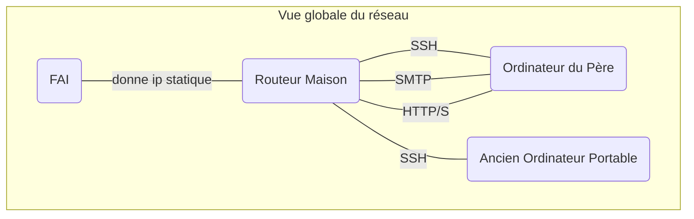
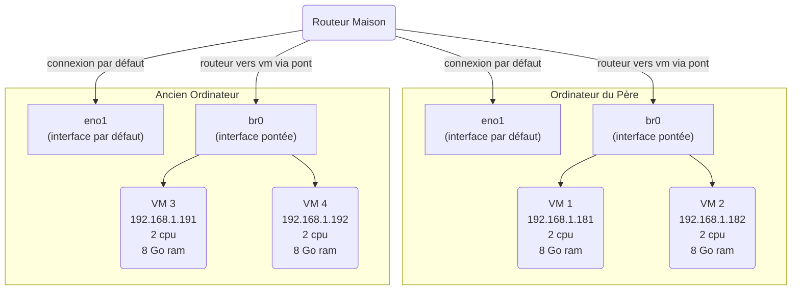
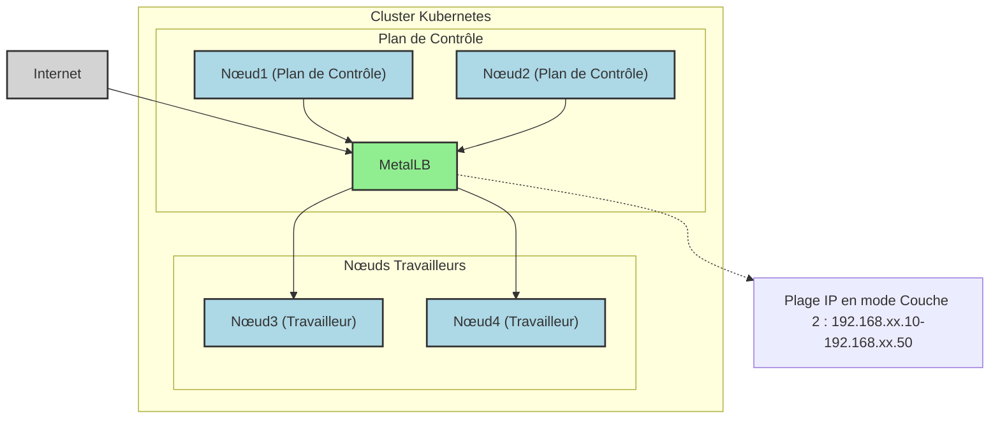
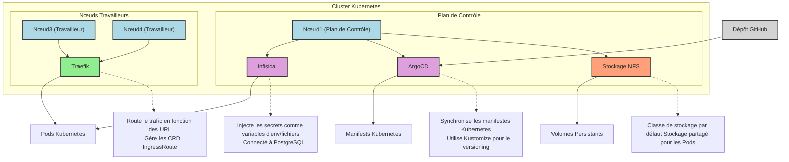

Un agent IA a traduit le texte depuis l'anglais.

## Introduction

Aussi loin que je me souvienne, j'ai toujours été fasciné par les systèmes – comment ils fonctionnent, comment ils tombent en panne, et comment les améliorer. En tant que développeur, j'ai toujours cherché des moyens de rationaliser mes flux de travail et de prendre le contrôle de mes outils. C'est pourquoi j'ai décidé de construire mon propre cluster Kubernetes à la maison. Poussé par ma passion pour les **systèmes** et le **code**, je voulais créer un cloud personnel. Je crois également que le contrôle individuel des infrastructures numériques mène à un monde plus équilibré.
Tout configurer moi-même – de l'installation du système d'exploitation sur des machines vierges au déploiement d'applications avec GitOps – a été une expérience d'apprentissage incroyable. Que vous soyez un expert technique ou un curieux, vous pouvez suivre mon processus de pensée et acquérir une compréhension pratique de la façon de mettre en place un cluster Kubernetes.

## Matériel

Mon père m'a donné son vieil ordinateur, avec un i5, 32 Go de RAM. J'ai ajouté mon ancien ordinateur portable avec un i7, 16 Go de RAM. Sur les deux machines, j'ai installé :

- **Debian 12**
- Mon **shell zsh** (oh-my-zsh, quelques plugins, powerlevel10k)
- **Tmux** pour la gestion de session
- **SSH**. J'ai lu quelque part que beaucoup de robots scannent les ports ouverts pour des attaques par force brute SSH, alors j'ai :
  - Changé le port par défaut
  - Activé l'authentification par clé privée uniquement
  - Ajouté le X11 forwarding pour le support GUI (principalement pour les machines virtuelles et les sauvegardes Timeshift).


Avoir une configuration confortable est crucial pour moi, cela réduit la complexité inutile lors du dépannage. Maintenant que nous pouvons facilement nous connecter et manipuler nos serveurs, parlons un peu du réseau.

### Réseau

Chez moi, nous avons un routeur basique avec un FAI commercial. J'ai demandé à ce que notre **IP soit statique**, et j'ai créé des règles de redirection de port pour SSH (sur mes ports personnalisés), HTTP/S, et certains ports de messagerie (j'ai demandé à notre FAI d'ouvrir le port 25).
À ce stade, j'aurais dû passer plus de temps à configurer un **DNS privé** pour identifier facilement mes machines, à mettre en place une **supervision du trafic réseau** et une **autorité de certification privée**. Vous devriez le faire si vous prévoyez de créer votre propre infrastructure comme moi !
Le réseau étant mon point faible, j'ai imaginé une configuration simple pour mon cluster : le serveur de mon père agit comme point d'entrée, tout le trafic entrant vers le cluster passera par le serveur i5 (plus de détails plus loin).



## Machines Virtuelles

Une fois ma configuration initiale terminée, j'étais prêt pour mon prochain défi : les **machines virtuelles**. Exécuter le cluster directement sur le matériel nu n'était pas idéal pour moi - je voulais la flexibilité de tester plusieurs configurations et de détruire ou recréer facilement des configurations. Voici comment j'ai abordé la chose :

### Configuration de la VM

- **2 VM par machine**
- Chacune avec **2 CPU** et **8 Go de RAM**
- **Adresse IP pontée**. Le pont a été très utile pour que mes VMs aient leurs propres adresses IP attribuées par mon routeur. De cette façon, elles apparaissent comme des machines distinctes sur mon réseau et peuvent facilement communiquer entre elles.

[lien markdown brut de la configuration du pont](https://raw.githubusercontent.com/MohammadBnei/shell-config/refs/heads/main/netplan.md?token=GHSAT0AAAAAAC72IR522GB534DWJMAA3TFE2ETJ76A)

### Outils de virtualisation

- **KVM (Kernel-based Virtual Machine)**. Contourne l'hyperviseur et exécute la VM directement sur le noyau hôte. Non compatible avec tous les CPU.
- **Virsh (Libvirt)**. Gère la lourde tâche de la gestion de la virtualisation.

### Infrastructure As Code

En tant que bon développeur, j'avais absolument besoin d'**IaC** (Infrastructure as Code) pour l'automatisation, le versioning et les mises à jour itératives. J'ai opté pour **Vagrant** plutôt que **Terraform** principalement en raison de sa syntaxe Ruby plus propre, et aussi parce qu'il est axé sur les VM (tandis que terraform excelle dans l'infrastructure cloud). Les deux sont des outils HashiCorp. Voici le Vagrantfile pour mes 2 premières VM :

```ruby
Vagrant.require_version '>= 2.0.4'

$num_node = 2

Vagrant.configure("2") do |config|
  config.vm.box = "generic/debian12"

  config.vm.provision "shell", inline: <<-SHELL
    sudo apt-get update
    sudo apt-get install -y nfs-common
  SHELL

  (1..$num_node).each do |i|
    config.vm.define "k8s-#{i}" do |node|
      node.vm.provider "libvirt" do |v|
        v.memory = 8192
        v.cpus = 2
      end
      node.vm.network "public_network",
        :ip => "192.168.1.18#{i}",
        :dev => "br0",
        :mode => "bridge",
        :type => "bridge",
        :mac => "5A74CA28570#{i}"

      node.vm.network "private_network", ip: "192.168.10.5#{i}"
    end
  end
end
```

Initialement, je voulais utiliser _flannel_ comme système d'exploitation. Il est spécialisé pour les conteneurs. Mais je n'ai pas réussi à le faire fonctionner ! Je suis donc revenu à ce que je connais, **Debian**.
Faire fonctionner **Libvirt** et **vagrant** ensemble a nécessité une version spécifique de vagrant, et une configuration de variable d'environnement. J'ai laissé la sécurité par défaut de vagrant (pour les connexions SSH) qui utilise une clé privée, et j'ai configuré via Libvirt les VM pour un démarrage automatique.



## Installation du Cluster

### Kubespray

Maintenant que mon matériel, mon réseau et mes VM sont prêts, passons à l'installation effective du cluster Kubernetes.
Au départ, j'ai utilisé un script [**Kubeadm**](https://kubernetes.io/docs/setup/production-environment/tools/kubeadm/high-availability/) de base injecté dans ma VM nœud de contrôle pour configurer le cluster. Mais c'était fastidieux, car je devais ensuite ajouter manuellement les nœuds et installer les outils requis (CNI, CRI, LB...). En tombant sur [**Kubespray**](https://kubespray.io/), j'ai trouvé la solution parfaite. Open source, basé sur Ansible, entièrement configurable. Le faire fonctionner a été un plaisir grâce à la documentation claire et au processus de configuration simple.
[Kubespray](https://kubespray.io/) facilite l'installation, la gestion et la mise à niveau des clusters. Nous pouvons ajouter/supprimer des nœuds ou des applications (argoCD, krew…), et configurer des parties vitales de notre cluster (CNI, provisioner, load balancer…). Pour mes besoins, j'ai utilisé :

- [Cert-manager](https://cert-manager.io/) avec des serveurs DNS de secours, car j'avais des problèmes de noms DNS non résolus sur mes services
- [Cilium](https://cilium.io/) comme mon plugin réseau (CNI). Je pourrais tester ePBF un jour, cela semble être une technologie vraiment cool
- [MetalLB](https://metallb.io/) comme mon load balancer bare metal. J'ai dû étiqueter mes nœuds de serveur 1 pour n'activer metalLB que sur eux, afin d'avoir un point d'entrée unique
- 2 plans de contrôle, 3 réplicas etcd

Configuration des hôtes (et du nœud de contrôle) :

```yaml
all:
  hosts:
    node1:
      ip: 192.168.1.xxx
    node2:
      ip: 192.168.1.xxx
    node4:
      ip: 192.168.1.xxx
    node5:
      ip: 192.168.1.xxx
  children:
    kube_control_plane:
      hosts:
        node1:
        node2:
    kube_node:
      hosts:
        node1:
        node2:
        node4:
        node5:
    etcd:
      hosts:
        node1:
        node2:
        node4:
    k8s_cluster:
      children:
        kube_control_plane:
        kube_node:
```

Configuration de MetalLB :

```yaml
# Déploiement MetalLB
metallb_enabled: true
metallb_speaker_enabled: '{{ metallb_enabled }}'
metallb_namespace: 'metallb-system'
metallb_version: 0.13.9
metallb_protocol: 'layer2'
metallb_config:
  speaker:
    nodeselector:
      kubernetes.io/os: 'linux'
      metallb-speaker: 'enabled' # pour sélectionner uniquement les nœuds du serveur 1
    tolerations:
      - key: 'node-role.kubernetes.io/control-plane'
        operator: 'Equal'
        value: ''
        effect: 'NoSchedule'
  controller:
    nodeselector:
      kubernetes.io/os: 'linux'
      metallb-controller: 'enabled' # pour sélectionner uniquement les nœuds du serveur 1
    tolerations:
      - key: 'node-role.kubernetes.io/control-plane'
        operator: 'Equal'
        value: ''
        effect: 'NoSchedule'
  address_pools:
    primary:
      ip_range:
        - 192.168.xx.10-192.168.xx.50 # pas besoin de plus de शायद 20 ips
      auto_assign: true
  layer2:
    - primary
```



Ensuite, tout ce que j'avais à faire était d'exécuter le script ansible et après un certain temps, mon **cluster Kubernetes était opérationnel** ! Une fois le cluster en marche, je me suis concentré sur l'installation des _outils essentiels_ pour le rendre accessible, gérable et convivial.

### Outils Requis

Maintenant, je dois installer les outils nécessaires pour gérer mes applications sur le cluster nouvellement créé.
D'abord, le **reverse proxy** : où et comment router le trafic utilisateur en fonction des **urls**, de l'**hôte** et des règles. J'ai choisi [**Traefik**](https://traefik.io/) car j'avais déjà de l'expérience avec, et pour ses capacités basiques mais puissantes. L'installation avec helm a été un jeu d'enfant. Comme j'ai plusieurs noms de domaine, je dois gérer mes certificats séparément. Pour l'instant, j'utilise les CRD **IngressRoute**, mais je prévois de passer à **GatewayAPI** dans les prochains mois.
Ensuite, j'ai besoin d'un stockage prêt pour le volume de mes pods. J'ai créé un **NFS folder** sur mon serveur1, et j'ai utilisé [Kubernetes nfs provisioner](https://github.com/kubernetes-sigs/nfs-subdir-external-provisioner) pour configurer ma **default storage class**. Par défaut, toute Persistent Volume (Claim) utilisera ce stockage. NFS était idéal en raison des multiples machines exécutant mon cluster, elles devaient trouver un moyen de communiquer sur le même espace de stockage.
Pour les **secrets**, j'ai utilisé [**Infisical**](https://infisical.com/). Il possède un opérateur Kubernetes qui injecte les secrets sous forme de **variables d'environnement** ou de **fichiers** pour une sécurité maximale si nécessaire. Il est connecté à mon instance Postgres (plus de détails plus loin), et n'a posé aucun défi significatif.
Enfin, **GitOps** est un impératif. Avec [**ArgoCD**](https://argo-cd.readthedocs.io/en/latest/) en place, j'ai le **CD** de mes pipelines qui **déploie automatiquement** les ressources sur mon cluster et les **garde synchronisées** avec mes dépôts Github. L'ajout de la clé secrète pour accéder au dépôt privé, la configuration correcte de kustomize pour gérer le versioning étaient quelques-uns des défis. J'ai eu des problèmes de synchronisation avec les secrets Infisical à cause du polling effectué par le secret watcher, ce qui a fait croire à argoCD que les ressources n'étaient jamais complètement synchronisées. J'ai résolu cela en gérant les secrets manuellement.



Il y a eu beaucoup d'essais et d'erreurs pour parvenir à cette configuration stable. En tant que développeur, je me suis concentré sur le **côté application** et je voulais développer mes API avec facilité. J'ai créé un [dépôt de modèle github](https://github.com/MohammadBnei/home-server-go-api) pour les API golang avec les bons workflows Github action et les manifests Kubernetes pour me concentrer réellement sur les fonctionnalités.
Je dois encore améliorer ma sécurité et mon observabilité : comme je n'ai pas beaucoup d'utilisateurs (principalement ma famille et mes amis), je n'ai pas un besoin immédiat de télémétrie, de métriques et de sécurité. Mais pour apprendre, je me concentrerai sur ces aspects pour la prochaine itération de ma mise à niveau de cluster, avec des outils comme **[OpenTelemetry](https://opentelemetry.io/)**, **[Grafana](https://grafana.com/)**, **[Prometheus](https://prometheus.io/)**, **[Jaeger](https://www.jaegertracing.io/)** ou **[Checkov](https://www.checkov.io/)**.

## Base de données

Kubernetes est **stateless** par nature. Les données sont **stateful** par nature. J'ai senti qu'il y avait une **incompatibilité** à faire fonctionner une **base de données dans mon cluster**. Cela complique également la gestion des **nouvelles tentatives et des erreurs** (pour l'ensemble du cluster), même avec des Persistent Volumes en place. Pour assurer la stabilité et les performances, j'ai créé une **VM dédiée pour ma base de données** — l'isolant du cluster Kubernetes.
Après avoir cherché des solutions, j'ai trouvé **[Pigsty](https://pigsty.io/)**, un outil de configuration de base de données **[Postgres for everything](https://postgresforeverything.com/)**. Il gère les clusters et les nœuds, je peux gérer des extensions comme `pg_vector`, les utilisateurs et intégrer des outils comme minIO (S3 bucket) ou ferretDB (mongoDB). **Postgres** est une excellente base de données, open source, ouverte aux plugins grâce à son architecture (extensible sans avoir à toucher le cœur).

```yaml
# Exemple d'une base de données avec l'extension pgvector, permettant le RAG pour les agents AI
- name: n8nuserdb # OBLIGATOIRE, `name` est le seul champ obligatoire d'une définition de base de données
comment: n8n user db # facultatif, chaîne de commentaire pour cette base de données
owner: dbuser_n8n # facultatif, propriétaire de la base de données, postgres par défaut
extensions: # facultatif, extensions supplémentaires à installer : tableau de `{name[,schema]}`
  - { name: vector, schema: public }
```

Il utilise des fichiers de configuration **Ansible et YAML** pour gérer le cluster. Ensuite, j'exécute simplement des commandes comme `bin/pgsql-user pg-meta dbuser_xxx` pour ajouter un utilisateur à la base de données (mais aussi à Pgbouncer). Beaucoup de commandes sont **idempotentes** ! Cela ressemble à une continuation naturelle de ma boîte à outils, car c'est similaire à Kubespray mais pour le monde de Postgres.


J'ai ensuite créé une VM, avec 2 CPU, 8 Go de mémoire et une image rocky9.
C'est super, mais comme toutes mes données sont dessus, je suis **terrorisé à l'idée de mettre à jour** !
Mes prochains objectifs pour le domaine des bases de données sont :

- une **sécurité** et un **monitoring** améliorés
- **créer de nouveaux nœuds** pour la réplication et la sauvegarde
- avoir une meilleure compréhension de l'**écosystème Pigsty** et des commandes

Très bien. Je pense que nous avons tout. Amusons-nous maintenant.

## Applications et API

J'adore **construire des choses**, et j'adore _les choses qui m'aident à construire des choses_. J'ai donc commencé avec **[N8N](https://n8n.io/)**, une application de création de flux de travail adaptée pour **connecter les agents AI** à un large éventail d'**outils** comme Gmail/SMTP, Calendar, Clickup, Telegram, bases de données Postgres...
Par exemple, j'ai créé un **agent IA gemini** avec accès à mes **Google tools** (Gmail et Calendar principalement), à la **recherche web** (avec ma propre API duckduckgo), et à mes données textuelles (sous forme de vecteurs dans une DB RAG). Je peux maintenant **envoyer des e-mails avec un message Telegram** !


_Légende : Mon agent IA Gemini connecté aux outils Google et à l'API de recherche DuckDuckGo._


Au-delà de l'automatisation des flux de travail, j'ai étendu mes capacités d'IA avec :

- [**Openwebui**](https://docs.openwebui.com/), une interface de chat qui peut se connecter à n'importe quel fournisseur et ajouter beaucoup d'extensibilité (RAG, Outils, Recherche Web...)
- [**Firecrawl**](https://docs.openwebui.com/), un scraper web, un crawler et un extracteur de contenu
- [**Ollama**](https://ollama.com/) sur mon ordinateur de jeu (pas techniquement partie du cluster) et j'exécute des modèles jusqu'à 8B de paramètres (largement suffisant pour _deepseek-r1_, _qwen3_ ou _gemma3_).

Voici une liste concise des autres applications que j'héberge :

- [**Wekan**](https://github.com/wekan/wekan), mon tableau Trello
- [**DDG-search**](https://github.com/MohammadBnei/ddg-search), une API pour rechercher et éventuellement scraper avec duckduckgo
- [**Gostreampuller**](https://github.com/MohammadBnei/gostreampuller), un téléchargeur de contenu depuis de nombreux sites web (_WIP_)
- [**VocOnSteroid (API)**](https://www.voconsteroid.com/), une plateforme d'apprentissage du vocabulaire (WIP)
- [**Editable Blog**](https://blog.bnei.dev/), ce blog actuel, avec des capacités d'édition directe

Comme vous pouvez le voir, j'adore l'IA et l'auto-hébergement. J'adore les cycles vertueux, où des outils interconnectés créent des résultats supérieurs à la somme de leurs parties. À cette fin, je recherche une meilleure interopérabilité avec des outils comme :

- [**Ory**](https://www.ory.sh/) Authentification unifiée pour une intégration transparente
- **Serveurs MCP (Model Context Protocol) à synchronisation automatique** : Agrégation d'outils d'IA pour une meilleure interopérabilité
- [**Langchain(-go)**](https://github.com/tmc/langchaingo) Solutions complexes pour des agents AI avancés en tant qu'API

J'adore **apprendre** et **découvrir** de nouveaux outils ou technologies, alors **n'hésitez pas à partager** ce que vous pensez que je devrais ajouter à mon cluster.
**Déployer et maintenir des applications** a été **difficile** au début, j'ai dû apprendre les concepts et les composants de Kubernetes, et j'ai naturellement fait beaucoup d'erreurs. Mais l'effort en valait la peine – j'ai récemment réussi ma certification CKAD, consolidant ainsi mon expertise Kubernetes !

## Conclusion

J'ai eu un vrai plaisir à configurer le cluster. J'ai beaucoup appris et j'ai vu à quel point il me restait encore à apprendre. Le chemin a été semé d'**étranges défis**, des problèmes de carte mère qui déconnectaient à plusieurs reprises mon serveur d'Internet, aux mauvaises configurations qui cassaient mon cluster des semaines après l'installation, révélant à quel point les ordinateurs peuvent être **merveilleusement fragiles**. J'ai dû trouver des solutions astucieuses et planifier soigneusement mes actions.

La **documentation est devenue essentielle**, car chaque fois que j'avais du mal à me souvenir des étapes que j'avais suivies, je devais **tout refaire**. C'est ainsi qu'après la deuxième reprise, j'ai créé un **tutoriel complet** pour moi-même, non seulement pour refaire les commandes, mais pour comprendre **pourquoi** je les avais faites et **d'où** je les tenais. Ce processus de documentation, je le crois, m'a donné la **profondeur théorique** et l'**expérience pratique** nécessaires pour réussir les certifications **CKA** et **CKAD**.

Ces défis m'ont appris des leçons précieuses et ont approfondi ma compréhension de Kubernetes. Bien que le déploiement d'un cluster Kubernetes multi-nœuds pour quelques applications et API puisse sembler excessif, je suis ravi d'avoir relevé le défi. L'expérience a été inestimable, et je suis impatient de continuer à construire des solutions cloud efficaces et évolutives.
