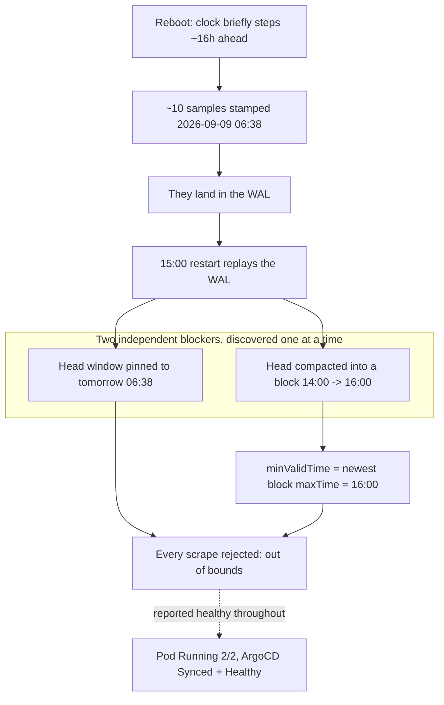

## Introduction

J'ai redémarré les trois hôtes Proxmox ce matin. Deux heures plus tard, je suis allé chercher ce que le reboot avait cassé, comme on le fait toujours — en m'attendant à un pod bloqué, un volume mal rattaché, une application revenue avant sa base de données.

Tout était vert. Cinq nœuds `Ready`. Aucun pod hors de `Running`/`Succeeded`. Les trente-deux Applications ArgoCD `Synced` et `Healthy`. Chaque PVC `Bound`, chaque volume Longhorn `healthy`. Le pod Prometheus lui-même : `Running`, `2/2`, sans redémarrage notable.

Prometheus n'avait ingéré aucun sample depuis plus d'une demi-heure.

Voici l'histoire d'une panne qui ne produit aucun rouge nulle part, parce que le composant qui tombe est celui qui colore tous les autres — et d'un correctif qui a semblé complet deux fois avant de l'être vraiment.

## Le vert qui ne voulait rien dire

La première chose utile que j'ai lancée n'était pas un health check. C'était ça :

```
count(up)
```

Réponse vide. Pas `0` — _vide_. Il n'existait aucune série `up`, pour aucune target, à l'instant courant. Un cluster où 52 targets scrapaient tranquillement une heure plus tôt n'en avait plus une seule, et rien dans Kubernetes ne l'avait remarqué, parce que rien dans Kubernetes ne mesurait ça.

Les logs disaient la même chose, sur tous les scrape pools à la fois :

```
level=warn component="scrape manager" scrape_pool=serviceMonitor/monitoring/...
  msg="Appending scrape report failed" err="out of bounds"
level=warn msg="Error on ingesting samples that are too old or are too far
  into the future" err="out of bounds"
```

Tous les pools. Pas un exporter, pas un nœud — les apiservers, les kubelets, kube-state-metrics, les service monitors de mes propres applications, tous rejetés à l'identique. Quand une panne est aussi uniforme, ce ne sont presque jamais les targets. C'est ce qui écrit.

La vue de Prometheus sur son propre stockage a tout expliqué :

```json
"headStats": {
  "numSeries": 10,
  "minTime": 1788935900563,
  "maxTime": 1788939500563
}
```

Ces timestamps, ce sont **le 9 septembre 2026 à 06:38 et 07:38** — le lendemain matin. Environ seize heures dans le futur. Dix samples avaient été écrits avec des timestamps futurs, et la fenêtre valide du head les avait suivis là-bas. Chaque sample réel arrivant à l'heure courante était désormais _plus vieux_ que le minimum accepté par le head, et se faisait rejeter en `out of bounds`. Prometheus serait resté aveugle jusqu'à ce que l'horloge murale rattrape son propre head, quelque part après le petit-déjeuner du lendemain.

L'horloge du conteneur était juste. Le `time()` de Prometheus était d'accord avec la mienne à la seconde près. Ce qui avait estampillé ces samples était terminé.

Les dix séries empoisonnées sont la partie intéressante. Elles venaient des apiservers de trois nœuds différents, de kube-state-metrics, et d'un kubelet — cinq targets distinctes. Un seul exporter défaillant peut mettre un mauvais timestamp dans votre base. Il ne peut pas en mettre un dans cinq targets sans rapport, simultanément. Prometheus estampille les samples avec sa propre horloge au moment du scrape : la seule explication cohérente avec cette dispersion, c'est que l'horloge de _Prometheus_ était brièvement seize heures en avance pendant le reboot, a écrit une poignée de samples, puis s'est fait remettre en arrière par NTP.



## Ce que le reboot avait réellement coûté

Avant de toucher à quoi que ce soit, j'ai vérifié que l'historique était toujours là, parce que la réparation que j'avais en tête impliquait de supprimer des choses.

```
count(up) @ 04:00 -> 52
count(up) @ 09:33 -> 52
count(up) @ 12:20 -> 52
count(up) @ 14:50 -> 52
count(up) @ 15:10 -> empty
```

Sept jours de blocks compactés sur disque, intacts et interrogeables. Les dégâts se limitaient au head en mémoire et au write-ahead log, et le trou commençait entre 15:00 et 15:10. C'était important : ça voulait dire que le correctif pas cher — jeter le head, garder les blocks — ne coûtait rien qui m'importait.

Le correctif cher aurait été le chirurgical. Prometheus dispose d'une admin API capable de supprimer des séries individuelles par matcher, ce qui aurait retiré exactement les dix séries empoisonnées sans toucher au reste. La mienne a `enableAdminAPI: false`, et l'activer signifie un changement de values, une pull request, une synchro ArgoCD et un redémarrage — pendant tout ce temps, le monitoring reste aveugle. Pour dix séries poubelle et un head qui ne contient rien d'autre, ça fait beaucoup de cérémonie pour préserver le néant.

Donc : supprimer le WAL et les chunks du head, ne pas toucher aux répertoires de blocks, redémarrer.

## Le correctif qui a retiré l'erreur, pas la panne

Ça a marché, au sens où tout ce que je regardais est devenu ce que je voulais.

```json
"headStats": { "numSeries": 0, "minTime": 1788883200000 }
```

Head vide. Timestamps futurs disparus. Les lignes `Appending scrape report failed` se sont arrêtées et ne sont jamais revenues. Trente répertoires de blocks toujours sur disque, historique toujours interrogeable à 04:00. Selon chaque signal qui m'avait dit que le système était cassé, le système était maintenant réparé.

`count(up)` était toujours vide.

C'est la partie de la journée qui mérite d'être écrite. J'avais une hypothèse claire, j'ai agi dessus, le symptôme que je suivais a disparu, et la fonction qui m'intéressait vraiment n'était pas revenue. Si j'avais vérifié en grepant le message d'erreur — ce qui est le réflexe naturel, et ce que j'avais déjà à moitié fait — j'aurais crié victoire sur un système qui n'ingérait toujours rien.

Les lignes `out of bounds` restantes avaient discrètement changé de nature. Elles ne disaient plus `component="scrape manager"`. Elles disaient `component="rule manager"`, en jetant des résultats de recording rules. Même chaîne d'erreur, autre sous-système, sens complètement différent. Un grep sur `out of bounds` renvoyait 651 lignes et ressemblait à un échec total ; un grep sur `Appending scrape report failed` renvoyait zéro et ressemblait à un succès total. Aucun des deux chiffres n'était la réponse.

La réponse était dans ce `minTime` : `1788883200000`, c'est **16:00:00Z**, et il était 15:33.

Prometheus fixe le timestamp minimum acceptable du head au `maxTime` du block le plus récent sur disque. Il refuse d'écrire dans une plage qu'un block persisté revendique déjà. Je suis donc allé lire les métadonnées des trente blocks :

```
01M20RHJS6KZ855GZVWCC72ZZ8  06:00:00Z -> 12:00:00Z   274,577 series
01M20RH8ETFJ0Y422BPZCBAJZB  12:00:00Z -> 14:00:00Z   198,289 series
01M20RHCRF8E02NXB2VSE6Y0SQ  14:00:00Z -> 16:00:00Z   198,985 series
```

Exactement un block sur trente se terminait dans le futur. Quand Prometheus a redémarré à 15:00 avec un head empoisonné, il a compacté ce qu'il avait dans un block dont la plage alignée va jusqu'à 16:00Z — et à partir de là, il a refusé tout ce qui précédait 16:00Z, puisque de son point de vue cette heure était déjà écrite.

Deux blocages indépendants, issus d'une seule cause racine, découverts l'un après l'autre. Vider le WAL avait bel et bien corrigé le premier. Ça n'avait strictement aucun effet sur le second.

## Renommer plutôt que supprimer

Le block devait cesser d'être visible. Il contenait aussi une vraie heure de métriques — de 14:00 à environ 15:05 — et je ne voulais pas la détruire pour gagner vingt minutes.

Prometheus décide de ce qui est un block en essayant de parser le nom du répertoire comme un ULID :

```go
func isBlockDir(fi fs.DirEntry) bool {
	if !fi.IsDir() { return false }
	_, err := ulid.ParseStrict(fi.Name())
	return err == nil
}
```

Un renommage suffit donc. `01M20RHCRF8E02NXB2VSE6Y0SQ` est devenu `quarantined-01M20RHCRF8E02NXB2VSE6Y0SQ`, qui n'est pas un ULID, donc pas un block, donc ne compte pas dans le `maxTime` le plus récent. Rien n'a été supprimé. Le renommer en sens inverse et redémarrer ramène l'heure d'historique telle quelle.

Le block suivant se termine à 14:00Z. Au redémarrage, `minValidTime` est descendu à 14:00Z, confortablement dans le passé, et :

```
count(up) -> 52
count(up == 0) -> none
count(up) @ 04:00 -> 52
"Appending scrape report failed" -> 0
```

L'ingestion repartie, aucune target réellement down, sept jours d'historique toujours là. Le coût : une heure de métriques vieilles d'une semaine cachée derrière un renommage, et un trou permanent dans les graphes entre 15:05 et 15:47.

## Le seul check qui a fonctionné

Tout l'intérêt de ce billet est que chaque signal auquel je faisais confiance était faux. Autant être précis sur celui qui ne l'était pas.

Il existe sur ce cluster une règle d'alerte Grafana appelée `monitoring-blind`. Elle existe parce que Prometheus est un StatefulSet et ne se reprogramme pas depuis un nœud mort : perdre un hyperviseur peut emporter l'évaluateur avec lui. Autrement dit, Prometheus ne peut pas être ce qui me dit que Prometheus manque à l'appel. Grafana est un Deployment, il tourne ailleurs, et c'est lui qui évalue cette règle.

Elle s'est déclenchée à **15:15:30**, puis chaque minute.

Elle avait raison, elle était en avance, et elle était la seule chose juste dans toute la stack. Kubernetes disait healthy parce que le process tournait. ArgoCD disait healthy parce que les manifests correspondaient à git. L'alerting de Prometheus, lui, disait... `KubeControllerManagerDown`, ce qui était faux — le controller manager allait très bien, il avait simplement cessé d'être observé. Vu de l'intérieur, une métrique absente et un composant mort sont indiscernables. La cécité fabriquait ses propres fausses alertes sur des composants sains tout en restant muette sur elle-même.

C'est la forme de cette classe de panne. Elle ne s'annonce pas. Elle vous retire la vue, puis vous fait un rapport sur ce qu'elle ne voit plus.

Je n'ai pas construit cette règle pour ça. Je l'ai construite pour un hyperviseur mort. Elle a attrapé quelque chose que je n'avais pas imaginé, et c'est tout l'argument en faveur d'un check, n'importe lequel, qui ne partage pas le sort du système qu'il surveille.

## Ce que je ne sais toujours pas

La cause racine est l'horloge, et je ne l'ai pas vérifiée. Un saut de seize heures au boot est cohérent avec des VMs qui reprennent sans RTC synchronisée, mais je n'ai pas pu joindre les nœuds en SSH pour contrôler — `Permission denied (publickey)` depuis les deux machines que j'ai essayées. Tant que `timedatectl` n'est pas confirmé synchronisé sur les cinq, le prochain reboot peut refaire exactement ça, et je préfère l'écrire plutôt que d'arrondir en conclusion propre.

Ce que je corrigerais en premier, cela dit, ce n'est pas l'horloge. C'est que `monitoring-blind` a alerté pendant trente-deux minutes dans un canal Discord pendant que je lisais un dashboard qui affirmait que tout allait bien. Le check a fonctionné. C'est le chemin entre le check et moi qui était lent, et c'est un problème beaucoup plus ennuyeux qu'un saut d'horloge de seize heures — ce qui est en général la façon dont ça se passe.

## Ce qu'il faut retenir

Deux leçons, et c'est la seconde qui me servira vraiment.

**Un système de monitoring ne peut pas signaler sa propre cécité à travers lui-même.** Chaque signal de santé dont vous disposez est produit par quelque chose. Quand ce qui a cassé est ce qui produit le signal, un dashboard vert n'est pas une preuve de bonne santé — ce n'est la preuve de rien du tout. Au moins un check doit être évalué ailleurs, et il gagne sa place un jour comme celui-ci, pas le jour où vous l'écrivez.

**« L'erreur s'est arrêtée » n'est pas « le système fonctionne ».** J'ai retiré exactement la panne que j'avais diagnostiquée, j'ai vu exactement le message d'erreur disparaître, et j'étais toujours totalement cassé — parce qu'une seconde conséquence de la même cause racine attendait une couche en dessous, portant la même chaîne d'erreur dans un autre sous-système. La vérification qui comptait n'était pas de greper les logs. C'était de demander au système de faire la seule chose pour laquelle il existe, et de vérifier qu'il l'a faite.
