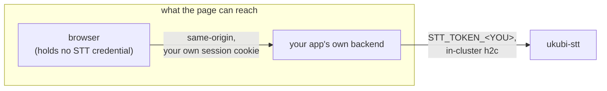
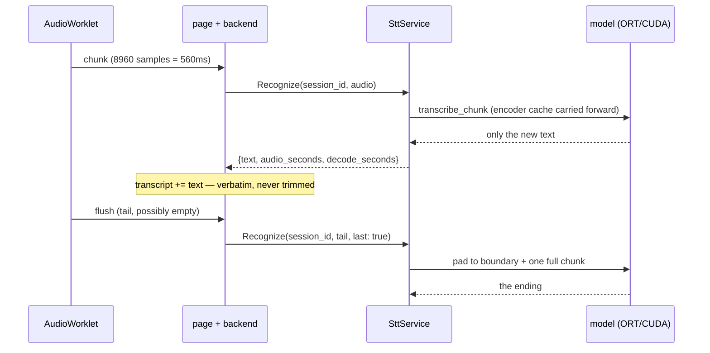

## Introduction

The cluster [I keep rebuilding](/blog/rebuilding-my-cluster-on-proxmox) got a GPU node this summer: one machine with an RTX 2070 SUPER, which is also the machine I game on. `ukubi-stt` is the first workload that needed it.

It is one Rust binary. It exposes a single gRPC method, takes raw 16 kHz audio, and returns text about 560 ms behind the speaker. Two of my own applications use it in production: `dream-analyst`, where you dictate a dream instead of typing it, and the `agent-fleet` console, where I dictate prompts at agents instead of typing those either. It went from empty repository to serving both in three days.

The first commit contains no service. It is one function that loads the model, reads GPU memory before and after, and refuses to continue if the number did not move.

That looks like paranoia until you know what the library does. `parakeet-rs` registers ONNX Runtime execution providers like this:

```rust
ExecutionProvider::Cuda => builder.with_execution_providers([
    ort::ep::CUDA::default().build(),
    CPUExecutionProvider::default().build().error_on_failure(),
])?
```

`error_on_failure()` is on the **CPU** provider. If CUDA fails to initialise, ONNX Runtime falls through to CPU, and the model loads, transcribes, and returns entirely correct text — roughly thirty times slower, with nothing in the logs that reads as an error.

So on the first real run, on real hardware, the assertion did its job:

```
gpu.used before load : 1 MiB
model loaded in      : 2.4s
gpu.used after warmup: 1 MiB (delta 0 MiB)
real-time factor     : 0.081
GATE FAILED: GPU memory grew by only 0 MiB (< 128 MiB)
```

A real-time factor of 0.081 is twelve times faster than speech. The transcripts were right. `nvidia-smi` answered from inside the container, so the RuntimeClass, the device plugin and the GPU resource request were all correct. Every signal available said the service was healthy. It was decoding on the CPU, and I would have shipped it that way.

That is the failure this whole system is designed against, and it is not a crash. Crashes are easy — something goes red and you go and look. This is the other thing: the run that returns the right answer, in the right shape, with every indicator green, by the wrong route. The rest of this post is what it takes to catch that, in Rust, on one GPU, and what it cost to learn.

## The contract

The service is small on the outside, and that is deliberate. One gRPC method:

```proto
service Stt { rpc Recognize(RecognizeRequest) returns (RecognizeResponse); }
```

Audio in is raw 16 kHz mono little-endian s16 PCM. No container, no encoding enum — the caller has already decided what it is sending, and a format field whose only legal value is one thing is a field that lies. Anything not 16 kHz is rejected rather than resampled, because a silently resampled request comes back with a plausible transcript and a meaningless real-time factor. Same reasoning for an odd byte count: that is a truncated frame, which means the caller's framing is wrong, and dropping the half-frame would corrupt the tail of the transcript with nothing to see.

Text out is a fragment, plus two floats: `audio_seconds` and `decode_seconds`. Those are in the wire format on purpose. The failure this service is most prone to looks like success in every way except speed — so the number that reveals it is part of the contract, available to every caller, rather than a log line on the server.

There is one method and not two because `session_id` selects the mode. Empty means a one-shot offline decode of a whole utterance. Non-empty means realtime, and the server keeps a streaming recognizer for that id.

I never declared a `StreamingRecognize`. A browser cannot stream _up_ under any transport gRPC offers — gRPC-Web gives you unary and server-streaming, and full-duplex `fetch` ships in no stable browser — so the audio arrives as discrete requests no matter what the proto says. A streaming method would have bought nothing and cost a second code path, a second auth surface and a reconnect story. An RPC that exists and returns `UNIMPLEMENTED` is scaffolding pretending to be an interface.

The other shape that is not optional, and which both consumers arrived at independently:



No browser ever holds an STT credential. Handing one to the page gives every user of that app a credential for my GPU, recoverable from devtools — and `stt.bnei.dev` appears in Certificate Transparency logs minutes after the certificate is issued, so the endpoint is not obscure.

It is also the only shape that works. Both consumers allow no CORS and their session cookies are `SameSite=Lax`, so a cross-origin call from the page carries no identity at all. There was nothing to relax; the proxy _is_ the design. The pay-off beyond credentials is that `session_id` stops being client-chosen — derive it server-side from the authenticated user, and one user cannot interleave audio into another's recognizer.

## Making the GPU prove itself

Back to the assertion, because the reasoning behind it is the reasoning behind everything else.

There are two traps stacked in front of a working CUDA session, and the second one hides the first. The `cuda` cargo feature _enables_ the provider; it does not _select_ it. `from_pretrained(path, None)` hands back a CPU session no matter what was compiled in. Both halves are required — the feature in `Cargo.toml`, and an explicit `ExecutionConfig` at load time. And `docs.rs` conceals this, because it builds with default features, so the `Cuda` variant of the provider enum never renders and the type looks CPU-only.

So the check is a memory delta: read `nvidia-smi`, load the model, run a warmup decode, read it again, and refuse to start if the difference is under 128 MiB. Not zero — `nvidia-smi` reports whole-GPU usage, and a few MiB of noise from something else on the card must not count as success. A real load is about 3.4 GiB, so the threshold has enormous margin.

On failure it crashes the process. That was a decision, not laziness: a CrashLoopBackOff is loud and attributable, and a Ready pod decoding thirty times slow is the failure this service is most likely to suffer and least likely to have noticed. Downtime was already accepted here — single replica, single node — so crashing costs nothing that was ever promised.

The warmup is not just for the assertion, either. The first decode pays lazy CUDA context creation and cuDNN algorithm selection, so doing it at startup is also what stops the first real user paying for it.

### What the failure actually was

Two independent bugs, either one sufficient, and both in the Dockerfile.

Finding them was harder than it should have been, and that part generalises. ONNX Runtime explains itself at `debug` level — which provider it registered, which it declined, and why. `ort` routes those lines through `tracing`, `parakeet-rs` installs no subscriber, and neither did I. So the diagnosis had to be done by reading `ort-sys`'s build script instead of reading my own logs. Installing a subscriber, with a default filter of `info,ort=debug`, is part of the fix.

That build script held the first bug. `ort-sys` does not build ONNX Runtime; it downloads a prebuilt one chosen from a hardcoded table. For `x86_64-unknown-linux-gnu` that table has four rows, and **none of them is CUDA 12**. Its own resolver says so out loud:

```rust
_ => { log::debug!("couldn't determine CUDA version, guessing 13");
       "cuda13" } // "fallback" to the lowest version we ship
```

I had been building in a CUDA 12.6 image, which produced a binary wanting `libcudart.so.13`. The base image is CUDA 13 now, and `ORT_CUDA_VERSION=13` is set explicitly in the builder so the resolution is read rather than guessed.

The second bug: `libonnxruntime_providers_cuda.so` was never in the image at all. ONNX Runtime is linked statically — `ldd` on the binary shows no `libonnxruntime` — but the CUDA provider is not part of that archive. It is a separate 79 MB shared object that ORT `dlopen`s _next to the calling module_, which for a static link means next to the executable. I had copied only the binary out of the builder.

The compounding detail is the good one. `ort-sys` does not copy those files on Unix, it **symlinks** them into `target/release/` from a cache directory. So the obvious fix — `COPY --from=build target/release/*.so` — lands a dangling symlink in the image and fails _identically_, with the same silent CPU fallback. `cp -L`, and the filenames written out explicitly, so an upstream rename breaks the build instead of quietly downgrading the service.

Before any of that, three builds died in a row, each because I had fixed the last: a missing `libssl-dev`, then a glibc mismatch when I moved to fix it, then PEP 668 refusing `pip3 install` on the newer base. The one transferable lesson is the first: `cargo clippy` had been green in CI the entire time, because GitHub's runner image ships `libssl-dev`. A hosted compile check cannot verify the image's own build environment. It only verifies the code.

With both provider bugs fixed:

```
gpu.used before load : 4 MiB
model loaded in      : 6.2s
gpu.used after warmup: 1843 MiB (delta 1839 MiB)
real-time factor     : 0.041
GATE PASSED: CUDA engaged (1839 MiB resident), RTF 0.041
```

Only then did I write the proto. The engine was the one unverified assumption in the design, and the streaming wire format is precisely the artefact an engine swap invalidates.

## What Rust actually bought

I did not pick Rust to be fast. The GPU is doing the arithmetic; the host language mostly moves buffers around. I picked it for two things, and one of them surprised me.

**A compile-time answer to a concurrency question.** The design had a documented open risk: the gRPC server wants to hold the model behind a mutex and hand it to `spawn_blocking`, which requires `ParakeetTDT: Send`. If it were not `Send`, the model would need a dedicated thread and a channel instead — a different architecture, discovered late. The README carried it as an open unknown for two days. It is now this:

```rust
const _: () = {
    const fn assert_send<T: Send>() {}
    assert_send::<ParakeetTDT>();
    assert_send::<Nemotron>();
    assert_send::<NemotronHandle>();
};
```

That is the part I would defend hardest. An open design question became a build failure the day it stops being true, in five lines, with no runtime cost and no test to maintain. In Python it would have been a race that shows up under load; in Go it would have been a comment.

**Exhaustive matching as a design tool.** There are three models now — batch, streaming, and a Persian one — and routing between them is an `enum`, not a trait. The two engines do not sit honestly behind one interface; they have different state, different lifecycles and different devices. An enum says so, and an exhaustive `match` makes a fourth model a compile error _at every decision point_ rather than a silently missing branch in one of them.

**Dependency honesty, which is a Rust-specific discipline.** `ort` is pinned with `=2.0.0-rc.13`, not a caret. A caret range on a pre-1.0 release candidate is how a build silently moves to a different ONNX Runtime ABI — and that ABI decides the base image, so it is not mine to float. Separately, `Cargo.toml` names the `cuda` feature for `ort` even though it already resolves through `parakeet-rs`'s own feature unification. Transitive availability is not importability, and a transitive version is not a promise. Declaring what you actually use turns a spooky future breakage into an ordinary one.

Where it hurt, honestly:

- **One error type could not be wrapped.** `ort::Error<SessionBuilder>` carries the builder back with it and is not `Send + Sync`, so `anyhow`'s `.context` will not take it. That message is attached by hand, with a comment saying why, because it looks like sloppiness otherwise.
- **Mutex poisoning is a real hazard with a real cost.** A panic while holding the model's lock would poison it, and every subsequent request would fail with the same panic on a pod that is still Ready. Poisoned locks are recovered rather than propagated — one bad request must not brick the service.
- **Clippy was wrong once, and I had to do arithmetic to prove it.** It wanted the large enum variant boxed. Eight sessions at roughly 320 bytes of slack is 2.5 KB for the whole process, against an allocation and a pointer chase on every decode. The `allow` carries the sum.

And what did not hurt at all: async. Every inference call is synchronous and pushed to `spawn_blocking`, so there is no async-in-trait anywhere, no `Pin`, no lifetime puzzle in a poll function. The interesting concurrency is not in the futures; it is in what shares the card.

## Designing for exactly one GPU

There is one card, it is not mine alone, and it disappears when I reboot to play something. Most of the server's design falls out of that.

**Offline decodes reject rather than queue.** The batch path holds a `Semaphore(1)`, and a second concurrent caller gets `RESOURCE_EXHAUSTED` immediately. There is no queue, deliberately: a queue in front of a single GPU converts overload into unbounded latency, and a caller who waits ninety seconds for a transcript would have preferred to be told no in ten milliseconds. `RESOURCE_EXHAUSTED` is a "try later", and both consumers map it to exactly that.

**Streaming is capped instead, because it is a different resource.** A streaming session occupies the GPU for 20-50 ms out of every 560 ms chunk, so eight concurrent sessions is a plausible share of the card rather than eight simultaneous decodes. It is one cap and one session map, not two — the resource being protected is one machine, and two separate caps would let sixteen sessions oversubscribe it while each map looked healthy on its own.

Worth saying plainly: eight is an estimate. It is roughly half the card's duty cycle with the batch path still needing room, and the right number is whatever the card actually sustains once real consumers are on it. Nobody has measured that yet.

**The streaming model loads lazily, on first use.** Both models resident is 6880 MiB of an 8192 MiB card. That fits — but it was an _estimate_ when the decision was made, and loading at startup turns a bad fit into an outage of the working batch service, because the deployment strategy is `Recreate` and the old pod is already gone. Loading on first request turns the same failure into one failed RPC. The CUDA assertion is not skipped for it, only deferred: two models means two silent-CPU-fallback surfaces, and covering one would quietly halve what the gate guarantees.

**Sessions are swept on idle, not just on close.** Browsers close tabs without saying goodbye; that is the normal case, not the edge. Anything untouched for 120 seconds is reclaimed.

## Realtime without a sliding window

Everyone assumes realtime speech-to-text means a sliding window, a voice activity detector, and partial hypotheses that get revised as more audio arrives. That is what you build when your model wants thirty seconds of audio at a time.

This does none of it. The streaming model is _cache-aware_: the encoder carries its own state forward across chunks, so each chunk is decoded once, in context, and the model emits only the text that is new.



Three things follow from that one property, and all three are load-bearing.

**There is no `is_final` field.** The model never revises what it already emitted, so the client concatenates and never has to replace a tail. An engine that revised would need that field, plus tail replacement, plus a very different client.

**Ordering is a contract, not an implementation detail.** The cache means a reordered or retried chunk corrupts everything after it. The browser module serialises every send through a single promise chain — exactly one request in flight, ever — and on error it abandons the stream rather than retrying. A consumer that "optimises" that into parallel sends corrupts every transcript after the first reorder, so it is documented as a contract in the module that implements it.

**The chunk size is not mine to choose.** 8960 samples is 560 ms, the encoder's own granularity. Smaller chunks add requests without lowering latency; larger ones add latency for nothing.

Text lands roughly 560 ms behind speech: the chunk, plus 20-50 ms of GPU, plus about a millisecond of in-cluster network. That is a design budget read off those three numbers, not a percentile study — there is no metrics endpoint here, and I have not aggregated the per-request timings into anything.

Instead of a voice activity detector, the end of an utterance is handled arithmetically. On `last`, the server pads with silence to the next chunk boundary and then adds one more full chunk, pushing the model's right-context window past the real speech. Silence decodes to nothing, so it costs one extra decode of about 25 ms and produces no spurious text.

## Persian, and the line that erases the transcript

The multilingual model covers twenty-five languages and Persian is not among them. Feed it Persian and it emits `<unk>` spam. The service counts those and warns rather than filtering them, because filtering quietly turns a visible failure into short, plausible output — which is the same disease as the CPU fallback, in a different organ.

Fixing it meant a third model, a cache-aware FastConformer CTC export. `parakeet-rs` has no CTC type, so it is driven through `ort` directly. Which meant writing the feature front end by hand, because `parakeet-rs` computes log-mel internally and exposes none of it. A NeMo-compatible streaming filterbank, in Rust, with every opportunity for silent wrongness that implies.

The parameters are not guessed. They come from the `model_config.yaml` inside the source `.nemo`, and one line of it decides everything:

```text
normalize: NA
```

`NA` means **no per-feature normalisation**. NeMo's usual default is per-feature CMVN, and `parakeet-rs`'s own pipeline applies it — so the obvious thing to copy is the wrong thing. Measured against the real model, applying CMVN moves character error rate from 0.033 to **1.000, with empty output**: normalised features land in a range the encoder never saw during training, and the CTC decode collapses to all-blank.

Two things I _expected_ to be traps measurably are not. Placing the 400-tap window at offset 0 instead of centring it in the 512-point FFT scores 0.042. Dropping preemphasis entirely scores 0.056. Both are implemented correctly anyway, because matching NeMo is free — but neither is load-bearing, and a future reader should not treat them as though they were. Only the normalisation matters, and it is now held by a unit test asserting the global mean stays below -2.0.

### A test that would have tested nothing

The filterbank is checked against golden mel frames, and their provenance is the part worth copying.

They were **not** generated from the Rust implementation. A fixture derived from the same description as the code only proves that the two agree. Instead there is an independent numpy implementation, and it was validated end to end _first_ — decoding six real Persian clips through the real ONNX model at a mean character error rate of 0.022, five of the six character-exact including punctuation. Only after it demonstrably worked were its frames frozen as the fixture. Regenerate them from the Rust file and you have deleted the test.

The fixture uses deterministic pseudo-random noise rather than a sine sweep, and that was learned by the fixture failing: a sweep leaves the high mel bins holding nothing but spectral leakage, where f32 and f64 disagree by up to 0.24 log units. Comparing those tests float noise, not the pipeline.

Two boundary bugs came out of this, both silent, both caught by checks rather than by users. The carry-over between chunks must be `N_FFT - HOP = 352` samples, not the intuitive `WIN_LEN - HOP = 240`: a frame consumes 512 samples even though only 400 of them are weighted by the window, so 240 silently drops audio. And the centre pad was being built from the first chunk rather than the utterance — reflect padding needs n+1 samples to mirror, so a first chunk under 256 samples degraded to a zero fill and corrupted the first two frames by up to 3.57 log units. That one was found in review, is not reachable from either consumer today, and becomes reachable the moment the offline path feeds engine-sized slices. The regression test now runs twelve chunk sizes from 1 sample to 99,999.

The gate for this model passes on the real node at a character error rate of 0.000 against a four-second clip, 44.8 ms per model step, no `<unk>`. A step is 1.12 seconds of audio, so about 4% duty per stream — which answered the open question of whether Persian needed the GPU. It does not. It runs on the ORT CPU provider, which removes the third-model VRAM problem, the eviction question, and a third silent-CUDA-fallback surface, in one decision.

## Five bugs, one shape

Here is the pattern I did not see until it had happened five times. Every one of these presented as _the model is a bit wrong_, and not one of them was the model.

The two worth telling in full:

**The utterance lost its ending.** Measured live, a 9.23 second utterance came back as `"...on an NVIDIA G"`, dropping its final 270 ms. The encoder emits only on a _complete_ chunk, so the last partial chunk was buffered and never decoded. From the client there is no symptom beyond a transcript that is slightly short — which reads as the model trailing off, not as arithmetic. That is what the tail padding above exists for. ([#8](https://github.com/MohammadBnei/ukubi-stt/pull/8))

**The word that split in half.** Dictation rendered "bonjour" as "bon jour" whenever a word straddled a chunk edge, and the server was right the whole time. SentencePiece marks a word-_initial_ piece, and the detokeniser renders that mark as a leading space. **The leading space is the word boundary.** A chunk continuing a word therefore arrives without one — correctly. The reference page was doing this:

```js
if (r.text.trim()) transcript += ((transcript && ' ') || '') + r.text.trim();
```

which deletes the real signal and fabricates a fake one between every pair of chunks. Three things had to go, not two: the `if` guard is the third, because a chunk whose entire text is one separator has to survive, or it glues together the words either side of it. The whole protocol is `transcript += r.text`, with no guard.

Two details make it worse than an ordinary bug. The consumer that never had the problem was the one that had always appended verbatim — so the broken implementation was the _reference_, which is the artefact people copy. And the tempting fix was a correction model to repair the output, which I rejected: it pays latency on a 560 ms path to fix a bug that was free to fix at the source. ([#24](https://github.com/MohammadBnei/ukubi-stt/pull/24))

The other three, briefly, because the pattern is the point rather than the parade:

- **Chunks were 768 ms, not 560.** The client shipped its whole buffer, which crossed the threshold at 12288 samples — not a multiple of the encoder chunk, so the server also held a remainder until the next request. About 1.4 seconds and irregular, against a smooth 650. It looked like "streaming is just laggier than it should be", and it was found by measuring rather than reading. ([#9](https://github.com/MohammadBnei/ukubi-stt/pull/9))
- **One Stop in thirty-five lost its ending**, plus every Stop pressed before speaking. The tail flush can legitimately carry zero samples, and the server was rejecting empty audio before looking at `last` — so the close failed, the recognizer leaked until the idle sweep, and the tail never flushed. One in thirty-five is exactly the frequency that gets dismissed as the model dropping a word. An empty final chunk is a valid close. ([#9](https://github.com/MohammadBnei/ukubi-stt/pull/9))
- **The first words of each sentence were missing.** This arrived as a user report, not from instrumentation. Clicking Record fetched the module, built an `AudioContext`, compiled a worklet and only _then_ opened the microphone; the start of the sentence landed in that gap. The trap is in the obvious fix: a context built outside a user gesture starts **suspended**, and a suspended context runs no worklet — so a naive prewarm looks live and records pure silence, which is strictly worse, because nothing errors. ([#15](https://github.com/MohammadBnei/ukubi-stt/pull/15))

A sixth belongs in the same family even though it is not a chunk bug. The browser test page was completely inert for four consecutive releases: an `import` was added without deleting the byte-identical local copy it duplicated, and a duplicate declaration is a _parse_ error, so the module died before running a single line. It survived because the only check against that page was that `/` returned 200 — which it did the whole time. The HTML was served perfectly; the JavaScript inside it never parsed. There is a syntax check in CI now, because the file is `include_str!`'d into the binary and a syntax error otherwise compiles and ships. ([#23](https://github.com/MohammadBnei/ukubi-stt/pull/23))

Six for six, every one invisible to the check that was nominally covering it.

## What got deleted

Deletion is the part I am most pleased with, so it gets its own list.

`StreamingRecognize`, never written. `offset_ms`, designed, given a field number, then removed when server-side session state made stateless stitching unnecessary — and the number is burned rather than reused, so an old client's field 4 can never be silently reinterpreted. `is_final`, deliberately never added. The correction model, rejected.

The builder image was `nvidia/cuda:*-cudnn-devel`, 8.23 GB, chosen on a hypothesis I wrote down and never checked: that `ort`'s CUDA feature might want headers at build time. It does not — nothing in the compile touches CUDA. It is plain `ubuntu:24.04` now, and I carried those 8 GB through the entire Gate 0 debugging saga before testing the assumption.

Python left with it, along with the HuggingFace CLI and about 150 MB of interpreter, replaced by four `curl` calls. `ScriptProcessorNode` went too, taking the silent gain node it needs to stay alive and every line of main-thread buffer arithmetic — which is exactly where two of the latency bugs had lived.

And one library was rejected on inspection rather than on trial: `sherpa-onnx`'s build script contains zero occurrences of `cuda` or `gpu` and only ever downloads the CPU tarball, so asking it for the CUDA provider links a CPU-only runtime and decodes on CPU. The same trap that cost me a day, with no escape hatch.

## What is still wrong

The honest ledger, all of it written down in the repo rather than discovered later by someone else.

The session cap is an estimate, not a measurement. Rotating any consumer's token restarts the pod, and since sessions are in-memory in a single replica, every in-flight dictation loses its encoder cache and resumes mid-sentence with no error the user can see — so adding a consumer is a maintenance action, not a routine one. The client-chosen `session_id` remains a hazard the wire format permits; per-client tokens and server-derived ids in the consumers mitigate it, but it is accepted rather than fixed. `cargo audit` is permanently non-clean by design, because this depends on a release candidate on purpose, so it is advisory — a permanently-red check trains people to ignore it. The declared PVC size is fiction twice over: the bound claim is smaller and the storage class cannot expand it.

Streaming accuracy is also visibly below the offline model. It renders "Yukie cluster" as "UQB cluster". That is fine for dictation into a box you are about to edit, and not fine for anything acting on the transcript unreviewed — which is why both consumers put the text in an editable field and neither acts on it directly.

And the service is single-replica, pinned to one node, with no HA and no CPU fallback, on a machine that reboots when I want to play something. `UNAVAILABLE` is a normal response, not an incident. Both consumers log it, disable the feature, and carry on — because a service that refuses to start without speech-to-text trades a working product for a broken deployment.

## The thing I would keep

Every structural decision here turned out to be a different instrument pointed at the same failure. The memory assertion at startup. `audio_seconds` and `decode_seconds` in the wire format instead of a log line. Crashing on boot rather than degrading. Rejecting the wrong sample rate instead of resampling it. Rejecting an odd byte count instead of dropping the half-frame. `assert_send` as a const block instead of a sentence in a README. A character-error-rate ablation table instead of a paragraph explaining why the normalisation is right.

None of those catch a crash. Crashes announce themselves. They catch the other thing — the run that returns the right answer, in the right shape, with every indicator green, by the wrong route. Twelve times faster than realtime, entirely on the CPU, and perfectly happy about it.

_(Housekeeping, since it is visible in `git log` anyway: this repository was built with agents from [the fleet](/blog/running-a-fleet-of-claude-agents-on-my-cluster), and every commit is co-authored accordingly. The gates, the measurements and the failures are real; the density of the comments is theirs.)_
