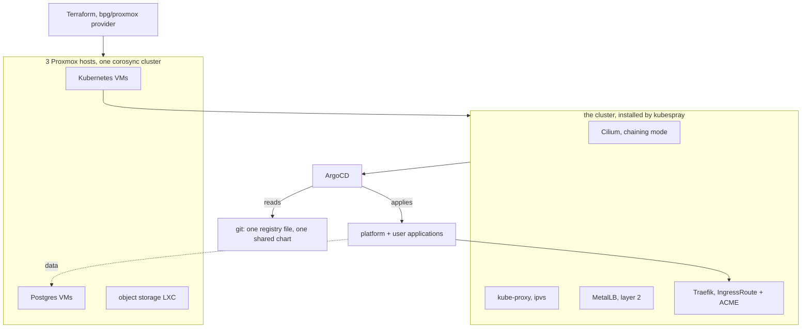
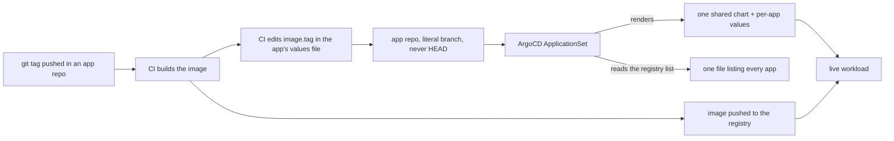

## Introduction

The first two posts in this series were about a cluster I built by hand: [three second-hand machines turned into a Kubernetes cluster](/blog/road-to-self-hosted-kubernetes-cluster), and then [the removal of the single point of failure sitting in front of it](/blog/how-i-reached-high-availability). That cluster worked. It also had a property I did not like: it existed mostly in my memory. If it died, rebuilding it meant remembering.

So on the fourth of June I started again, with one rule: **nothing gets configured by hand**. The hosts come from Terraform, the cluster comes from kubespray, everything running on it comes from git, and if it is not written down it does not exist.

It is true now: the machine mostly runs itself, and the parts of it I understand least are the parts I wrote down most carefully. This post is what I learned getting there — and because nearly all of it was learned the hard way, by building the wrong thing first, it is heavier on failures than on architecture diagrams.

## The shape

Three Proxmox hosts. Terraform creates the virtual machines on them. Kubespray installs Kubernetes on those. Everything above that is ArgoCD reading git.

Three choices in there are worth defending, because each had an obvious-looking alternative that I rejected on purpose.

**Cilium in chaining mode, with kube-proxy kept.** The fashionable configuration is Cilium replacing kube-proxy entirely. I did not do that, because MetalLB owns layer-2 announcement in this setup and the two want the same job. Keeping kube-proxy in `ipvs` mode with strict ARP is what makes MetalLB's ARP behaviour correct on a domestic switch. The eBPF-everything version is written down as a later, deliberate flip rather than a thing I stumbled into.

**Longhorn for application volumes, not Ceph.** Ceph is the better answer at a scale I do not have. Every Kubernetes virtual machine gets a second disk dedicated to Longhorn's data path, kept off the OS disk. Postgres deliberately does _not_ live there — it stays on host storage, managed separately, because putting a database on a replicated network volume is paying twice for replication and getting worse latency for it.

**One shared Helm chart, and a registry file.** Every application in this cluster is deployed by the same chart. A per-app repository contains a `values.yaml` of about five fields — hostname, image, port, probes — and nothing else. A single registry file in the cluster repository lists what exists, and an ArgoCD ApplicationSet turns that list into Applications. No per-app charts. No directory scanning that silently picks up whatever happens to be committed.

That last one is the decision I would defend hardest, and it took the longest to make honest.

## What I rejected, and why that mattered

Seven of the first twelve decision records in that repository are rejections: no Vagrant, no Flatcar, no Wireguard or Tailscale, no external managed Postgres, no multi-region or DR or service mesh, no GitOps-managed Proxmox, and no using the secrets manager as a certificate authority.

Writing down a rejection feels like bureaucracy until the third time you re-litigate the same idea at midnight. Each of those files is about a page, and each one exists because the idea is genuinely attractive and genuinely wrong _here_. A service mesh solves problems I do not have, at a complexity cost I would pay every day. Managed Postgres solves a problem I built this cluster specifically to own.

The rejections also do something subtler: they define the scope. A cluster with no service mesh, no multi-region ambition and no DR site is a _small_ system, and small systems can be understood completely. Every hour I did not spend on those went into the parts that actually break.

## GitOps that lies

Here is the part I did not expect. The hardest thing about GitOps was not deploying anything. It was getting ArgoCD to stop being confidently wrong.

**Every application was reading `HEAD`.** The `targetRevision` field takes a branch or a revision, and `HEAD` looks like a sensible default. It is not, when your repositories have more than one branch: I found production applications reading a development branch, which had been true for some time and which nothing had reported, because from ArgoCD's point of view everything was perfectly in sync. Two pull requests replaced every `HEAD` in the repository with a literal branch name. It has stayed that way since.

**A perpetual self-heal loop from an empty stanza.** One bootstrap Application carried an empty `directory` block. That is meaningless as configuration, but it was enough to make ArgoCD believe live state differed from git, forever. Sync, no change, out of sync, sync again. The dashboard was green in the way a broken smoke detector is quiet.

**Four attempts at one Longhorn diff.** Longhorn's custom resource definitions carry a `caBundle` field that the cluster fills in at runtime and git therefore never matches. Four consecutive pull requests to teach ArgoCD to ignore it: the first two ignore rules did not match, the third one matched the wrong path, and the fourth used a JSON-path expression on the actual field plus the `preserveUnknownFields` flag that turned out to be the real difference. Four attempts, one line of final config, and a much better understanding of how the diff engine works than I ever wanted.

**A deadlock between a secrets hook and a sync wave.** Secrets are injected by an operator that populates a Kubernetes Secret from a central store. That operator runs as a pre-sync hook. The application needs the secret to start. The hook waits for the application. Nothing moves, and the error message is about neither of those things.

**Credentials, twice.** Access to per-app repositories started as one SSH deploy key per repository, which is the textbook answer and does not scale to a person adding repositories on a whim. It became one shared HTTPS credential with a personal access token. That worked, and then it stopped working for a genuinely stupid reason: a trailing newline had been captured into the token when it was stored. The symptom was authentication failures; the cause was one invisible byte.

The pattern here is worth stating plainly, because it took me most of July to see it: **GitOps does not tell you the truth by default.** It tells you whether live state matches declared state, which is a different question, and it will report perfect health while serving the wrong branch of the wrong repository from an application it has never successfully synced. Every one of those bugs was a case of the tool being honest about something narrower than what I thought I was asking.

That is the whole deploy path today. A release tag in an application repository is the only human action; everything after it is machinery. No `kubectl apply` anywhere, and — deliberately — no per-app chart for anyone to fork and drift.

## Making it observable, then making the alerts true

By the end of July the cluster ran things. It could not tell me anything about them.

Centralised logging went in as Loki with Grafana Alloy collecting: chosen over ClickHouse, which is more database than a home cluster's logs justify, and over Promtail, which was already on its way out. Alerts route to Discord, because that is where I actually am.

Then came a fortnight of the alerting stack being wrong in ways that all looked like silence.

Alertmanager started with no receiver configured for the default route, so alerts arrived somewhere and stopped. Grafana's contact point needed its webhook URL in the plain settings block, not the secret one — put it in the secret block and it fails quietly. The log-based alert rule evaluated against a query that returned a range where the alert engine wanted a single number, so it never fired at all; adding a reduce step fixed it. Kubernetes component metrics were bound to loopback and so scraped nothing. The link inside each alert pointed at an address only reachable from inside the cluster, which is precisely where you are not when your phone buzzes at midnight. Alloy was switched from the Kubernetes API to tailing files on disk, because the API path was dropping lines under load.

None of those are interesting individually. Collectively they are the lesson: **an alerting stack that has never fired is not working, it is untested.** The only way I found the six problems above was by deliberately breaking things and waiting for a message that did not come. Every one of them would have been discovered in production instead, at the worst possible time, by silence.

While that was going on, the cluster grew a proper control plane — three control-plane and etcd members instead of one, fronted by a virtual IP — and a local DNS server, so machines have names instead of addresses. That part went smoothly, which after the preceding paragraph felt suspicious.

## Bringing things home

Two moves in August changed what the cluster is for.

**Object storage and a photo service.** Self-hosted S3-compatible storage went in, exposed externally, with per-bucket CORS rules declared in configuration rather than clicked into a UI. On top of it, a self-hosted photo manager. That took fourteen pull requests, most of them small and infuriating: a connection pooler that had to be switched to session mode because the application uses prepared statements, mail that needed STARTTLS on a different port than documented, container image references that were subtly wrong, and CORS rules that accept exactly one origin each — including the literal string `null`, which is what a browser sends for a redirect from an opaque origin.

**Builds and images came in-house.** Images used to be built on a hosted CI runner and pushed to a public registry, then pulled back down over a domestic connection. That is the slow direction on the slowest link in the system. Now there is a registry inside the cluster, backed by the object storage above, and a dedicated build machine on the local network. Nodes pull over gigabit. The blog you are reading is served from an image that never left the house.

That one had a satisfying failure. The build tool refused to run inside the cluster: building container images unprivileged, inside a container, hits a wall that is not worth fighting. The build machine became a lightweight container on the hypervisor instead — outside Kubernetes, holding no cluster credentials, which is a better security posture than the thing I originally wanted anyway. The constraint improved the design.

## What is still wrong

Two things, both written down rather than hidden.

**There is no proven restore path.** Backups exist. A tested, end-to-end restore of this cluster from nothing does not, and my own written principles say the recovery path must survive the cluster failing entirely — which means it cannot live only inside the cluster. It currently does. That gap is named explicitly in the architecture document, because a known gap is a task and an unknown one is an outage.

**One machine is on a 100 megabit link.** I assumed gigabit everywhere. Measuring, months later, showed one node at a tenth of that — a cable and a switch port, not a configuration. It had been quietly shaping everything: that link is why a database failover left a replica unable to catch up. Hardware does not read the architecture document.

## What I would tell myself in June

**Write the rejections down.** The decisions that saved the most time were the ones about what not to build. They are also the only kind of decision that is otherwise impossible to remember having made.

**Green is not the same as correct.** Every serious problem in this rebuild was reported as healthy by something: ArgoCD in sync while serving the wrong branch, an alerting pipeline that never fired, a cleanup job that reported success and did nothing. Build the thing that verifies the verifier, then trust the dashboard.

**Measure the physical layer before designing on top of it.** One cable cost me a database replica and several days of confusion.

Next in this series: [what happens when the cluster starts doing its own maintenance](/blog/running-a-fleet-of-claude-agents-on-my-cluster) — Claude agents running as Kubernetes workloads, one pod per session, opening pull requests against the repositories described here.
