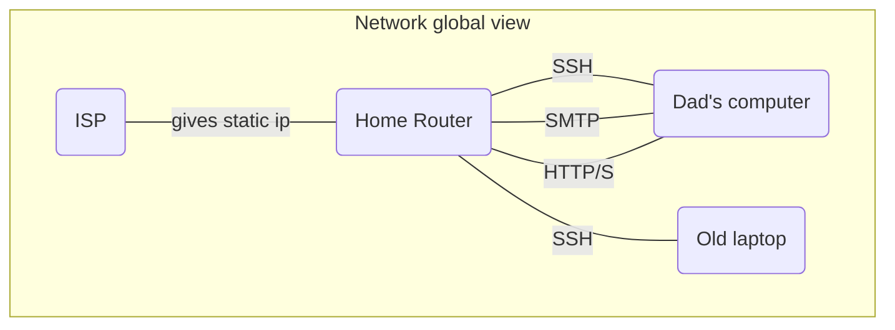
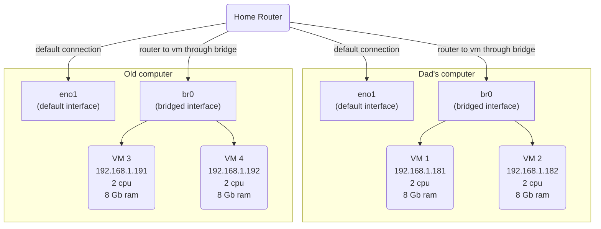
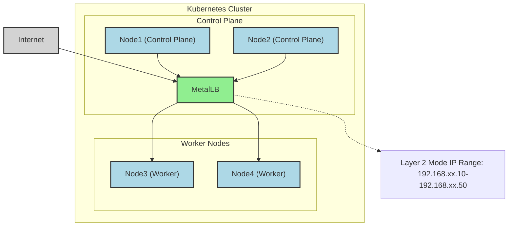
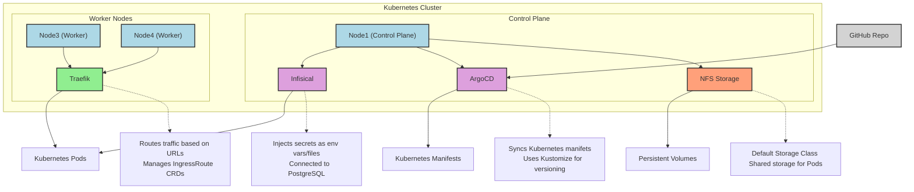

## Introduction

For as long as I can remember, I’ve been fascinated by systems—how they work, how they break, and how they can be made better. As a developer, I’ve always sought ways to streamline my workflows and take control of my tools. That’s why I decided to build my own Kubernetes cluster at home. Driven by my passion for **systems** and **coding**, I wanted to create a self-owned cloud. I also believe that individual control of digital infrastructures leads to a more balanced world.
Setting up everything myself — from installing the OS on blank machines to deploying apps using GitOps — was an incredible learning experience. Whether you're a technical expert or a curious wanderer, you can follow my thought process and get a practical understanding on how to set up a Kubernetes cluster.


## Hardware

My father gave me his old computer, with an i5, 32Gb ram. I added my old laptop with an i7, 16Gb ram . On both machines, I installed :

- **Debian 12**
- My **zsh shell** (oh-my-zsh, some plugins, powerlevel10k)
- **Tmux** for session management
- **SSH**. I read somewhere that lots of bots are scanning open ports for SSH brute force hacking, so I :
  - Changed the default port
  - Enabled private key authentification only
  - Added X11 forwarding for GUI support (primarly for VMs and Timeshift backups).


Having a comfortable setup is crucial to me, it reduces unnecessary complexity when troubleshooting problems. Now that we can easily connect and manipulate our servers, let's talk a bit about networking.

### Network

In my home, we have a basic router with a commercial ISP. I requested our **IP to be static**, and created forward rules for SSH (on my custom ports), HTTP/S, and some mailing ports (requested our ISP to open port 25).
At this point, I should have spent more time setting up a **private DNS** to easily identify my machines, set up **network traffic monitoring** and a **private certificate authority**. You should do it if you are planning to create your own infrastructure like me !
Since networking is my weak point, I imagined a simple setup for my cluster : dad's server acts as the entry point, all ingress traffic to the cluster will pass through the i5 server (more on that later).



## VMs

With my initial setup completed, I was ready for my next challenge: **virtual machines**. Running the cluster directly on bare metal wasn’t ideal for me — I wanted the flexibility to test multiple configurations and easily destroy or recreate setups. Here’s how I approached it:

### VM Configuration

- **2 VMs per machine**
- Each with **2 CPUs** and **8Gi of RAM**
- **Bridged IP address**. The bridge was really useful for my VMs to have their own IP addresses given to them by my router. This way, they appear as separate machines on my network and can easily communicate with each other.

[bridge configuration raw markdown link](https://raw.githubusercontent.com/MohammadBnei/shell-config/refs/heads/main/netplan.md?token=GHSAT0AAAAAAC72IR522GB534DWJMAA3TFE2ETJ76A)

### Virtualisation tools

- **KVM (Kernel-based Virtual Machine)**. Bypass the hypervisor and run the vm directly on the host kernel. Not compatible with all cpus.
- **Virsh (Libvirt)**. Handles the heavy lifting of the virtualisation management.

### Infrastructure As Code

As a good developer, I absolutely needed **IaC** (Infrastructure as Code) to have automatisation, versioning, and iterative update. I opted for **Vagrant** over **Terraform** primarily because of its cleaner Ruby syntax, and also because of its focus on VM (while terraform excels at cloud infrastructure). Both are HashiCorp tools. Here is the Vagrantfile for my 2 first VMs :

```ruby
Vagrant.require_version '>= 2.0.4'

$num_node = 2

Vagrant.configure("2") do |config|
  config.vm.box = "generic/debian12"

  config.vm.provision "shell", inline: <<-SHELL
    sudo apt-get update
    sudo apt-get install -y nfs-common
  SHELL

  (1..$num_node).each do |i|
    config.vm.define "k8s-#{i}" do |node|
      node.vm.provider "libvirt" do |v|
        v.memory = 8192
        v.cpus = 2
      end
      node.vm.network "public_network",
        :ip => "192.168.1.18#{i}",
        :dev => "br0",
        :mode => "bridge",
        :type => "bridge",
        :mac => "5A74CA28570#{i}"

      node.vm.network "private_network", ip: "192.168.10.5#{i}"
    end
  end
end
```

Initaly, I wanted to use _flannel_ as the OS. It's specialised for containers. But i could not get it to work ! So i switched back to what I know, **Debian**.
Getting **Libvirt** and **vagrant** to work together required specific version of vagrant, and env variable configuration. I left vagrant default security (for SSH connections) which uses private key, and I set via Libvirt the VMs to auto-start.



## Cluster Installation

### Kubespray

Now that I have my hardware, network, and VMs ready, let's move on to actually installing the Kubernetes cluster.
I initially used a basic [**Kubeadm**](https://kubernetes.io/docs/setup/production-environment/tools/kubeadm/high-availability/) script injected into my control node VM to set up the cluster. But this was cumbersome, as I had to then manually add the nodes and install the required tools (CNI, CRI, LB…). Stumbling upon [**Kubespray**](https://kubespray.io/), it was the perfect solution. Open source, Ansible-based, fully configurable. Getting it to work was a pleasure because of the clear documentation and configuration only process.
[Kubespray](https://kubespray.io/) makes it easy to install, manage and upgrade clusters. We can add/remove nodes or applications (argoCD, krew…), and configure vital parts of our cluster (CNI, provisioner, load balancer…). For my needs, I used :

- [Cert-manager](https://cert-manager.io/) with fallback DNS servers because I had issues with unresolved DNS names on my services
- [Cilium](https://cilium.io/) as my network plugin (CNI). I may test ePBF one day, it seems like a really cool technology
- [MetalLB](https://metallb.io/) as my bare metal load balancer. I had to label my server 1 nodes to enable metalLB only on them, for the purpose of having a single entry point
- 2 control planes, 3 etcd replicas

Hosts (and control node) configuration :

```yaml
all:
  hosts:
    node1:
      ip: 192.168.1.xxx
    node2:
      ip: 192.168.1.xxx
    node4:
      ip: 192.168.1.xxx
    node5:
      ip: 192.168.1.xxx
  children:
    kube_control_plane:
      hosts:
        node1:
        node2:
    kube_node:
      hosts:
        node1:
        node2:
        node4:
        node5:
    etcd:
      hosts:
        node1:
        node2:
        node4:
    k8s_cluster:
      children:
        kube_control_plane:
        kube_node:
```

MetalLB configuration :

```yaml
# MetalLB deployment
metallb_enabled: true
metallb_speaker_enabled: '{{ metallb_enabled }}'
metallb_namespace: 'metallb-system'
metallb_version: 0.13.9
metallb_protocol: 'layer2'
metallb_config:
  speaker:
    nodeselector:
      kubernetes.io/os: 'linux'
      metallb-speaker: 'enabled' # to select only server 1 nodes
    tolerations:
      - key: 'node-role.kubernetes.io/control-plane'
        operator: 'Equal'
        value: ''
        effect: 'NoSchedule'
  controller:
    nodeselector:
      kubernetes.io/os: 'linux'
      metallb-controller: 'enabled' # to select only server 1 nodes
    tolerations:
      - key: 'node-role.kubernetes.io/control-plane'
        operator: 'Equal'
        value: ''
        effect: 'NoSchedule'
  address_pools:
    primary:
      ip_range:
        - 192.168.xx.10-192.168.xx.50 # don't need more than probably 20 ips
      auto_assign: true
  layer2:
    - primary
```



Then, all I had to do was run the ansible script and after some time, my **Kubernetes cluster was up** ! With the cluster running, I focused on installing the _essential tools_ to make it accessible, manageable, and user-friendly.

### Required Tools

Now, I need to install the required tools to manage my applications on the newborn cluster.
First, the **reverse proxy** : where and how to route user traffic based on **urls**, **host** and rules. I chose [**Traefik**](https://traefik.io/) because I had some experience with it, and for its basic but powerful capabilities. Installing it with helm was a breeze. Since I have multiple domain names I must manage my certificates separately. For now, I use **IngressRoute** CRDs, but I plan on moving to **GatewayAPI** in the next few months.
Next, I need to have storage ready for my pods’ volume. I created an **NFS folder** on my server1, and used the [Kubernetes nfs provisioner](https://github.com/kubernetes-sigs/nfs-subdir-external-provisioner) to setup my **default storage class**. As the default, any Persistent Volume (Claim) will use this storage. NFS was ideal because of the multiple machines running my cluster, they had to find a way to communicate on the same storage space.
For the **secrets**, I used [**Infisical**](https://infisical.com/). It has a Kubernetes operator which injects secrets as **env variables** or as **files** for maximum security if needed. It's connected to my Postgres instance (more on that later), and posed no significant challenges.
Finally, **GitOps** is a must. With [**ArgoCD**](https://argo-cd.readthedocs.io/en/stable/) in place, I have the **CD** of my pipelines **automatically deploying** the resources to my cluster and **keeping them in sync** with my Github repos. Adding the secret key to access private repository, correctly setting up kustomize to handle the versioning were some of the challenges. I had syncing issues with Infisical secrets because of the polling performed by the secret watcher, which made argoCD believe the resources was never fully synced. I resolved this by managing the secrets manually.



There was a lot of trial and errors to achieve this stable configuration. As a developper, I focused on the **application side** and wanted to develop my APIs with ease. I created a [github template repo](https://github.com/MohammadBnei/home-server-go-api) for golang apis with the right Github action workflows and Kubernetes manifest to really focus on the functionalities.
I still need to upgrade my security and observability : since I don't have a lot of users (mainly family and friends), I don't have the immediate need for telemetry, metrics and security. But to learn, I will focus on these parts for the next iteration of my cluster upgrade, with tools like **[OpenTelemetry](https://opentelemetry.io/)**, **[Grafana](https://grafana.com/)**, **[Prometheus](https://prometheus.io/)**, **[Jaeger](https://www.jaegertracing.io/)** or **[Checkov](https://www.checkov.io/)**.

## Database

Kubernetes is **stateless** in nature. Data is **stateful** in nature. I felt there was an **incompatibility** in running any **database in my cluster**. It also complicates **retry and error** handling (for the whole cluster), even with Persistent Volumes in place. To ensure stability and performance, I created a **dedicated VM for my database** — isolating it from the Kubernetes cluster.
After searching for solutions, I found **[Pigsty](https://pigsty.io/)**, a **[Postgres for everything](https://postgresforeverything.com/)** database setup tool. It handles clusters and node, I can manage extensions like `pg_vector`, users and integrate tools like minIO (S3 bucket) or ferretDB (mongoDB). **Postgres** is a great database, open source, open to plugins because of its architecture (extensible without having to touch the core).

```yaml
# Example of a database with the pgvector extension, allowing RAG for AI agents
- name: n8nuserdb # REQUIRED, `name` is the only mandatory field of a database definition
comment: n8n user db # optional, comment string for this database
owner: dbuser_n8n # optional, database owner, postgres by default
extensions: # optional, additional extensions to be installed: array of `{name[,schema]}`
  - { name: vector, schema: public }
```

It uses **Ansible and YAML** configuration files to manage the cluster. Then I simply run commands like `bin/pgsql-user pg-meta dbuser_xxx` to add a user to the database (but also to the Pgbouncer). Many of the commands are **idempotent**! It feels like a natural continuation of my toolset, as it's similar to Kubespray but for the Postgres world.


I went on and created a VM, with the 2 CPUs, 8 Gb memory and rocky9 image.
It's been great, but since all my data is on it, I am **terrified of upgrading**!
My next goals for the database domain are :

- upgraded **security** and **monitoring**
- **create new nodes** for replication and backup
- have a better understanding of the **pigsty ecosystem** and commands

Alright. I think we have everything. Let's have some fun now.

## Apps and APIs

I love **building things**, and I love _things that help me build things_. So I started with **[N8N](https://n8n.io/)**, a workflow building application that is fitted to **connect AI agents** to a large set of **tools** like Gmail/SMTP, Calendar, Clickup, Telegram, Postgres databases...
For example, I created a **gemini AI agent** with access to my **Google tools** (Gmail and Calendar mainly), to **web searches** (with my own duckduckgo api), and my textual data (as vectors in a RAG DB). I can **send email with a telegram message** now!


_Caption: My Gemini AI agent connected to Google tools and DuckDuckGo search API._


Beyond workflow automation, I've extended my AI capabilities with:

- [**Openwebui**](https://docs.openwebui.com/), a chat ui that can connect to any provider and add a lot of extensibility (RAG, Tools, Web Search...)
- [**Firecrawl**](https://docs.openwebui.com/), a web scrapper, crawler and content extractor
- [**Ollama**](https://ollama.com/) on my gaming computer (not technically a part of the cluster) and I run models up to 8B parameters (plenty enough for _deepseek-r1_, _qwen3_ or _gemma3_).

Here is a concise list of the other apps I host :

- [**Wekan**](https://github.com/wekan/wekan), my trello board
- [**DDG-search**](https://github.com/MohammadBnei/ddg-search), an api to search and optionally scrape with duckduckgo
- [**Gostreampuller**](https://github.com/MohammadBnei/gostreampuller), a content downloader from a lot of website (_WIP_)
- [**VocOnSteroid (API)**](https://www.voconsteroid.com/), a vocabulary learning platform (WIP)
- [**Editable Blog**](https://blog.bnei.dev/), this current blog, with direct editing capabilities

As you can see, I love AI and self-hosting. I love virtue cycles, where interconnected tools create outcomes greater than the sum of their parts. For this purpose, I'm searching for better interoperability with tools like :

- [**Ory**](https://www.ory.sh/) Unified auth for seamless integration
- **Auto-sync MCP (Model Context Protocol) servers**: Aggregating AI tools for better interoperability
- [**Langchain(-go)**](https://github.com/tmc/langchaingo) Complex solutions for advanced AI agents as APIs

I love **learning** and **discovering** new tools or technologies, so **feel free to share** what you think I should add to my cluster.
**Deploying and maintaining applications** was **challenging** at first, I had to learn the Kubernetes concepts and components, and naturally made a lot of mistakes. But the effort was worth it—I recently passed my CKAD certification, solidifying my Kubernetes expertise!

## Conclusion

I had a blast setting up the cluster. I learned a lot, and saw how much more I needed to learn. The road was full of **weird challenges**, from motherboard issues that repeatedly disconnected my server from the internet, to misconfigurations that broke my cluster weeks after installation, revealing how **wonderfully fragile computers can be**. I had to find smart workarounds and carefully plan my moves.

**Documentation became essential**, as each time I struggled to remember the steps I took and had to **redo everything**. So, after the second do over, I created a **complete tutorial** for myself to not only redo the commands, but to understand **why** I did them and **where** I got them from. This documentation process, I believe, gave me the **theoretical depth** and **practical experience** needed to pass both the **CKA** and **CKAD** certifications.

These challenges taught me valuable lessons and deepened my understanding of Kubernetes. While deploying a multi-node Kubernetes cluster for a few apps and APIs might seem like overkill, I’m thrilled I took on the challenge. The experience was invaluable, and I’m excited to continue building efficient and scalable cloud solutions.
