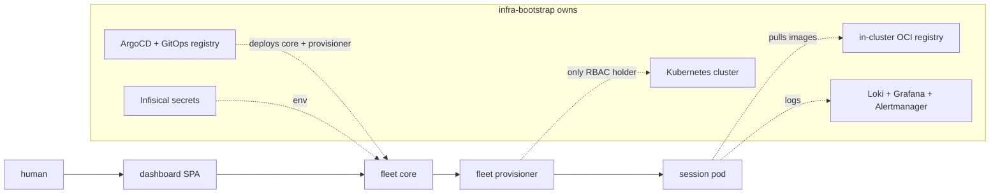
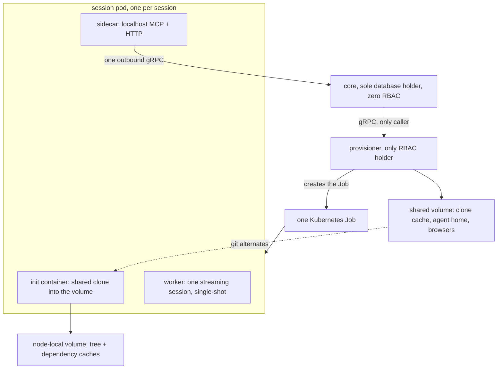
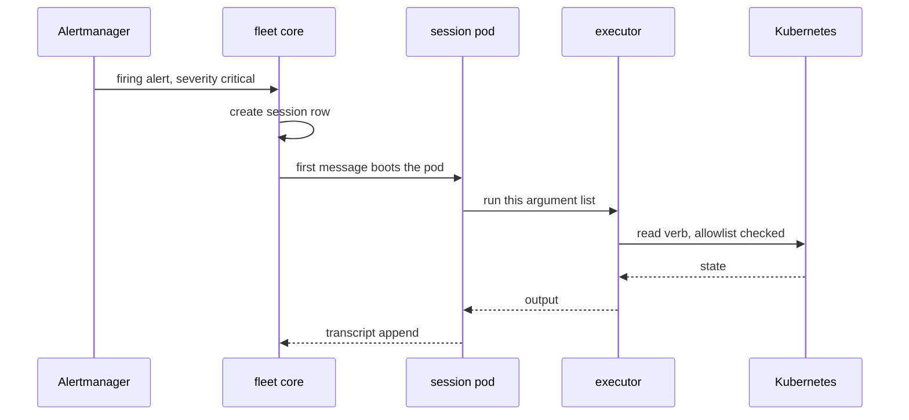

## Introduction

Three earlier posts covered how this cluster came to exist: [building it from blank machines](/blog/road-to-self-hosted-kubernetes-cluster), [removing the single point of failure in front of it](/blog/how-i-reached-high-availability), and then [tearing the whole thing down and rebuilding it declaratively on Proxmox](/blog/rebuilding-my-cluster-on-proxmox). They all end at the same place — a self-hosted Kubernetes cluster that serves my things reliably, and that I still have to operate by hand.

This post is about what I built on top of that, and it is a different kind of story. Not a build log with a happy ending, but a design I got wrong, ran for three weeks, and then deleted almost entirely. The deletion is the interesting part.

The thing is called `agent-fleet`. It runs Claude Code agents as Kubernetes workloads on my own hardware: one pod per working session, each with a real clone of a real repository, each able to build, test, commit and open a pull request. I talk to them through a dashboard. They do not share a machine with my laptop, they do not depend on my laptop being awake, and when one of them wedges itself, it dies and the cluster notices.

Ten weeks of work, across two repositories: 144 merged pull requests in the platform repo, 183 in the fleet repo, 88 architecture decision records between them. I am not going to walk through all of it. I want to describe one arc — the shape the fleet started as, why that shape rotted, and what replaced it — because it is the most useful thing I learned, and because I keep seeing the same mistake in my own designs.

## What the fleet actually is

Before internals, the contract. There are two repositories and they own strictly different things.

`infra-bootstrap` owns the substrate: three Proxmox hosts, the Kubernetes cluster installed with kubespray, Cilium, MetalLB, Traefik, ArgoCD, Postgres via Pigsty, an in-cluster OCI registry, secrets, and the whole observability stack. `agent-fleet` owns the agents, and consumes the substrate without redefining any of it.

That boundary matters more than it looks. The fleet holds no cluster credentials except in one component. The provisioner is the only thing with a Kubernetes `Role` — namespaced, never a `ClusterRole` — and the core, which holds every database credential, has no cluster access at all. An agent that goes wrong can do a great deal of damage inside its own pod and its own git branch, and almost none outside it.

## Version zero: one pod per repository

The first design was one long-lived worker pod per target repository. Inside each pod, a shared volume held a git worktree per task. A task arrived, the fleet created a worktree and a branch for it, the agent worked in that worktree, and the fleet cleaned up afterwards.

Everything about that felt correct at the time, and I can still reconstruct the reasoning. A pod per repository means dependencies stay warm between tasks — no reinstalling `node_modules` for every small change. Worktrees mean several tasks can share one clone instead of paying for a fresh one each time. And a queue in front of it all, with leases and heartbeats and a retry counter, means no task is ever lost if a pod dies.

Every one of those sentences is a real engineering argument. Together they were wrong, and it took three weeks of small repairs before I understood why.

The tell was the shape of the repairs, not their number. Each one was locally correct. None of them made me re-ask whether the underlying thing needed to exist.

## The three weeks it quietly rotted

Here is what the repair log actually looks like, and I am picking the ones that hurt.

**The branch sweep never removed a single worktree.** The fleet's cleanup logic — the thing whose entire purpose was to keep the shared volume from filling up with dead worktrees — had never once worked in production. It ran, it reported success, and it removed nothing. That bug is not really about worktrees. It is about owning a lifecycle whose success you never verified, because the failure mode is invisible until the disk is full.

**The log viewer never returned anything: six bugs in one path.** Six. Not one bug with five consequences — six independent defects stacked in a single feature, which is what happens when you build a surface nobody looks at until the day they urgently need it.

**A worker crashed mid-session because the image had no `ps`.** The agent shelled out to something that wanted `procps`, the process table lookup failed, and the session died. One `apt-get install` in a Dockerfile. Deeply unglamorous, and a perfect illustration of how much of this work is not clever.

**The worker ran as root, which crashed the most permissive mode.** The mode meant to let an agent work without being asked for permission was the one mode that could not start, because of a file-ownership assumption nothing had ever tested.

**Three separate defects were mis-reporting whether a session was alive.** The dashboard would show a session as working when its pod was gone, or blocked when nobody was waiting on anything. This is the worst class of bug in a system like this: it does not break the work, it breaks your ability to trust what you are looking at.

Look at that list as a set rather than a queue. The queue was never contended — it never had two producers and never had a backlog. The lease-and-reclaim machine existed to recover work that in practice was never lost. The worktree lifecycle existed so the fleet could manage trees the agent was perfectly capable of managing itself. And the `status` column had eight values, one of which — `done` — had _no writer anywhere in the codebase_. Nothing ever set it. Completion was inferred somewhere else entirely.

I had built a scheduler for a workload that did not need scheduling, and then spent three weeks maintaining the scheduler.

## One session, one pod, one shared home

The replacement is one decision record, and it deleted more than it added. Seven earlier decisions were superseded outright, plus half of two more.

The new shape: a session is the unit, and it has exactly one pod. There is no queue at all. Creating a session writes a database row and nothing else; the _first message_ is what boots the pod. There is no heartbeat and no lease — liveness is reconciled against Kubernetes every sixty seconds, because Kubernetes already knows whether a pod exists and is a better source of truth than anything I would write. The pod's tree is a shared clone made by an init container into its own node-local volume. The fleet does not create worktrees and does not name branches; the agent does its own `git checkout -b`, like a person would.

Two details in that diagram are the whole trick.

The **shared clone** means a new session does not pay for a full clone. There is one cache clone per repository on a replicated volume, and each session's tree borrows its objects through git's alternates mechanism. Cheap trees, no shared writable state.

The **split by access pattern** came from measuring rather than guessing. The working tree and the dependency caches live on node-local disk, because they are rebuildable and want speed. Only the clone cache and the session-resume state live on replicated storage, because those are the things whose loss actually costs something.

What got deleted along the way: the queue, the status enum, the lease and heartbeat and reclaim machine, a hundred-line task-claiming function built on advisory locks and `SKIP LOCKED`, worktrees, branch naming, an "environment recipe" system that stored per-repo build commands, and an entire second pod that existed as a sandbox — the last of which I removed in a pull request whose title starts with `refactor!` and whose diff is almost all subtraction.

The fleet went from version 2.0.0 to 3.0.0 in four days. Both majors were deletions.

## Keeping a human in the loop

The part I misjudged worst was not the runtime. It was permissions.

An agent that can run arbitrary commands on hardware I own needs a real boundary, and "real" turns out to mean "structural", not "an instruction in a prompt". My cluster's own guiding document puts this as a hierarchy I now believe in: a rule should ideally make the bad state impossible to represent; failing that, it should be checked automatically; and only as a last resort should it be prose an agent is trusted to comply with, or a question asked of a human.

In practice the fleet asks. Every tool call an agent makes goes through a permission check, and the interesting ones surface in the dashboard as a decision I have to answer. A fixed list always asks regardless of mode — `git push`, `gh`, `rm`, `sudo`, `kubectl`, `curl`, `wget`, `env` — because those are the calls that reach outside the pod.

Two problems with that, both instructive.

First, a blocking question used to die with its pod. Sessions are torn down when idle, so a question I did not answer within the idle window vanished, along with the turn waiting on it. The fix was to make the question durable: it survives teardown, and its answer is delivered to the _next_ pod when the session warms again — even days later. An agent asking a human is only useful if the human is allowed to be slow.

Second, and more embarrassing: the escape hatch was lying. There is a mode that skips permission prompts entirely, meant for sessions a human deliberately launches that way. A recent SDK upgrade — pulled in to fix something unrelated — replaced the permission evaluator underneath the fleet, and in the new evaluator that mode can only be set at launch. A request to switch into it mid-session is refused.

The fleet did not notice the refusal. It logged a warning, allowed the parked tool call anyway, wrote the new mode to the database, and flipped the badge in the dashboard. The next tool call prompted again. From the outside, a refused switch and a working switch looked identical.

Finding that required reading the actual shipped binary, because the SDK's own documentation is wrong about at least one branch of it. The resulting decision record is blunt about the conclusion: the permissive mode is a _launch profile_, not a control you can request at runtime, and the always-ask list outranks every mode including that one. A boundary you can talk your way past at runtime was never a boundary.

## The cluster gets its own agent

The other half of this, and the reason I built any of it, is that a cluster which can run agents can also be _repaired_ by them.

There is an agent whose scope is the cluster itself. It started as a standing service with its own permanent cluster permissions, and within four days I deleted the standing service and made it an ordinary session — same pods, same permission prompts, same dashboard, no special case. The only privileged thing left is a tiny component with a single remote procedure: run this argument list, on behalf of a pod that holds no credentials at all. Reads are checked against an allowlist. Mutations are a dumb pipe, because a human already approved that exact command through the permission prompt.

Then alerts became an input.

A critical alert now creates a session. The agent wakes up with the alert as its first message, investigates with read-only cluster access, and either explains the problem or proposes a fix as a pull request for me to merge. The two sessions I asked for context at the start of writing this post were exactly that: one had already diagnosed a failed Kubernetes Job — a volume permission issue, a missing `fsGroup` — and shipped the fix.

Getting there was, predictably, a sequence of things not working. The alerts never reached the agent at first: wrong severity matcher on one side, and no path at all from Grafana on the other. The link in the alert pointed at an address only reachable from inside the cluster. The log-based alert did not say _which_ error had spiked, which is the only detail that makes such an alert actionable. Each one is a two-line fix that took a day to find.

## What it costs

Two things, both worth naming.

**Context is the scarce resource, not compute.** An agent's context window fills with tool output, and a single unbounded command — a verbose test run, a log dump — can consume most of it and take the useful history with it. The fix that stuck was capping output at the source, always with a documented way to get the full thing when it is genuinely needed. Truncation with no escape hatch produces confidently wrong conclusions, which is worse than no output at all.

**Observability of the fleet is not the same as observability of the cluster.** Metrics are scoped to the two long-lived components plus one cell per live session pod; anything richer belongs in Grafana, which already exists and is better at it.

## What I would tell myself in July

Three things.

**The repairs are the signal.** When a component collects consecutive fixes, the question is not whether each fix is correct. It is whether the component should exist. Three of my decision records in a row were repairs to a sandbox whose entire purpose was letting _one tool_ skip a permission prompt. Nobody asked why the sandbox was there, including me.

**Do not own what the thing you are managing can own itself.** The fleet managing git worktrees for an agent that knows git perfectly well was pure invented liability. Same for build recipes: instead of the fleet storing how to build each repository, the agent now reads the repository, where that information already lives and is maintained by whoever changes it.

**Let a boundary be structural, not polite.** Every permission mechanism I built on trust eventually got talked past — usually by my own code, silently. The ones that hold are the ones where the bad state cannot be represented: no credentials in the pod, one component with cluster access, an always-ask list evaluated before any mode can override it.

The cluster is still three second-hand computers in my home. What changed is that it now does some of its own maintenance, and files pull requests for the rest. This post was written by an agent running on it, in a pod, on a branch, from a pull request I reviewed.
