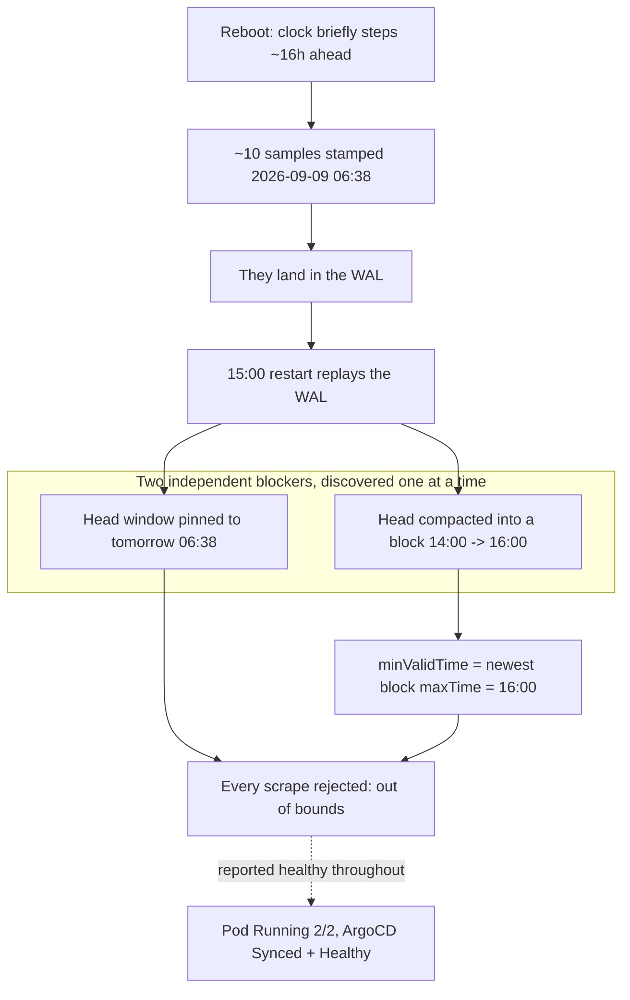

## Introduction

I rebooted all three Proxmox hosts this morning. A couple of hours later I went looking for whatever the reboot had broken, in the way you do — expecting a stuck pod, a volume that hadn't reattached, an app that came back before its database did.

Everything was green. Five nodes `Ready`. Zero pods outside `Running`/`Succeeded`. All thirty-two ArgoCD Applications `Synced` and `Healthy`. Every PVC `Bound`, every Longhorn volume `healthy`. The Prometheus pod itself: `Running`, `2/2`, no restarts worth mentioning.

Prometheus had not ingested a single sample in over half an hour.

This is the story of a failure that produces no red anywhere, because the component that failed is the one that colours everything else — and of a fix that looked complete twice before it actually was.

## The green that meant nothing

The first useful thing I ran was not a health check. It was this:

```
count(up)
```

It came back empty. Not `0` — _empty_. There was no `up` series at all, for any target, at the current instant. A cluster where 52 targets had been scraping happily an hour earlier now had none, and nothing in Kubernetes had noticed, because nothing in Kubernetes was measuring it.

The logs said the same thing, on every scrape pool at once:

```
level=warn component="scrape manager" scrape_pool=serviceMonitor/monitoring/...
  msg="Appending scrape report failed" err="out of bounds"
level=warn msg="Error on ingesting samples that are too old or are too far
  into the future" err="out of bounds"
```

Every pool. Not one exporter, not one node — apiservers, kubelets, kube-state-metrics, my own app service monitors, all rejected identically. When a failure is that uniform it is almost never the targets. It is the thing doing the writing.

Prometheus's own view of its storage explained it:

```json
"headStats": {
  "numSeries": 10,
  "minTime": 1788935900563,
  "maxTime": 1788939500563
}
```

Those timestamps are **2026-09-09 06:38 and 07:38** — the next morning. About sixteen hours in the future. Ten samples had been written with future timestamps, and the head block's valid window had moved out there with them. Every real sample arriving at the actual current time was now _older_ than the minimum the head would accept, and got rejected as out of bounds. Prometheus would have stayed blind until the wall clock caught up with its own head, some time after breakfast tomorrow.

The container's clock was correct. Prometheus's own `time()` agreed with mine to the second. Whatever had stamped those samples was over.

The ten poisoned series were the interesting part. They came from apiservers on three different nodes, from kube-state-metrics, and from a kubelet — five different targets. A single misbehaving exporter can put one bad timestamp in your database. It cannot put one in five unrelated ones simultaneously. Prometheus stamps samples with its own clock at scrape time, so the only thing consistent with that spread is that _Prometheus's_ clock was briefly sixteen hours ahead during the reboot, wrote a handful of samples, and then got stepped back by NTP.



## What the reboot had actually cost

Before touching anything I checked whether the history was still there, because the repair I had in mind involved deleting things.

```
count(up) @ 04:00 -> 52
count(up) @ 09:33 -> 52
count(up) @ 12:20 -> 52
count(up) @ 14:50 -> 52
count(up) @ 15:10 -> empty
```

Seven days of compacted blocks on disk, all intact and queryable. The damage was confined to the in-memory head and the write-ahead log, and the gap started somewhere between 15:00 and 15:10. That mattered: it meant the cheap fix — throw away the head, keep the blocks — cost nothing I cared about.

The expensive fix would have been the surgical one. Prometheus has an admin API that can delete individual series by matcher, which would have removed exactly the ten poisoned ones and left everything else alone. Mine has `enableAdminAPI: false`, and turning it on means a values change, a pull request, an ArgoCD sync and a restart — during all of which the monitoring stays blind. For ten junk series and a head block containing nothing else, that is a lot of ceremony to preserve nothing.

So: delete the WAL and the head chunks, leave the block directories alone, restart.

## The fix that removed the error but not the fault

It worked, in the sense that everything I had been looking at changed to what I wanted.

```json
"headStats": { "numSeries": 0, "minTime": 1788883200000 }
```

Head empty. Future timestamps gone. The `Appending scrape report failed` lines stopped and never came back. Thirty block directories still on disk, history still queryable at 04:00. By every signal that had told me the system was broken, the system was now fixed.

`count(up)` was still empty.

This is the part of the day worth writing down. I had a clear hypothesis, I acted on it, the symptom I had been tracking disappeared, and the function I actually cared about had not come back. If I had verified by grepping for the error message — which is the natural thing to do, and which I had already half-done — I would have declared victory on a system that was still ingesting nothing.

The remaining `out of bounds` lines had quietly changed character. They no longer said `component="scrape manager"`. They said `component="rule manager"`, discarding recording-rule results. Same error string, different subsystem, completely different meaning. A grep for `out of bounds` returned 651 hits and would have looked like total failure; a grep for `Appending scrape report failed` returned zero and would have looked like total success. Neither number was the answer.

The answer was in that `minTime`: `1788883200000` is **16:00:00Z**, and it was 15:33.

Prometheus sets the head's minimum appendable timestamp to the `maxTime` of the newest block on disk. It will not let you write into a range a persisted block already claims. So I went and read the metadata of all thirty blocks:

```
01M20RHJS6KZ855GZVWCC72ZZ8  06:00:00Z -> 12:00:00Z   274,577 series
01M20RH8ETFJ0Y422BPZCBAJZB  12:00:00Z -> 14:00:00Z   198,289 series
01M20RHCRF8E02NXB2VSE6Y0SQ  14:00:00Z -> 16:00:00Z   198,985 series
```

Exactly one block of thirty ended in the future. When Prometheus restarted at 15:00 with a poisoned head, it compacted what it had into a block whose aligned range runs to 16:00Z — and from then on refused to accept anything before 16:00Z, because as far as it was concerned that hour was already written.

Two independent blockers, from one root cause, discovered one at a time. Clearing the WAL had genuinely fixed the first. It had no effect whatsoever on the second.

## Renaming instead of deleting

The block had to stop being visible. It also held a real hour of metrics — 14:00 to about 15:05 — and I did not want to destroy that to save twenty minutes.

Prometheus decides what is a block by trying to parse the directory name as a ULID:

```go
func isBlockDir(fi fs.DirEntry) bool {
	if !fi.IsDir() { return false }
	_, err := ulid.ParseStrict(fi.Name())
	return err == nil
}
```

So a rename is enough. `01M20RHCRF8E02NXB2VSE6Y0SQ` became `quarantined-01M20RHCRF8E02NXB2VSE6Y0SQ`, which is not a ULID, which means it is not a block, which means it does not count toward the newest `maxTime`. Nothing was deleted. Renaming it back and restarting brings the hour of history straight back.

The next-newest block ends at 14:00Z. On restart, `minValidTime` dropped to 14:00Z, which was comfortably in the past, and:

```
count(up) -> 52
count(up == 0) -> none
count(up) @ 04:00 -> 52
"Appending scrape report failed" -> 0
```

Ingesting again, no targets actually down, seven days of history still there. The cost was one hour of week-old metrics hidden behind a rename, and a permanent gap in the graphs between 15:05 and 15:47.

## The one check that worked

The whole point of this post is that every signal I trusted was wrong, so it is worth being precise about the one that wasn't.

There is a Grafana alert rule on this cluster called `monitoring-blind`. It exists because Prometheus is a StatefulSet and does not reschedule off a dead node, so losing a hypervisor can take the evaluator down with it — which means Prometheus cannot be the thing that tells me Prometheus is missing. Grafana is a Deployment, it runs elsewhere, and it evaluates that rule itself.

It fired at **15:15:30**, and every minute after that.

It was right, it was early, and it was the only thing in the entire stack that was. Kubernetes said healthy because the process was running. ArgoCD said healthy because the manifests matched git. Prometheus's own alerting said... well, Prometheus's own alerting said `KubeControllerManagerDown`, which was false — the controller manager was fine, it had simply stopped being observed, and an absent metric and a dead component look identical from the inside. The blindness was manufacturing its own false alarms about healthy components while staying silent about itself.

That is the shape of this class of failure. It does not announce itself. It removes your ability to see, and then reports on what it can no longer see.

I did not build that rule for this. I built it for a dead hypervisor. It caught something I had not imagined, which is the argument for having any check at all that does not share a fate with the system it watches.

## What I still don't know

The root cause is the clock, and I have not verified it. A sixteen-hour step on boot is consistent with VMs resuming without a synchronised RTC, but I could not reach the nodes over SSH to check — `Permission denied (publickey)` from both machines I tried. Until `timedatectl` is confirmed synced on all five, the next reboot can do exactly this again, and I would rather write that down than round it off into a tidy ending.

What I would fix first, though, is not the clock. It is that `monitoring-blind` fired for thirty-two minutes into a Discord channel while I was reading a dashboard that said everything was fine. The check worked. The path from the check to me was the slow part, and that is a much more boring problem than a sixteen-hour clock step, which is usually how it goes.

## The thing worth keeping

Two lessons, and the second one is the one I will actually use.

**A monitoring system cannot report its own blindness through itself.** Every health signal you have is produced by something. When the thing that failed is the thing producing the signal, a green dashboard is not evidence of health — it is evidence of nothing at all. At least one check has to be evaluated somewhere else, and that check earns its keep on a day like this rather than on the day you write it.

**"The error stopped" is not "the system works."** I removed the exact fault I had diagnosed, watched the exact error message disappear, and was still completely broken — because a second consequence of the same root cause was sitting one layer down, wearing the same error string in a different subsystem. The verification that mattered was not grepping the logs. It was asking the system to do the one thing it is for, and checking that it did.
