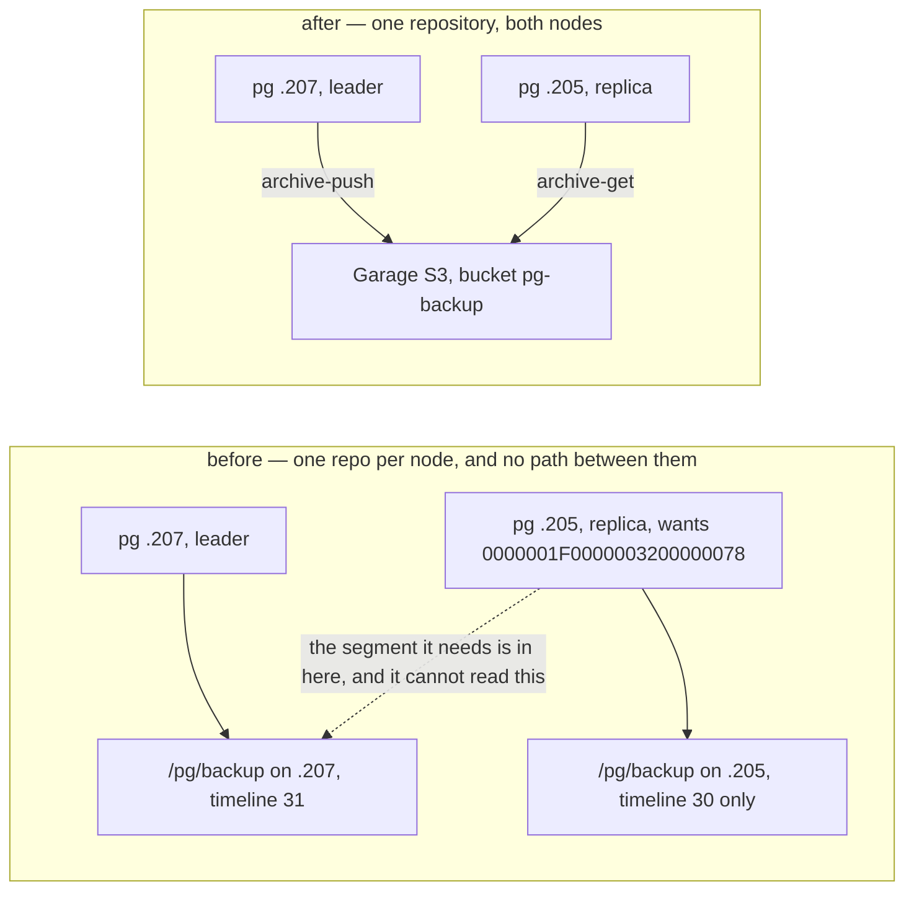
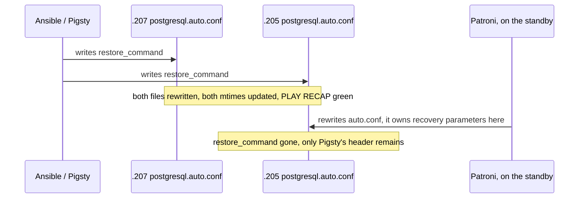

## Introduction

The earlier posts in this series covered how this cluster came to exist: [built from blank machines](/blog/road-to-self-hosted-kubernetes-cluster), [the single point of failure removed from in front of it](/blog/how-i-reached-high-availability), [torn down and rebuilt declaratively on Proxmox](/blog/rebuilding-my-cluster-on-proxmox), and then [given a fleet of agents to run on top](/blog/running-a-fleet-of-claude-agents-on-my-cluster). Somewhere under all of that sits a two-node Postgres cluster managed by Patroni, which has been quietly correct for long enough that I had stopped thinking about it.

On the twenty-fifth of August I went to look at why a photo app was down. It was down for its own unrelated reason. But while I was in there I noticed that one of the two Postgres nodes had been a non-streaming replica for over a day. The cluster had been running on a single node the entire time. Nothing had alerted. Nothing would have.

This is the story of the day after that: what was actually broken, why the fix I was sure of was wrong, and the one trap that neither I nor the runbook I wrote saw coming.

## The replica that was dead for a day

`pg-proxmox-1` was stuck in `state=starting`, `lag=unknown`, `tl=None`. Its Postgres log had one thing to say, every five seconds, for a day and a half:

```
FATAL: could not receive data from WAL stream: ERROR: requested WAL segment
       0000001F0000003200000078 has already been removed
LOG:   waiting for WAL to become available at 32/78000018
```

The leader had recycled the WAL the replica needed. That is a normal thing for a leader to do — `max_slot_wal_keep_size` is set to 18 GB, and past that the leader stops holding segments hostage for a replica that isn't keeping up. What is less normal is what happens next: **a replica in that state cannot recover on its own, ever.** It retries the same request forever. There is no backoff into a different strategy, no fallback, no escalation. Just the same line, every five seconds, until a human types `patronictl reinit`.

I typed `patronictl reinit`, and thirty seconds later the cluster was healthy again.

This was the second time. The first was on the fifteenth of August, in the opposite direction — the other node was the one that fell behind. My own notes had predicted it: _"this will recur after every ungraceful failover with timeline divergence … a human must run `reinit` each time."_ I had written that down, agreed with it, and then done nothing about it, which is its own small lesson about the difference between recording a risk and addressing one.

## The obvious fix that fixes nothing

I knew the fix before I started. Postgres has had an answer to this since forever: give the replica a `restore_command`, so when streaming fails it falls back to pulling the missing segment out of the WAL archive. pgBackRest is already running on both nodes. The archive exists. It is one line of config.

It would have fixed nothing, and finding out why is the actual result of this whole exercise.

`repo1-path=/pg/backup` is **a directory on each node**. Not a shared repository — a local path that happens to have the same name in two places. Each node has been backing up to its own private copy, and after months of failovers the two had diverged:

| Node                       | WAL archive range it holds                                                |
| -------------------------- | ------------------------------------------------------------------------- |
| `.207` (current leader)    | `0000001B00000018000000C4` → `0000001F00000033000000AF` (timeline 31)     |
| `.205` (the stuck replica) | `0000001E0000003000000085` → `0000001E0000003200000077` (timeline **30**) |

The segment `.205` needed is on timeline 31. It existed. It was sitting in `.207`'s repository, which `.205` has no way to read. A `restore_command` on `.205` would have queried an archive containing no timeline-31 WAL at all — and it would have looked completely configured while doing it.



One root cause, three consequences, and only one of them was the one I came in looking for:

1. **The backups don't survive the node holding them.** `.205` lives on `server1`, which had been [isolated from the LAN for 23 hours and 40 minutes](/blog/rebuilding-my-cluster-on-proxmox) the previous day when its USB uplink dropped out of its bridge and nothing put it back. Losing that VM loses every backup on it. That is a durability problem wearing a backup system's clothes.
2. **The archive splits at every failover.** Neither repository holds a complete history, so neither is a trustworthy point-in-time-recovery source across a role change.
3. **No replica can ever self-heal**, which is precisely why a manual `reinit` had been the only remedy both times.

The part that stung: a Garage bucket and an access key for exactly this had been provisioned on the twenty-sixth of July and never used. The playbook that creates them says so in the comment: _"provisional — rename freely once pigsty's `pgbackrest_repo` config is written."_ It was never written. The config block sat commented out, and Pigsty silently fell back to its `local` default.

## Shipping the alert first

Before touching any of that, I shipped the smaller thing, because the worst part of the incident wasn't the failure. It was that the failure was invisible for a day and got found by accident.

```
(count(patroni_replica == 1 and on(instance) patroni_postgres_streaming == 0) or vector(0)) > 0
```

Ten minutes, against Pigsty's own VictoriaMetrics. Simple enough that it looks like it doesn't need explaining, which is exactly the kind of expression that eats you.

**The `or vector(0)` is load-bearing.** `count()` over an empty vector doesn't return `0` — it returns _no data_. And this rule has `noDataState: Alerting`. So the healthy case, zero non-streaming replicas, would have produced no data, which would have been read as "alerting", which means a brand-new alert that fires permanently on a perfectly healthy cluster and gets muted within a week. I ran both forms against live data before committing:

```
bare count()        -> EMPTY (no data)   <- would fire forever on a healthy cluster
... or vector(0)    -> 0                 <- correct
```

`execErrState` and `noDataState` are both `Alerting` deliberately, and that is not laziness. The datasource this rule queries runs on `.205`. If `.205` is what died, the query erroring **is** the signal I want.

## Four things checked before writing a line of config

The plan was now: point pgBackRest at the Garage bucket so both nodes share one repository, and only then add the `restore_command`, which is meaningless — worse than meaningless — until the repository is shared.

I wrote that up as an ADR and then spent the time to check four assumptions, because a Pigsty run against a live database cluster is not a place I want to be discovering things.

| Check                                 | Result                                                                                                                                                                           |
| ------------------------------------- | -------------------------------------------------------------------------------------------------------------------------------------------------------------------------------- |
| Can I use the LAN endpoint?           | **No.** pgBackRest 2.58's S3 driver has no scheme option — it always speaks TLS. Garage serves plain HTTP on `:3900`. `garage.bnei.lan` doesn't resolve from the pg nodes either |
| Is `s3.bnei.dev` reachable from them? | Yes — `403` from `.207`, which is Garage's own auth error, meaning the request arrives. Grey at Cloudflare, so it doesn't traverse the edge                                      |
| Does the origin lock block it?        | No — the `garage-s3` IngressRoute carries no middlewares at all, and the allowlist admits `192.168.1.0/24` anyway                                                                |
| Do the credentials work?              | Yes — the keys provisioned in July and never touched authenticate against `pg-backup` with a signed request: HTTP 200, `KeyCount 0`                                              |

The first row is the interesting one. `192.168.1.199:3900` was the obvious endpoint: fewest hops, no Traefik, no DNS involved. It simply isn't available to this client, and the way you find that out is reading pgBackRest's help output and noticing what _isn't_ there — `--repo-storage-host`, `--repo-storage-port` and `--repo-storage-verify-tls` all exist, and nothing selects `http`.

## The failure that reports success

The credentials resolve through `lookup('env', ...)`, because `pigsty.yml` is tracked in git and secrets are not going in it. That means the playbook run has to be wrapped by Infisical.

I tested the unwrapped case instead of assuming it, and it was worse than I expected:

```
env -u PGBACKREST_S3_ACCESS_KEY ...   ->   key=[]  + SUCCESS
```

A bare `lookup('env')` on a missing variable returns an empty string, and Ansible reports the task as **successful**. An unwrapped run would have written a `pgbackrest.conf` with no credentials in it, printed a green PLAY RECAP, and left the trap sitting on `main` for whoever ran Pigsty next without reading the comment above the block.

Closed with `or undef(...)`, which fails at template time and names the missing variable. Both paths retested:

| Run               | Before                 | After                                                                   |
| ----------------- | ---------------------- | ----------------------------------------------------------------------- |
| unwrapped         | `key=[]` + **SUCCESS** | `PGBACKREST_S3_ACCESS_KEY is empty - the run must be Infisical-wrapped` |
| Infisical-wrapped | resolves               | resolves (key + 64-char secret)                                         |

Hold onto that shape — _the failure that reports success_ — because it is the entire theme of the rest of this post.

## The run, and both traps firing on cue

There were two traps I knew about, both written into the runbook, both inside Pigsty's own `pgbackrest` tag:

- **`stanza-create` and the initial backup are both `ignore_errors: true`.** A green PLAY RECAP proves precisely nothing about either.
- **The initial backup is guarded by `/etc/pgbackrest/initial.done`**, which already existed from the original bootstrap. So the run creates an empty repository against S3 and reports success, and you end up migrated with no backup at all.

Both fired, and a third thing I'd flagged as "worth fixing separately" turned out to be the amplifier. Those two tasks gate on the **inventory** `pg_role`, not the live one. `pigsty.yml` still declares `.205` as primary; Patroni has had `.207` leading for a while. So `stanza-create` and the initial backup ran on `.205` and were skipped on `.207`.

Net result of the run: a stanza with no backup in it, and a completely green PLAY RECAP. Anyone doing this without the runbook would have walked away believing they had backups.

I took the first full backup by hand on the live primary, and then the numbers were good:

| Check                      | Result                                                                        |
| -------------------------- | ----------------------------------------------------------------------------- |
| `repo1-type` on both nodes | `s3`, bucket `pg-backup`, path style                                          |
| WAL archiving              | 448 archived, **0 failed**                                                    |
| First full backup          | `20260826-065830F` — 8.4 GB → 4.1 GB, 14,969 files, 78s                       |
| Repo genuinely shared      | `.205` reads the backup `.207` took                                           |
| Replica can fetch WAL      | `archive-get` on `.205` retrieved a 16 MB segment: _"found … in the archive"_ |
| Cluster                    | `streaming`, lag 0, timeline 31 throughout                                    |

That fourth row is the whole point of the exercise. An hour earlier it was structurally impossible.

## The trap nobody predicted

And then I checked the `restore_command`, which was the other half of the change, and it was on `.207` and **absent on `.205`**.

`.205` is the replica. It is the only node that ever uses a `restore_command`. The setting had landed exclusively on the node that has no use for it.

I checked rather than guessed at why, because the obvious explanations were all wrong:

- Ansible resolved `pg_parameters` **identically on both hosts**. Not a templating problem.
- `postgresql.auto.conf` was **rewritten on both** — the mtime updated on each. Not a "the task didn't run" problem.
- Yet the replica's file contained nothing but Pigsty's header.

Something rewrote that file after Pigsty did, and on a standby the thing that owns recovery parameters is Patroni. `pg_parameters` writes `postgresql.auto.conf`; Patroni rewrites `postgresql.auto.conf` on a standby; Patroni goes last.



**`pg_parameters` is not a reliable home for anything a replica must honour.** The correct home is Patroni's own DCS config:

```bash
patronictl -c /etc/patroni/patroni.yml edit-config pg-proxmox \
  -p "restore_command=pgbackrest --stanza=pg-proxmox archive-get %f %p" --force
```

That applies to every member, survives restarts, failovers and `reinit`, and isn't clobbered by the next Pigsty run — the `dcs:` block in Pigsty's template only takes effect at bootstrap. The `pg_parameters` entry stays in `pigsty.yml` as the rebuild-from-scratch path, but it is not what governs the running cluster. After the edit, both nodes report the setting.

The reason this one is worth more than everything above it: had I not checked per node, the ADR would have been marked complete, the runbook would have been marked followed, and the exact fragility the whole exercise exists to remove would still have been fully present on the only node that needed the fix — now with a paper trail claiming otherwise.

## Six false trails

Each of these produced a confident wrong reading. I'm recording them because the next person to touch this will hit the same tooling.

**1. "The backups are gone."** The pre-migration state check reported `du -sh /pg/backup` → `0` on _both_ nodes, while `pgbackrest info` happily listed real full backups. `/pg/backup` is a **symlink** to `/data/backups/pg-proxmox-18/backup`, and `du` doesn't follow symlinks. The data was there all along — 8.6 to 8.7 GB per node. Taken at face value this reads as "the local repos are already empty, nothing to preserve," immediately before a migration whose entire rollback story depends on those files existing.

**2. "Garage is unreachable from the pg nodes."** The first connectivity test said all three endpoints were dead: `/dev/tcp/garage.bnei.lan: No such file or directory`, and the same for the other two. `/dev/tcp` is a **bash** feature, and `ansible -m shell` uses `/bin/sh` on these hosts. The error was about the shell, not the network. Re-testing with `curl` gave a materially different answer — `192.168.1.199:3900` and `s3.bnei.dev` both returned `403`, i.e. reachable. Taking the first result at face value would have killed the approach on a false negative. One genuine finding did survive the correction: `garage.bnei.lan` really doesn't resolve from these nodes.

**3. "Just point it at the LAN endpoint."** Covered above — pgBackRest 2.58's S3 driver is TLS-only, Garage's `:3900` is plain HTTP.

**4. "A `restore_command` would have fixed the original incident."** This was the plan going in, and it was wrong for the reason the whole middle of this post is about.

**5. "An unwrapped run would obviously fail."** It reported SUCCESS.

**6. "`--check` will tell me if this is safe."** It won't. `--check` fails on these Pigsty and Ansible paths for reasons unrelated to correctness: command tasks don't execute under check mode, so registered output is empty and every downstream filter blows up. Check mode provides no safety here at all. Safety came from ordering instead — shared repo first, verify, take the backup by hand, verify again, and leave the local repositories untouched.

## What's still unproven

The mechanism is proven: the replica demonstrably fetches a WAL segment from the shared archive, in about three seconds. What has **not** been exercised is PostgreSQL invoking that path under the real failure condition.

The test that closes it: stop the replica, push the primary past the 18 GB `max_slot_wal_keep_size` — which is deliberate work, not a wait — restart the replica, and confirm it reaches `streaming` with no `reinit`, watching for `restored log file` in the log instead of the `has already been removed` loop.

Until that passes, the decision is _prepared_, not _implemented_, and the document says so in its status line. The pre-migration local repositories are deliberately still sitting there, 8.6 GB per node, which keeps rollback a one-line config flip.

## What I take from it

There is no CI on any of this. The lint workflow in that repo triggers on `ansible/**` and `gitops/**`, and the Pigsty config lives in neither — both pull requests reported "no checks reported on the branch", and two CI-wait loops timed out waiting for runs that were never going to start. Every check that happened here was one I chose to run.

Which makes the split unusually clean, so I'll state it plainly:

**The things I verified against reality up front all survived contact with reality.** The alert expression, tested live in both forms before committing. The credentials, tested with a signed request. The unwrapped run, actually run unwrapped. Not one of them needed correcting afterwards.

**The one thing I reasoned about instead did not survive.** `pg_parameters` sets a Postgres parameter, `restore_command` is a Postgres parameter, therefore `pg_parameters` sets `restore_command`. Every step of that is true and the conclusion is false, and no amount of re-reading the config would have shown it. Only reading the value back, per node, on the running cluster.

The failure mode running through all of it is the same one, six times over: `ignore_errors: true`, `lookup('env')` on a missing variable, `count()` over an empty vector, `du` on a symlink, `/dev/tcp` under `/bin/sh`, and `pg_parameters` resolving identically on two hosts and landing on one. **None of them failed. All of them reported success.**

A green PLAY RECAP is a statement about Ansible's opinion of Ansible. It is not evidence about the system.
