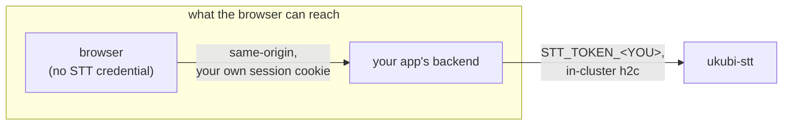
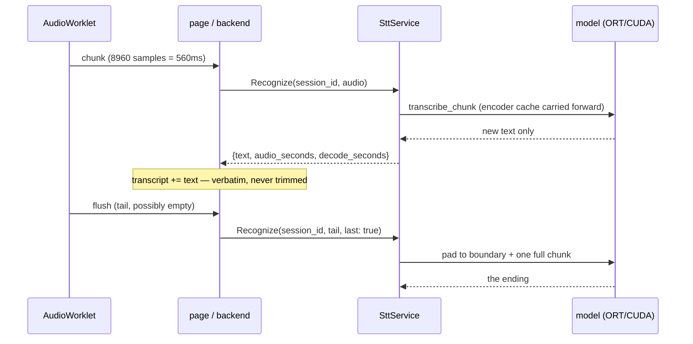

## Introduction

The cluster [I keep rebuilding](/blog/rebuilding-my-cluster-on-proxmox) got a GPU node this summer: one machine with an RTX 2070 SUPER, which also happens to be the machine I game on. `ukubi-stt` is the first workload that actually needs it. It is a single Rust binary that turns microphone audio into text, over gRPC, in roughly real time, and it is used today by two of my own apps — `dream-analyst`, where you dictate a dream instead of typing it, and the `agent-fleet` console, where I dictate prompts at agents instead of typing those either.

It went from empty repository to production in three calendar days. That is not the interesting part. The interesting part is the first commit, which contains no service at all — just a function that loads the model, reads GPU memory before and after, and refuses to continue if the number did not move.

When that check first ran on real hardware, it failed. Everything else said the service was fine.

```
gpu.used before load : 1 MiB
model loaded in      : 2.4s
gpu.used after warmup: 1 MiB (delta 0 MiB)
real-time factor     : 0.081
GATE FAILED: GPU memory grew by only 0 MiB (< 128 MiB)
```

A real-time factor of 0.081 is twelve times faster than speech. The transcripts were correct. `nvidia-smi` answered from inside the container. Every log line read as success. The model was running entirely on the CPU, and without that one memory assertion I would have shipped a GPU service that never touched the GPU and only found out when someone complained it felt slow.

That failure mode — _succeeding, slowly, on the wrong device_ — turned out to be the shape of the entire project. Almost every bug I hit over those three days was a silent one that presented as "the model is a bit wrong". This post is about them.

## What it actually is

Before internals, the contract, because it is unusually small.

One gRPC service, one unary RPC:

```proto
service Stt { rpc Recognize(RecognizeRequest) returns (RecognizeResponse); }
```

Audio in is raw 16 kHz mono little-endian s16 PCM. No container, no encoding enum — the caller has already decided what it is sending, and a format field whose only legal value is one thing is a field that lies. Anything not 16 kHz is rejected rather than resampled, because a silently resampled request returns a plausible transcript and a meaningless real-time factor.

Text out is a fragment, plus two floats: `audio_seconds` and `decode_seconds`. Those two are in the wire format on purpose. The failure this service is most prone to is decoding correctly on the wrong device, which looks like success in every way except speed — so the number that reveals it is part of the contract, not a debug log.

There is one RPC and not two because `session_id` selects the mode. Empty means a one-shot offline decode of a whole utterance. Non-empty means realtime: the server keeps a streaming recognizer for that id, the client sends ~560 ms chunks in order, and sets `last: true` on the final one.

The credential shape matters more than it looks, and both consumers arrived at it independently:



No browser ever holds an STT credential. Handing one to the page would give every user of the app a credential for my GPU, recoverable from devtools — and `stt.bnei.dev` shows up in Certificate Transparency logs minutes after issuance, so the endpoint is not obscure. It also happens to be the only shape that works: both consumers' APIs allow no CORS and their session cookies are `SameSite=Lax`, so a cross-origin call from the page carries no identity at all. There is nothing to relax. The proxy is the design.

The pay-off beyond credentials is that `session_id` stops being client-chosen. Derive it server-side from the authenticated user and one user cannot interleave audio into another's recognizer.

## Gate 0: the assertion before the service

The design rested on one unverified assumption — that `parakeet-rs`'s CUDA execution provider actually engages on a Turing card through this cluster's container runtime. Writing the gRPC layer first would have built on sand, and the streaming proto is precisely the artefact an engine swap invalidates. So the first commit is the assertion and nothing else, and the README still carries its name: Gate 0.

Here is why that is not paranoia. `parakeet-rs` registers execution providers like this:

```rust
ExecutionProvider::Cuda => builder.with_execution_providers([
    ort::ep::CUDA::default().build(),
    CPUExecutionProvider::default().build().error_on_failure(),
])?
```

`error_on_failure()` is on the **CPU** provider. If CUDA fails to initialise, ONNX Runtime falls through to CPU, the model loads, transcribes and returns correct text — roughly thirty times slower, with nothing in the logs that reads as an error.

There is a second trap sitting in front of that one: the `cuda` cargo feature _enables_ the provider, it does not _select_ it. `from_pretrained(path, None)` gives you a CPU session no matter what was compiled in. Both halves are required, and `docs.rs` hides the second one — it builds with default features, so the `Cuda` variant of `ExecutionProvider` never renders and the enum looks CPU-only.

So the gate is a memory delta. Read `nvidia-smi` before loading, load, run a warmup decode, read it again, and bail if the difference is under 128 MiB. Not zero, because `nvidia-smi` reports whole-GPU usage and a few MiB of noise from something else on the card must not count as success. On a startup failure this crashes the process, which is deliberate: a CrashLoopBackOff is loud and attributable, and a ready pod decoding thirty times slow on CPU is the failure this service is most likely to suffer and least likely to have noticed. Downtime was already accepted for this service, so crashing costs nothing that was promised.

### Getting to the point where it could fail

Before the gate could run at all there were three builds that died, each one caused by fixing the last.

The first died compiling `openssl-sys`: _"Package openssl was not found in the pkg-config search path"_. GitHub's `ubuntu-latest` ships `libssl-dev`, so `cargo clippy` in CI had been passing the entire time. A hosted compile check cannot verify the image's own build environment — it only verifies the code.

The second compiled and then died at link time on `__isoc23_strtoll` and `_M_replace_cold` — glibc 2.38+ and libstdc++ 13+ symbols, against an Ubuntu 22.04 base that has neither. My rule when picking the builder base had been _build on an image no newer than the runtime_. That rule was necessary but not sufficient: it constrains my binary against the runtime and says nothing about a third-party prebuilt demanding newer than both.

The third finally compiled and linked, then died in the runtime stage on `pip3 install`: Ubuntu 24.04 enforces PEP 668 and answers with `externally-managed-environment`. Rather than `--break-system-packages` or a venv, I deleted Python from the image entirely and fetched the four model files with `curl`. Working around PEP 668 means carrying about 150 MB of interpreter to fetch four plain HTTP objects.

Each build iteration costs about eleven minutes on the build runner, which is why I verified all four model URLs returned 200 by hand before committing.

### Two bugs, either one sufficient

Then Gate 0 ran and failed, and the diagnosis immediately hit a wall of its own. ONNX Runtime explains itself at `debug` level — which provider it registered, which it declined, and why — and those lines were going nowhere. `ort` routes them through `tracing`, `parakeet-rs` installs no subscriber, and neither did I. So the first real diagnosis was done by reading `ort-sys`'s build script instead of reading my own logs. Installing a subscriber with a default filter of `info,ort=debug` is now part of the binary.

That build script produced the first bug. `ort-sys` 2.0.0-rc.13 does not build ONNX Runtime; it downloads a prebuilt one chosen from a hardcoded table. For `x86_64-unknown-linux-gnu` that table holds four rows, and **none of them is CUDA 12**. Its own resolver says so:

```rust
_ => { log::debug!("couldn't determine CUDA version, guessing 13");
       "cuda13" } // "fallback" to the lowest version we ship
```

I had been building in a CUDA 12.6 image, which produced a binary wanting `libcudart.so.13`. The base image is now CUDA 13.0.3 and `ORT_CUDA_VERSION=13` is set explicitly in the builder, so the resolution is read rather than guessed.

The second bug would have been enough on its own. ONNX Runtime is linked statically — `ldd` on the binary shows no `libonnxruntime` — but the CUDA provider is not part of that archive. It is a separate 79 MB shared object that ORT `dlopen`s _next to the calling module_, which for a static link means next to the executable. The build produced it and I had copied only the binary out.

The compounding detail: `ort-sys`'s `copy-dylibs` step doesn't copy on Unix, it **symlinks** into `target/release/` from a cache directory. So the naive fix — `COPY --from=build target/release/*.so` — lands a dangling symlink in the image and fails identically. `cp -L`, and the filenames written out explicitly so an upstream rename breaks the build instead of quietly falling back to CPU.

With both fixed:

```
gpu.used before load : 4 MiB
model loaded in      : 6.2s
gpu.used after warmup: 1843 MiB (delta 1839 MiB)
real-time factor     : 0.041
GATE PASSED: CUDA engaged (1839 MiB resident), RTF 0.041
```

Only after that did I write the proto.

## The realtime part is not Whisper chunking

Everyone assumes realtime speech-to-text means a sliding window, a voice activity detector, and partial hypotheses that get revised. That is what you build when your model wants thirty seconds of audio at a time. This does something else: the streaming model is _cache-aware_. The encoder carries its own state forward across chunks, so each chunk is decoded once, in context, and the model emits only the new text.



Three consequences follow from that one property, and all three are load-bearing.

There is no `is_final` field in the proto. The model never revises what it already emitted, so the client concatenates and never has to replace a tail. An engine that revised would need that field and a very different client.

Ordering is a hard contract, not an implementation detail. The cache means a reordered or retried chunk corrupts everything after it. The browser module serialises every send through a single promise chain — exactly one request in flight, ever — and on error it abandons the stream rather than retrying. A consumer that "optimises" that into parallel sends corrupts every transcript after the first reorder.

And the chunk size is not mine to choose. 8960 samples is 560 ms, the encoder's own granularity. Smaller chunks add requests without lowering latency; larger ones add latency for nothing. Text lands roughly 560 ms behind speech, which is the chunk plus 20–50 ms of GPU and about a millisecond of in-cluster network. That number is a design figure read off the budget, not a percentile study — there is no metrics endpoint here and I have not aggregated the per-request timings into anything.

## Five bugs, all at a chunk boundary

Here is the pattern I did not see until it had happened five times. Every one of these presented as _the model is a bit wrong_, and not one of them was the model.

**The utterance lost its ending.** Measured live: a 9.23 second utterance came back as `"...on an NVIDIA G"`, dropping its final 270 ms. The encoder only emits on a _complete_ chunk, so the final partial chunk was buffered and never decoded. From the client there is no symptom beyond a transcript that is slightly short. The fix is on the server, where `last: true` already means exactly this: pad with silence to the next chunk boundary, then add one more full chunk to push the model's right-context window past the real speech. Silence decodes to nothing, so it costs one extra decode and produces no spurious text. ([#8](https://github.com/MohammadBnei/ukubi-stt/pull/8))

**The chunks were 768 ms and I never noticed.** The client shipped its whole buffer each time; the audio callback delivers a fixed block, so the buffer crossed the threshold at 12288 samples and shipped 768 ms per request. Worse, 12288 is not a multiple of the encoder chunk, so the server decoded one chunk and held the remainder until the _next_ request — about 1.4 seconds and irregular, against a smooth 650. It looked like "streaming is just laggier than it should be." Found by measuring rather than reading. ([#9](https://github.com/MohammadBnei/ukubi-stt/pull/9))

An earlier latency number I had quoted — 230-320 ms per round trip — turned out to be wrong for an unrelated reason: I had measured with a Python client that opened a fresh TLS connection per chunk. On a persistent HTTP/2 connection, which is what a browser actually uses, it is 84-102 ms of round trip and 24-27 ms of decode.

**The empty tail that broke one Stop in thirty-five.** Found reviewing the previous fix rather than by running it. The tail flush can send zero samples, when the buffer happens to land exactly empty — one callback in thirty-five, and _every_ Stop pressed before speaking. The server rejected empty audio before looking at `last`, so the close failed, the recognizer leaked until the 120-second idle sweep, and the tail was never flushed. One in thirty-five is exactly the frequency that gets dismissed as the model dropping a word. An empty final chunk is a valid close, and the server now treats it as one. ([#9](https://github.com/MohammadBnei/ukubi-stt/pull/9))

**128 ms of jitter with nowhere to go.** `ScriptProcessorNode` delivers 2048 frames at a time, so a chunk could sit up to 128 ms waiting for the callback that crossed its boundary — on every chunk, every session. The symptom was latency that would not go below a floor no matter what else I tuned. Replacing it with an `AudioWorklet` cut the render quantum to 128 frames, 8 ms at 16 kHz, and I moved the chunking _into_ the worklet at the same time. The main thread now has no buffer arithmetic left to get wrong, and that arithmetic is exactly where the last two latency bugs lived. ([#10](https://github.com/MohammadBnei/ukubi-stt/pull/10))

**The first words of every sentence, missing.** This one arrived as a user report from the agent-fleet composer: _the start of my phrase is not transcribed_. Clicking Record fetched the module, constructed an `AudioContext`, compiled the worklet and only _then_ opened the microphone. The first part of the sentence landed in that gap and was simply never captured. Two independent contributors: none of that needed to happen after the click, and the serialisation was gratuitous anyway — `getUserMedia` and the context work are independent, and the microphone is the slow one at 100-300 ms.

The trap is in the obvious fix. A context built outside a user gesture starts **suspended**, and a suspended context runs no worklet. So a naive prewarm looks live and records pure silence — strictly worse than the bug it replaces, because nothing errors. `start()` resumes it, which is permitted because the click is what reached `start()`. And never memoise a _failed_ warm, or the button is dead until reload. ([#15](https://github.com/MohammadBnei/ukubi-stt/pull/15))

That module now exists exactly once and is vendored into consumers rather than reimplemented, with the reason written at the top of the file: writing it twice means finding the fourth bug twice.

## The word that split in half

The fifth boundary bug is my favourite, because the server was right the whole time.

Dictation rendered "bonjour" as "bon jour" whenever a word straddled a chunk edge. It looked like a model failure. It was the reference page throwing away the answer the server had already sent:

```js
if (r.text.trim()) transcript += ((transcript && ' ') || '') + r.text.trim();
```

SentencePiece marks a word-_initial_ piece, and the detokeniser renders that mark as a leading space. **The leading space is the word boundary.** A chunk that continues a word therefore arrives without one — correctly. Trimming each chunk deletes the real signal and fabricates a fake one between every pair of chunks.

Three things had to go, not two. The `if` guard is the third, because a chunk whose entire text is one separator has to survive, or it glues together the two words either side of it. The whole protocol is `transcript += r.text`, with no guard.

Two details make this worse than an ordinary bug. The consumer that had _never_ had the problem — agent-fleet — was the one that had always appended verbatim; the broken implementation was the reference page, which is the artefact people copy. And the "obvious" repair was a correction model reviewing the output, which I rejected: it pays latency on a 560 ms path to fix a bug that was free to fix at the source. ([#24](https://github.com/MohammadBnei/ukubi-stt/pull/24))

## The page that did nothing for four releases

`Uncaught SyntaxError: Identifier 'toPCM16' has already been declared`.

The prewarm change added `import { createDictation, prewarm, toPCM16 }` without deleting the local copy that had existed since the page was first written. The two implementations were byte-identical, which is why nobody looked twice. But a duplicate declaration is a _parse_ error, so the entire module died before running a single line — the page was completely inert. Entering a token did nothing, because the handler that listens for it never got installed.

It shipped in four consecutive releases. It survived because the only check ever run against that page was that `/` returned 200, which it did the whole time: the HTML was served fine, the JavaScript inside it just never parsed. There is now a syntax check in CI, because nothing else looks at this file — it is `include_str!`'d into the binary, so a syntax error compiles and ships.

The first version of that checker stripped the import before parsing, which passed — and would have failed to catch this exact bug, since removing the import removes the conflict. Both directions are verified now. ([#23](https://github.com/MohammadBnei/ukubi-stt/pull/23))

## Persian, and the normalisation that erases everything

The multilingual model covers twenty-five languages and Persian is not one of them. Feed it Persian and it emits `<unk>` spam. The service counts those and warns rather than filtering them, because filtering quietly turns a visible failure into short, plausible output.

Fixing that meant a third model — a cache-aware FastConformer CTC export — and `parakeet-rs` has no CTC type, so it is driven through `ort` directly. Which meant bringing my own feature front end, because `parakeet-rs` computes log-mel internally and exposes none of it. So: a hand-written NeMo-compatible streaming filterbank, in Rust, with all the opportunities for silent wrongness that implies.

The parameters are not guessed. They come from the `model_config.yaml` inside the source `.nemo`, and one line of it is the whole story:

```text
normalize: NA
```

`NA` means **no per-feature normalisation**. NeMo's usual default is per-feature CMVN, and `parakeet-rs`'s own pipeline applies it — so the obvious thing to copy is the wrong thing. Measured against the real model, applying CMVN takes character error rate from 0.033 to **1.000, with empty output**. The decode collapses to all-blank.

Two things I _expected_ to be traps measurably are not. Placing the 400-tap window at offset 0 instead of centring it in the 512-point FFT scores 0.042. Dropping preemphasis entirely scores 0.056. Both are implemented correctly anyway, because matching NeMo is free — but neither is load-bearing, and a future reader should not treat them as though they were. Only the normalisation matters, and it is now guarded by a unit test that asserts the global mean stays below -2.0.

### A test that would have tested nothing

The filterbank is checked against golden mel frames. The provenance of those frames is the part I want to keep:

They were **not** written from the prose in the Rust file. A fixture derived from the same description as the code only proves the two agree. Instead there is an independent numpy implementation, and it was validated end to end _first_ — decoding six real Persian clips through the real ONNX model at a mean CER of 0.022, five of the six character-exact including punctuation. Only after that were its frames frozen. If you ever regenerate that fixture from the Rust file itself, you have deleted the test.

The fixture also uses deterministic pseudo-random noise rather than a sine sweep, and that was learned by the fixture failing: a sweep leaves the high mel bins holding nothing but spectral leakage, where f32 and f64 disagree by up to 0.24 log units. Comparing them tests float noise instead of the pipeline.

### Two boundary bugs, again

The carry-over between chunks must be `N_FFT - HOP = 352` samples, not the intuitive `WIN_LEN - HOP = 240`. A frame consumes 512 samples even though only 400 of them are weighted by the window, so 240 silently drops audio.

And the centre pad was built from the first chunk rather than the utterance. Reflect padding needs n+1 samples to mirror, so a first chunk under 256 samples degraded to a zero fill and corrupted the first two frames by up to 3.57 log units. Silently. It was found in review, and it is not reachable from either consumer today, because the browser module always sends 8960 samples — it becomes reachable the moment the offline path feeds engine-sized slices. The regression test now runs twelve chunk sizes from 1 sample to 99,999 and asserts the result does not change.

### And then it shipped raw

The Persian gate passed on the real node: CER 0.000 against a four-second clip, 44.8 ms per model step, no `<unk>` at all. A step is 1.12 seconds of audio, so that is about 4% duty per stream — which settled the open question of whether Persian needed the GPU. It does not. It runs on the ORT CPU provider, which removes the third-model VRAM problem, the eviction question, and a third silent-CUDA-fallback surface in one go.

Then I used it through the actual RPC and every response came back as raw SentencePiece: `▁حال▁شما▁من`. The detokeniser existed. It was only ever called from the self-test. The gate looked perfect while the endpoint every consumer uses returned the marks. ([#22](https://github.com/MohammadBnei/ukubi-stt/pull/22))

That is six for six: every bug in this project was invisible to the check that was supposed to cover it.

## What got deleted

Deletion is the part I am most pleased with.

`StreamingRecognize` was never declared. Not removed — never written. An RPC that exists and returns `UNIMPLEMENTED` is scaffolding pretending to be an interface. Realtime shipped later on the same unary RPC it was always going to use, because a browser cannot stream _up_ under any transport gRPC offers, so the audio arrives as discrete requests regardless. A streaming RPC would have bought nothing and cost a second code path.

`offset_ms` was designed, given a field number, and then deleted — server-side session state made stateless stitching unnecessary. The number is burned rather than reused, so an old client's field 4 can never be silently reinterpreted.

The builder image was `nvidia/cuda:*-cudnn-devel`, 8.23 GB, on a hypothesis I wrote down and never checked: that `ort`'s CUDA feature might want CUDA headers at build time. It does not. Nothing in the compile touches CUDA — `ort-sys` downloads a prebuilt runtime, links it statically, and `dlopen`s the provider. The builder is plain `ubuntu:24.04` now. I carried those 8 GB through the entire Gate 0 debugging saga before checking.

Python left with it. So did `ScriptProcessorNode`, along with the silent gain node it needs to stay alive and every line of main-thread buffer arithmetic. So did the duplicated capture logic in the test page, and the correction model that would have papered over the split-word bug.

I also rejected `sherpa-onnx` after reading its build script: it contains zero occurrences of `cuda` or `gpu` and only ever downloads the CPU tarball, so asking it for the CUDA provider links a CPU-only runtime and decodes on CPU. Same class of trap as the one that cost me a day, with no escape hatch.

## An aside, because it is too good to leave out

The commit that fixed the lost utterance ending has a 361-line body. I wrote the sentence

> Server-side rather than client-side because `last: true` already means exactly this

with `last` in backticks, and passed it through a shell, which command-substituted it. The commit message contains the complete output of the Unix `last` command — every login session on my laptop back to January — spliced into the middle of the sentence, which then resumes on the other side.

A commit about losing the tail of an utterance, which lost the middle of its own sentence. It is still in `main`.

## What is still wrong

The honest ledger, all of it documented in the repo rather than discovered later:

The session cap of 8 is an estimate, not a measurement. Rotating any consumer's token restarts the pod, and since sessions are in-memory in a single replica, every in-flight dictation loses its encoder cache and resumes mid-sentence with no error the user can see — adding a consumer is a maintenance action, not a routine one. The `session_id` hazard is accepted, not fixed: the wire format still permits a caller who guesses another's id to interleave audio into it, and the mitigation lives in the consumers. `cargo audit` is permanently non-clean by design, because this depends on an `ort` release candidate, so it is advisory — a permanently-red check trains people to ignore it. The declared PVC size is fiction twice over: the bound claim is smaller and `local-path` cannot expand it. And one of the gate manifests is stale and says so in its own header.

Streaming accuracy is also visibly below the offline model — it renders "Yukie cluster" as "UQB cluster". That is fine for dictation into a box you are about to edit, and not fine for anything acting on the transcript unreviewed.

Above all: this service is single-replica, pinned to one node, with no HA and no CPU fallback, and that node reboots when I want to play something. `UNAVAILABLE` is a normal response. Both consumers log it, disable the feature, and carry on — because a service that refuses to start without speech-to-text trades a working product for a broken deployment.

## The thing I would keep

Every structural decision in this repo turned out to be a different instrument pointed at the same failure. The memory assertion at startup. `audio_seconds` and `decode_seconds` in the wire format instead of a log line. Crashing on boot rather than degrading. Rejecting the wrong sample rate instead of resampling it. Rejecting an odd byte count instead of dropping the half-frame. A CER ablation table rather than a paragraph about why the normalisation is right.

None of those catch a crash. Crashes are easy — something goes red and you go and look. They catch the other thing: the run that returns the right answer, in the right shape, with every indicator green, by the wrong route. Twelve times faster than realtime, entirely on the CPU, and perfectly happy about it.

_(Housekeeping, since it is visible in `git log` anyway: this repository was built with agents from [the fleet](/blog/running-a-fleet-of-claude-agents-on-my-cluster), and every commit is co-authored accordingly. The measurements, the gates and the failures are real; the density of the comments is theirs.)_
