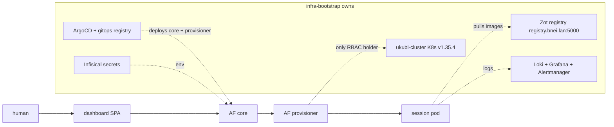
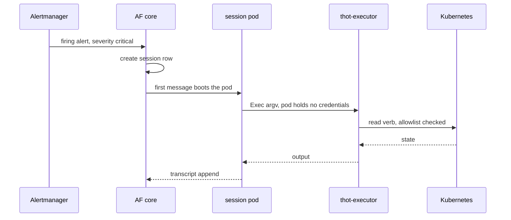
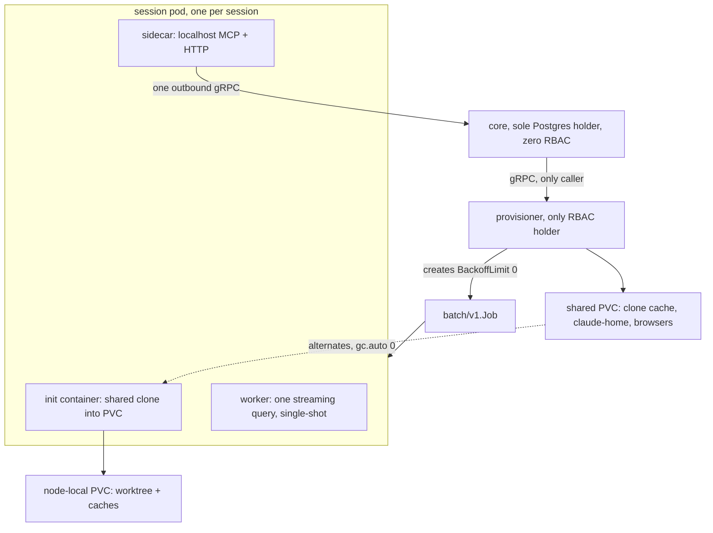

## Legend

Spine doc. Refs over prose. Not a published page — no `date:` key, so RSS skips it, and no route serves `/notes/*`.

- `IB` = `github.com/MohammadBnei/infra-bootstrap` · `AF` = `github.com/MohammadBnei/agent-fleet`
- `IB#144` = that repo's PR 144. Same shape for `AF`. No inline links: 327 link definitions outweigh the text.
- `IB-ADR-0034` = `IB:docs/adr/0034-*.md` · `AF-ADR-0048` = `AF:docs/adr/0048-*.md`
- `IB:path` = file in that repo. Read via `git show origin/main:<path>` — worktrees in `/repo-cache` run days behind.
- Dates 2026. Landing PR blank where evidence absent. No guesses.

## Cast

`IB` owns substrate. `AF` consumes it. Contract, black box:

`IB` hardware: 3 Proxmox hosts, Terraform-provisioned, kubespray-installed. Cilium chaining + kube-proxy retained. MetalLB L2 over a reserved LAN range. Traefik + TLS-ALPN-01. ArgoCD Pattern C. Pigsty Postgres. StorageClasses `longhorn` / `nfs` / `local-path`.

`AF` components, from `AF:docs/ARCHITECTURE.md` §1:

- `core` — Go. Sole Postgres holder. Dashboard API, 60s reconcile loop against K8s, Discord outbound. Zero RBAC.
- `provisioner` — Go, `client-go`. Only RBAC holder, namespaced `Role`, never `ClusterRole`. Makes the session Job, PVC, Service, IngressRoute.
- `worker` — TS/Bun. One continuous `query()` in streaming-input mode. Single-shot, exits.
- `sidecar` — Go. Second container per pod. Localhost MCP + HTTP, one outbound gRPC to core.
- `dashboard` — React SPA, built into core's binary.
- `executor` — Go. One RPC, `Exec(argv)`, for pods holding no credentials. `AF-ADR-0037`.

## Timeline

### Act 0 — 06-04→07-06 · bare metal, declared

- Scaffold. `IB 2b10e6b`. Terraform over 3 Proxmox hosts, kubespray as submodule.
- Mission stated. `IB#3`.
- ADR wave `IB-ADR-0001`–`0012`. **Seven of twelve are rejections**: Infisical-as-CA, Vagrant, Flatcar, Wireguard/Tailscale, managed Postgres, multi-region/DR/service-mesh, GitOps-for-Proxmox.
- Shape of this repo: it grows by refusing.

### Act 1 — 07-13→07-19 · first smoke test

- Traefik CRDs automated, Infisical K8s operator registered. `IB#4`.
- Wave-10 smoke: searxng + pgweb through `common-app-chart`. `IB#5`.
- `InfisicalSecret` hostAPI pointed at a service that was not the backend. `IB#6`.
- Findings written down same day. `IB#7`, `IB:docs/bootstrap-test-notes-full-run-2026-07-12.md`.
- Scars: DHCP domain-search acceptance broke VM DNS `IB#8`. GPU passthrough dead from wrong host driver + IOMMU disabled `IB#9`.

### Act 2 — 07-26→07-28 · three hosts, and the GitOps hardening wave

- Stage 2 prep, 3-host PVE cluster. `IB#12`. Corosync, not three standalone hosts — `IB-ADR-0020`.
- **`AF` is born inside `IB`** as a submodule, design doc moved in. `IB#11`.
- First user app onboarded: `editable-blog`. `IB#13`.
- Self-syncing `gitops/bootstrap/`. `IB-ADR-0021`, `IB#14`.
- Repo credentials: per-repo SSH deploy keys dropped for one shared HTTPS+PAT. `IB-ADR-0025`, `IB#16`. Then a trailing newline in that PAT corrupted auth. `IB#17`.
- Traefik ACME: fsGroup so `acme.json` is writable `IB#19`, then HTTP-01 → TLS-ALPN-01 `IB#20`.
- `hooks:` / `oneOffJobs:` in `common-app-chart`. `IB-ADR-0023`, `IB#21`.
- `targetRevision: HEAD` purged everywhere for literal branch names. `IB#23`, `IB#26`. Prod had been reading the dev branch.
- Scars, all of them ArgoCD telling the truth badly: `InfisicalSecret` PreSync deadlock `IB#25`; empty `directory` stanza causing a perpetual bootstrap self-heal loop `IB#42`; **four consecutive attempts** at one Longhorn CRD `caBundle` diff `IB#43`, `IB#44`, `IB#45`, `IB#46`.
- Dashboards-as-code `IB#36`. Redirectors need `ExternalName`, not Endpoints `IB#35`. CI lint for `ansible/` + `gitops/` `IB#49`. k9s LXC for cluster-admin `IB#50`.

### Act 3 — 07-29 · it can be watched

- Alertmanager → Discord, plus resource-governance defaults. `IB#51`.
- Loki + Grafana Alloy, over ClickHouse, over Promtail. `IB-ADR-0027`, `IB#54`, docs `IB#58`.
- App Logs dashboard with level + text filters. `IB#57`. Platform apps switched to JSON logging `IB#59`, `IB#60`.
- `app.kubernetes.io/instance` promoted to a Loki stream label. `IB#63`.
- Scars: Alertmanager null receiver `IB#52`; Grafana Discord `url` belongs under `settings`, not `secureSettings` `IB#56`; kube-proxy/etcd metrics bound to loopback `IB#65`; error-rate alert needed a Reduce step `IB#66`; Alloy switched to file-based tailing `IB#67`; Loki retention 14d → 7d `IB#69`.

### Act 4 — 07-30→08-05 · HA, and the fleet's first pods

- 3 control-plane / etcd members + kube-vip, Pi-hole DNS bootstrap. `IB#70`, `IB-ADR-0017`.
- LAN IPs swapped for `bnei.lan` hostnames `IB#74`. ArgoCD `externalRedis` repointed `IB#71`.
- First `AF` GitOps apps: bot + two per-repo workers. `IB#75`. Two-source user-app pattern `IB#77`, `AF-ADR-0007`.
- Per-app Grafana dashboards + a `/grafana-ops` skill. `IB#79`.
- `AF` starts 07-23, `AF 2151790` "Initial MVP spec + parked v0 design doc". First four decisions: durable Redis list `AF-ADR-0001`, **no orchestration framework** `AF-ADR-0002`, persistent worker pod per repo `AF-ADR-0003`, subscription OAuth over metered API `AF-ADR-0004`.

### Act 5 — 08-01→08-07 · organs

- Garage S3 exposed at `s3.bnei.dev`. `IB-ADR-0030`, `IB#83`. Per-bucket CORS declarative `IB#89`; each rule takes exactly one origin, including `"null"` for redirects `IB#94`.
- ente self-hosted photos, 14 PRs `IB#84`–`IB#97`. Scars: pgbouncer `pool_mode` had to be `session` for prepared statements `IB#88`; SMTP STARTTLS on 587 `IB#87`; ghcr image refs wrong `IB#85`.
- Dashboard published at `fleet.bnei.dev`. `IB#100`.
- **Provisioner manifests move out of `IB` into `AF:k8s/provisioner/`.** `IB#105`, `IB#106`. Attribution corrected in docs `IB#104`. `agent-fleet-bot` Application renamed `agent-fleet-core` `IB#107`.
- `AF` rewrites itself in Go, nine decisions in five days, dates from the ADR headers: Redis coordination deleted `AF-ADR-0013` 08-03; dashboard backend `0014`; ConnectRPC replaces REST+SSE `0015`; proposer/critic collapses to one planner `0017`; `AskUserQuestion` answered in the dashboard, not Discord `0018`; shared worktree PVC + unified provisioner `0019` 08-04; one continuous streaming session `0021` 08-04; sessions as `batch/v1.Job` `0022` 08-05; worker session is a plain Claude Code session, transports are transport only `0025` 08-05.
- **`AF-ADR-0029` 08-07**: sessions replace tasks as the durable unit, and `canUseTool` becomes a live per-call prompt instead of a prospective approval gate. `/approve` stops existing. Half-finished — it declined to split the row, and `AF-ADR-0048` finishes the job eight days later.

### Act 6 — 08-10→08-11 · thot: the cluster gets an agent

Cross-repo, four days, two ADR sets.

- `AF-ADR-0035` proposed `AF#90`, scaffolded `AF#92`. Live permission gating `AF#99`. Real cluster access + sidecar Q&A `AF#94`. Scheduled audits `AF#95`. Reads free, mutation gated `AF#96`. Humans can ask it directly `AF#101`.
- Then it stops being a service. `AF-ADR-0037`: thot is a worker task. `thot-executor` `AF#106`, dispatch as ordinary sessions `AF#108`, **standing service deleted** `AF#109`, task-detail UI `AF#110`, ADR written `AF#111`.
- `IB` side: RBAC scope + alert routing `IB-ADR-0032`, `IB#110`, manifests `IB#111`, `thot-executor` Deployment `IB#114`.
- Alerts become agent work: `IB#117` routes critical alerts to thot; `AF#115` turns a firing Alertmanager alert into a task. `task_id` promoted to an Alloy stream label `IB#121`.
- Scars: thot liveness must not depend on session readiness `IB#112`, `AF#102`; readiness made free instead of costing a boot turn `AF#103`; `THOT_GRPC_ADDR` never wired `AF#104`; Infisical read from prod instead of dev `IB#113`; **alerts never reached thot at all** — wrong severity, and Grafana had no path `IB#125`; Alertmanager link pointed inside the cluster `IB#124`; the log alert never said which error `AF#123`.
- Same window, unrelated and worse: the log viewer never returned anything — **six bugs** `AF#117`. The branch sweep never removed a single worktree `AF#118`. Worker crashed mid-session because the image had no `ps` `AF#119`. Worker ran as root, so `bypassPermissions` crashed `AF#91`.
- DNS moves to Cloudflare, DNS-01 wildcard for previews. `IB-ADR-0033`, `IB#116`, number collision renumbered `IB#118`. Traefik needs `Recreate` — an RWO `acme.json` PVC deadlocks rollouts `IB#119`.

### Act 7 — 08-12→08-13 · registry comes home, fleet sheds a limb

- Vision stated: one organism converging on declared intent. `IB#126`, `IB:VISION.md`.
- In-cluster OCI registry, Zot, Garage-backed, builds moved in-house. `IB-ADR-0034`, `IB#128`. Forgejo proposed as authoritative forge, GitHub demoted to mirror `IB-ADR-0035`.
- Scars, same 24h: Zot did not declare `distSpecVersion` `IB#129`; `/metrics` needed anonymous authz `IB#130`; autoReload restarted the registry on unrelated secrets `IB#132`; containerd trust applied and the feared collateral restart never happened `IB#131`.
- **buildah cannot build unprivileged in-cluster.** Builder becomes an LXC. `IB#133`, live bring-up + V10 result `IB#134`.
- `AF` console rewrite from mockups. `AF-ADR-0042`, `AF#133`. One decision surface, the dock, both form factors `AF-ADR-0043`, `AF#136`. A replayed message and four lying surfaces `AF#137`.
- Liveness derived, never-start pods torn down `AF-ADR-0040`, `AF#129`. One session can prompt another `AF-ADR-0041`, `AF#130`.
- Direct dial via a service endpoint roster `AF-ADR-0045`, `AF#142`, `AF#147`, `AF#149`, `AF#150`. Every task had been serialized behind one MCP dial `AF#144`. ndots comment corrected with measured numbers `AF#145`.
- Context budget: cap tool output at the source, always with a way back. `AF-ADR-0046`, `AF#146`. Sibling: `AF:fleet-shared/CLAUDE.md` compressed `AF#151`.
- **`AF#152` `refactor!`: the e2e tool relay is deleted.** Predecessor `AF-ADR-0044`, `AF#140`.
- `AF v2.0.0` 08-13.

### Act 8 — 08-14→08-15 · one session, one pod

- `IB-ADR-0034` accepted and cascaded into the canonical files `IB#135`. `ARCHITECTURE.md` reconciled against `VISION.md`, **restore-path gap named rather than hidden** `IB#136`.
- Second, unreplicated `nfs` StorageClass `IB-ADR-0036`, `IB#138`. Export disks addressed by-id `IB#139`, playbook made honestly idempotent `IB#140`, and "no backup for this class is a decision, not a gap" written down `IB#141`.
- Prometheus metrics scoped to the two hubs, ServiceMonitor-scraped, plus an Observability view. `AF-ADR-0047`, `AF#154`.
- **`AF#157` `feat!`: `AF-ADR-0048` — one session, one pod, one shared home.** Supersedes `0016`, `0023`, `0034`, `0036`, `0039`, `0044`, `0045` entirely, and half of `0012` and `0019`. Deleted in one PR: the queue, `tasks.status` (8 values, `done` had no writer), the lease/heartbeat/reclaim machine, the ~100-line `ClaimNextTask`, worktrees, branch naming, the recipe system, the e2e sandbox. `AF v3.0.0` 08-15.
- Fallout, same 48h: dashboard caught up with the session model `AF#158`, `AF#159`; canonical docs brought forward `AF#161`; wildcard `safe.directory` for the shared clone `AF#160`; per-session `claude-home` made writable by the worker `IB`-side equivalent `AF#162`; **three defects mis-reporting a live session's state** `AF#163`; `AskUserQuestion` re-invoke losing the human's answer `AF#164`.
- A session loads the target repo's own project settings `AF-ADR-0049`, `AF#165`. `set_session_meta` `AF#166`. Full-text session search `AF#168`. `/clear` resets instead of crashing `AF#171`.

### Act 9 — 08-16→08-17 · the permission surface moves

- Per-repo worker images, Playwright browsers on the shared PVC instead of the image. `AF-ADR-0051`, `AF#172`. Then the cache Job's `PodSpec` had no `fsGroup`, so `/browsers` stayed root-owned and the chmod failed `AF#177`.
- A blocking question outlives its pod; the answer is delivered on warm. `AF-ADR-0050`, `AF#174`.
- Only a non-human append proves a pod came up. `AF#173`.
- SDK `0.1.77` → `0.3.233` to survive background tasks. `AF#178`. It replaced the CLI's permission evaluator underneath the fleet.
- **`AF-ADR-0052`, `AF#180`**: the mode short-circuit moved *below* the ask rules. A live switch into `bypassPermissions` is refused — it is computed once at launch. `permissions.ask` now outranks every mode, bypass included. The worker had been swallowing the rejection into a warning and allowing the parked call anyway, so a refused switch was indistinguishable from a working one. Prose synced `AF#181`.
- Read-only Bash stops prompting; dead MCP server dropped `AF#176`. Default model to Claude Opus 5, drifting pins fixed `AF#175`. Which build each component runs, shown in the dashboard `AF#179`. Per-frame SDK progress no longer relayed `AF#182`. Feed opens on the newest page `AF#183`. `AF v3.8.0`.
- `IB`: `.165` measured at **100 Mbps**, not gigabit — plus the fleet's session-node label `IB#142`. That link is why a Postgres failover left a dead replica `IB#143`. Grafana log-alert false positives `IB#144`.

## Threads

Five things that only make sense across both repos.

1. **thot** — `AF-ADR-0035` standing agent → `AF-ADR-0037` ordinary worker task. `AF#90`→`AF#111`, `IB-ADR-0032`, `IB#110`–`IB#115`. A component whose best version was its own deletion.
2. **Alerts as work** — `IB#117`, `IB#125` (routing) + `AF#115`, `AF#123` (consumption). Alertmanager is an input device.
3. **Registry and builds** — `IB-ADR-0034`, `IB#128`–`IB#134`. Consumed by app repos as an `image.repository` line pointing at `registry.bnei.lan:5000`; `editable-blog` cut over 08-14.
4. **Manifest ownership** — `IB#105` hands provisioner manifests to `AF:k8s/provisioner/`. Registration stays in `IB:gitops/apps/registry.yaml` + `IB:gitops/bootstrap/apps.applicationset.yaml`, which must move together. `AF:docs/ARCHITECTURE.md` §9.
5. **Worktrees → one pod** — `AF-ADR-0048`, `AF#157`, plus `IB#142`'s session-node label. What the fleet stopped owning, the cluster had to start expressing.

## Decision index

`IB` — 36 ADRs. Landing PR where evidence exists.

| ADR | Title | PR |
|---|---|---|
| 0001 | Traefik IngressRoute for app HTTPS routing, over Gateway API | — |
| 0002 | Longhorn for K8s app PVs, over Ceph, over the NFS-server plan | — |
| 0003 | Cilium in chaining mode with kube-proxy retained | — |
| 0004 | GitOps Pattern C: registry + ApplicationSet list generator | — |
| 0005 | Install ArgoCD via Helm, not the kubespray addon | — |
| 0006 | Reject Infisical as SSH CA / TLS CA | — |
| 0007 | Reject Vagrant for Proxmox provisioning | — |
| 0008 | Reject Flatcar as VM OS | — |
| 0009 | Reject Wireguard / Tailscale for this cluster | — |
| 0010 | Reject external managed Postgres | — |
| 0011 | Reject multi-region / DR / GPU multi-tenancy / service mesh | — |
| 0012 | Reject GitOps-managed Proxmox | — |
| 0013 | `.161` ex-laptop sleep-risk mitigation | — |
| 0014 | PVE storage layout: ZFS pool vs `local-zfs` directory | — |
| 0015 | Kubespray inventory ↔ submodule version alignment | — |
| 0016 | K8s API endpoint naming | — |
| 0017 | Second and third control-plane / etcd member | `IB#70` |
| 0018 | Cilium eBPF offload flip, kube-proxy-replacement | — |
| 0019 | Longhorn rollout specifics | — |
| 0020 | PVE corosync cluster, not 3 standalone hosts | `IB#12` |
| 0021 | Self-syncing `gitops/bootstrap/`, scoped App-of-Apps | `IB#14` |
| 0022 | Self-hosted GitHub Actions runner in-cluster | — |
| 0023 | `hooks:` / `oneOffJobs:` in common-app-chart, layered values | `IB#21` |
| 0024 | `server1` single-disk, ext4 root, no dedicated ZFS pool | — |
| 0025 | Repo credentials via shared HTTPS+PAT, not SSH deploy keys | `IB#16` |
| 0026 | NFS-backed shared PVE storage for cross-host template cloning | `IB#48` |
| 0027 | Loki + Grafana Alloy, over ClickHouse, over Promtail | `IB#54` |
| 0028 | `ex-laptop` also has no dedicated ZFS pool | — |
| 0029 | Postgres automatic failover accepted, 3-node etcd DCS quorum | — |
| 0030 | Expose Garage's S3 API externally at `s3.bnei.dev` | `IB#83` |
| 0031 | Defer Kubernetes-native HPA scale-to-zero for user apps | — |
| 0032 | thot's cluster-wide RBAC scope and Alertmanager routing | `IB#110` |
| 0033 | `bnei.dev` DNS to Cloudflare, DNS-01 wildcard for previews | `IB#116` |
| 0034 | In-cluster OCI registry, Zot, Garage-backed, builds in-house | `IB#128` |
| 0035 | Self-hosted Forgejo authoritative, GitHub as push-mirror | `IB#128` |
| 0036 | Second, unreplicated `nfs` StorageClass on `nfs-storage` | `IB#138` |

`AF` — 52 ADRs. Struck-through = superseded by `AF-ADR-0048`.

| ADR | Title | PR |
|---|---|---|
| 0001 | ~~Durable Redis list over pub/sub for the planning transcript~~ | — |
| 0002 | No orchestration framework, Hermes/OpenClaw rejected | — |
| 0003 | ~~Persistent worker pod per target repo, not one Job per task~~ | — |
| 0004 | Claude Code subscription OAuth, not a metered API key | — |
| 0005 | ~~Explicit human approval only gates write/edit unlock~~ | — |
| 0006 | Git commit identity derived live from the authenticated bot | — |
| 0007 | Two-source ArgoCD Application for independent tag bumps | `IB#77` |
| 0008 | Guardrail defaults are unbounded, capped only opt-in | — |
| 0009 | `rtk` + `ponytail` baked into the worker image | — |
| 0010 | ~~Shared ReadWriteMany PVC across bot + both workers~~ | — |
| 0011 | ~~Critic session is opt-out, proposer→critic context handoff~~ | — |
| 0012 | e2e provisioner as a standalone app, pod half superseded | — |
| 0013 | Go `fleet-core` replaces Redis, provisioner and bot rewritten | — |
| 0014 | fleet-core as the web dashboard's backend | — |
| 0015 | ConnectRPC replaces the dashboard's REST+SSE API | — |
| 0016 | ~~Task crash recovery, heartbeat reclaim, transient retry~~ | — |
| 0017 | Single-session planner replaces proposer/critic | — |
| 0018 | AskUserQuestion is real, answered via the dashboard | — |
| 0019 | Shared worktree PVC + unified provisioner, partly superseded | — |
| 0020 | Hub-and-spoke gRPC, Postgres centralized, MCP kept local | — |
| 0021 | One continuous streaming-input session per task | — |
| 0022 | Worker sessions run as `batch/v1.Job`, not bare Pods | — |
| 0023 | ~~Worktree/branch lifecycle around explicit signals only~~ | — |
| 0024 | Pod-crash fast-path, real retry cap, journal read path | — |
| 0025 | Worker session is a plain Claude Code session | — |
| 0026 | `core` stays on common-app-chart, no per-app Helm chart | — |
| 0027 | Dashboard permission-mode selector and command palette | — |
| 0028 | Dashboard-editable, DB-backed repo config | — |
| 0029 | Sessions replace tasks, canUseTool becomes a live prompt | — |
| 0030 | golang-migrate replaces hand-copied schema files | — |
| 0031 | Garage S3 shared files, presigned URLs minted only by core | — |
| 0032 | PVC-resident, provisioner-synced fleet-shared skills/context | — |
| 0033 | Journal search/write tools, persistent worker plugins | `AF#80` |
| 0034 | ~~Environment recipe system replaces the e2e start switch~~ | `AF#83` |
| 0035 | thot, a standing cluster agent with its own RBAC | `AF#90` |
| 0036 | ~~e2e recipe readable, override human-approved, port probed~~ | `AF#97` |
| 0037 | thot is a worker task, not a standing service | `AF#111` |
| 0038 | Per-task subdomains for e2e previews, over path routing | `AF#116` |
| 0039 | ~~The e2e pod is the worker's execution sandbox~~ | `AF#122` |
| 0040 | Session liveness derived, a silent pod torn down in minutes | `AF#129` |
| 0041 | One session can prompt another, and prove it is still the pod | `AF#130` |
| 0042 | The dashboard becomes a console: full-width, ranked feed | `AF#133` |
| 0043 | One decision surface: the dock, on both form factors | `AF#136` |
| 0044 | ~~The e2e pod is a sandbox that may also run an app~~ | `AF#140` |
| 0045 | ~~Direct dial via a service endpoint roster~~ | `AF#142` |
| 0046 | Context budget: cap at the source, always with a way back | `AF#146` |
| 0047 | Prometheus metrics scoped to the two hubs, ServiceMonitor | `AF#154` |
| 0048 | **One session, one pod, one shared home** | `AF#157` |
| 0049 | A session loads the target repo's own project settings | `AF#165` |
| 0050 | A blocking question outlives its pod, answered on warm | `AF#174` |
| 0051 | Playwright browsers on the shared PVC, not in the image | `AF#172` |
| 0052 | `auto` is the working mode, `bypassPermissions` a launch profile | `AF#180` |

## Numbers

| | `IB` | `AF` |
|---|---|---|
| First commit | 06-04 `2b10e6b` | 07-23 `2151790` |
| Last read | 08-16 `9e109c8` | 08-17 `07d1c59` |
| Merged PRs | 144 | 183 |
| Commits on main | 393 | 659 |
| ADRs | 36 | 52 |
| Tags | 0 | 164, `0.1.1`→`3.8.0` |
| Majors | n/a | `2.0.0` 08-13, `3.0.0` 08-15 |

Two shapes, opposite directions. `IB` grew by refusing — 7 of its first 12 decisions are rejections. `AF` grew by deleting — `AF-ADR-0048` superseded seven ADRs and half of two more in a single PR, and its largest feature was subtraction.

## Open, as of 08-17

- **Restore path.** Named as a gap by `IB#136`, not closed. `IB:VISION.md` principle 8 says every reachable state must be recoverable and the restore path must survive the cluster failing entirely — so it cannot live only inside the cluster. It currently does.
- **Permission surface.** Least-settled area. `AF-ADR-0052` is a repair to an evaluator that changed underneath the fleet in `AF#178`; behaviour was read out of the shipped binary because the SDK's own docs are wrong about at least one branch.
- **`.165` at 100 Mbps.** `IB#142`, `IB#143`. Physical, not fixable in code. Postgres replica placement still assumes it isn't there.
- **Forgejo.** `IB-ADR-0035` accepted on paper, GitHub still authoritative in practice.
- **`AF` journal for `editable-website`** is empty. Nothing recorded from this session's repo yet.
