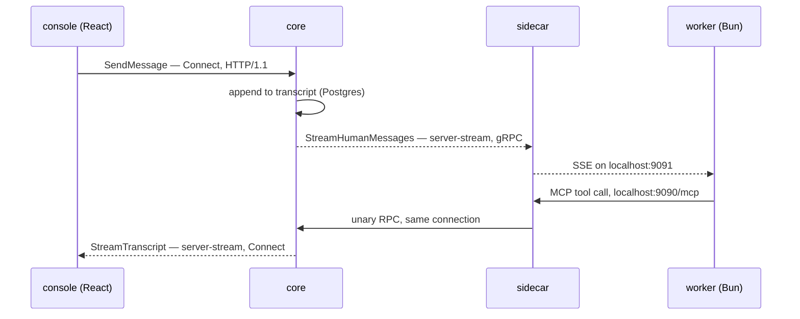

I wanted coding agents that did not live on my laptop. Not because the laptop
is slow, but because an agent that dies when I close the lid is not
infrastructure — it is a terminal tab with ambitions.

`agent-fleet` runs Claude Code sessions as Kubernetes workloads on hardware I
own. One pod per session, each with a real clone of a real repository, each
able to build, test, commit and open a pull request. I talk to them through a
console. When one wedges itself, it dies and the cluster notices.

## Shape

Six Go and TypeScript components, each with one job, and a hard rule about who
is allowed to touch what.

- **core** — the only holder of the Postgres connection, and the only thing
  with zero cluster permissions. Dispatch, the console API, Discord, log
  reads.
- **provisioner** — the only holder of RBAC, scoped to a namespaced `Role`,
  never a `ClusterRole`. It creates the session pod and owns the git
  lifecycle on shared storage.
- **worker** — TypeScript on Bun. One streaming session, single-shot: it runs,
  it opens its pull request, it exits.
- **sidecar** — a second container in every pod, offering tools over localhost
  and holding exactly one outbound connection back to core.
- **executor** — a Go shim with a single `Exec(argv)` RPC and a read allowlist,
  so a pod that needs to look at the cluster never has to hold credentials
  that could change it.
- **console** — a React SPA, compiled into core's binary rather than deployed
  as a service of its own.

The split is not tidiness. It is the answer to one question asked repeatedly:
if this component is compromised or simply wrong, what is the worst it can do?

## How the parts talk

One schema, two transports, and one deliberate exception.

Every interface is protobuf, in a single package (`agentfleet.v1`, six files
under `proto/`) generated by `buf` v2 into four different shapes:
`protoc-gen-go` and `protoc-gen-connect-go` for the Go services,
`protoc-gen-es` for the console, and `ts-proto` for the worker with
`outputClientImpl=false` — types only. That last one is the interesting
choice: the worker never speaks gRPC at all, so generating a client for it
would be dead code with a dependency attached.

The two transports split by who is calling:

- **In-cluster, `CoreService` over plain gRPC** (HTTP/2, cleartext).
  Everything a pod does goes here.
- **Browser-facing, `DashboardService` over ConnectRPC** (HTTP/1.1), which
  replaced a REST API plus an SSE endpoint. `connect-go`'s handler also
  speaks gRPC and gRPC-Web framing on the same path, but the server it is
  mounted on has no h2c and no TLS/ALPN, so that capability is nominal
  rather than a working gRPC endpoint. The decision record says so in those
  words, which is the only reason I trust the rest of it.

Exactly two streams carry the live work, and the third hop is not an RPC at
all:

The sidecar holds **one** `grpc.ClientConn` to core and multiplexes
everything over it: the long-lived `StreamHumanMessages` it consumes, and
every unary call its tools make. It then re-terminates that stream locally as
Server-Sent Events, because the worker is Bun and native `fetch()` is enough
— no gRPC client library in the runtime that runs untrusted-ish code. The SSE
side emits a keep-alive comment every fifteen seconds, added after a live
incident: an idle, wire-silent stream got reaped somewhere upstream, and the
session lost the ability to receive human input without anything reporting an
error.

`ReportPodEvents` is the other stream, and it runs the other way —
client-streaming, provisioner pushing pod lifecycle into core.

The agent's tools are MCP over `localhost` only, served by the sidecar
(`mark3labs/mcp-go`, streamable HTTP). Nothing in the pod dials core
directly; every tool proxies through that one connection. Playwright's tools
are registered lazily, when a preview environment actually exists, and
announced with a `tools/list_changed` notification rather than being present
and broken.

The privileged path is deliberately tiny. `ExecutorService` has one RPC,
`Exec`, and its request field is `repeated string args` — an array, never a
command string, so shell metacharacters are inert by construction instead of
filtered. Read calls are checked against a verb allowlist (`get`, `describe`,
`logs`, `top`, `events`…) with `rollout` excluded, because `rollout restart`
mutates; impersonation and credential flags (`--as`, `--kubeconfig`,
`--token`) are denied outright. The mutating path is _not_ validated, on
purpose: a human already approved that exact argument list at the permission
prompt, and a second allowlist would only constrain what a human is allowed
to decide.

Two smaller things that shape the deployment. The console is not a service:
`//go:embed all:dist` puts the built SPA inside core's binary, served by
`http.FileServer` with a fallback to `/` for client-side deep links, mounted
last as the catch-all — so the Dockerfile has to build the React app in a Bun
stage _before_ `go build`, because `go:embed` reads from disk at compile
time. And core applies no schema: `pgx/v5` for queries with hand-written SQL,
`golang-migrate` shipped as a separate image that runs the migrations. The
migration history is a decent changelog of my mistakes on its own — one table
is created in `000005` and dropped again in `000009`, which is the standing
cluster-agent service being deleted in favour of an ordinary session.

## The design I got wrong

The first version gave each repository one long-lived pod and ran every
session as a git worktree inside it. Each argument for that was real: keep
dependencies warm between tasks, share one clone instead of paying for a
fresh one, put a queue with leases and heartbeats in front so no task is ever
lost when a pod dies.

It rotted quietly for three weeks, and the tell was the shape of the repairs rather
than how many there were. The cleanup job meant to reclaim dead worktrees had
never once removed anything in production — it ran, reported success, deleted
nothing. The log viewer had six independent defects stacked in a single path
nobody looked at until they urgently needed it. A session died because the
image had no `ps`. Three separate bugs were mis-reporting whether a session
was alive, which is the worst class: the work is fine, but you can no longer
trust what you are looking at.

Every one of those fixes was locally correct, and not one of them made me
re-ask whether the thing being repaired needed to exist. The queue was never
contended. The lease machine recovered work that was never lost. The status
column had eight values and one of them had no writer anywhere in the
codebase. I had built a scheduler for a workload that did not need
scheduling, then spent weeks maintaining the scheduler.

The replacement was a single change that deleted far more than it added:
one session, one pod, one shared home, no queue, liveness reconciled against
Kubernetes because Kubernetes already knows. The agent runs its own
`git checkout -b`, like a person would. Several earlier decision records were
superseded at once, and roughly a fifth of the repository stopped existing.

The write-up below is about that arc specifically, because it is the most
useful thing I learned building this.
