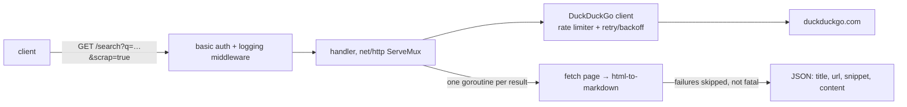

A lightweight REST API in front of DuckDuckGo. Add `?scrap=true` and each
result comes back with the page itself converted to clean markdown, which is
the form most useful to something further down a pipeline — an LLM, usually,
which does not want your navigation bar.

No framework: it is the standard library's `ServeMux` with two handlers and
one middleware. The DuckDuckGo client sits behind a `golang.org/x/time/rate`
limiter and a retry with backoff, because the upstream is scraped HTML and
will occasionally decide it does not like you. The scrape path fans out one
goroutine per result and converts each page with `html-to-markdown`, guarded
by a mutex on the shared response slice; a page that fails to fetch is logged
and skipped rather than failing the whole request, which is the right trade
when nine of ten results are still useful.

The API itself is small on purpose. What made it worth building was
everything around it:

- **A contract, not just endpoints.** Annotated in the handlers, generated to
  OpenAPI by `swaggo`, and served as interactive documentation at `/swagger/`
  from that same generated spec — so the docs cannot drift from the code
  without the build noticing.
- **Closed by default.** Basic authentication, credentials from the
  environment and _required_ — the process refuses to start without them
  unless local mode is set explicitly — plus configurable rate limiting,
  because an unauthenticated search proxy on the public internet is somebody
  else's scraping budget. `pprof` is wired but only registered when debug mode
  is on, for the same reason.
- **Observable from the first request.** Middleware emits structured JSON
  logs with status, latency and path — no separate instrumentation pass.
- **A minimal image.** Multi-stage build, `CGO_ENABLED=0` so the binary is
  static, and a final layer that holds it and nothing else.
- **Deployed the same way as everything else.** Kustomize manifests, semantic
  versioning derived from commit messages, an image tag pushed by CI, and
  Argo CD reconciling the cluster to match the repository.

Archived: the deployment is gone and the endpoint no longer answers. The
repository stands as a compact example of the pipeline.
