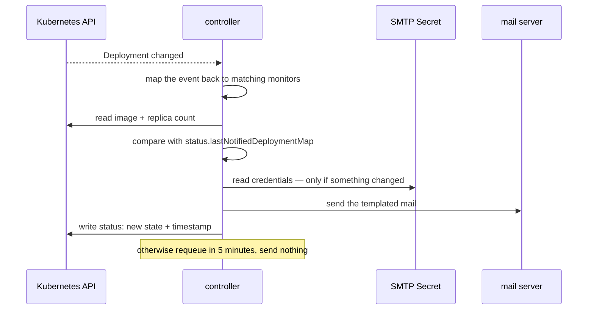

A Kubernetes operator, built with Kubebuilder, that watches `Deployment`
resources across every namespace and sends email when a watched one changes.

Configuration is a custom resource rather than a config file. A
`DeploymentMonitor` is cluster-scoped and names the deployments to watch — by
label key/value or annotation key/value — the address to notify, the `Secret`
holding SMTP credentials, and an optional Go template for the body with
`.Namespace`, `.Name`, `.Image` and `.Replicas` bound. Nothing sensitive lives
in the resource itself.

The wiring is the interesting part. The controller reconciles
`DeploymentMonitor`s, but it _watches_ `Deployment`s, mapping each event back
to whichever monitors select it — so the reconcile loop is driven by the
resource that actually changes, not by polling the one that configures it.

And the thing that makes it usable rather than unbearable lives in the status
subresource: `lastNotifiedDeploymentMap`, keyed by `namespace/name`, holding
the image and replica count as of the last email. A reconcile compares against
that map and stays silent unless one of them actually moved. Without it, every
resync of every deployment in the cluster is a notification.

It exists because I wanted to understand operators by writing one that did
something real, rather than by reading about the reconcile loop. The lesson
that stuck was not the CRD scaffolding — Kubebuilder generates that in a
minute — it was that a reconcile is called constantly and for reasons that
have nothing to do with you, so an operator's real design is the comparison it
makes before acting. "Notify on any change" is a one-line feature and an
unusable product.

Archived: superseded by proper alerting on the platform. Alertmanager reaches
Discord, and increasingly reaches an agent instead of a human.
