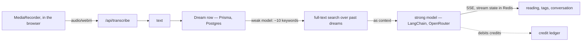

A journalling app for dreams, built with SvelteKit, where the entry is only
half the point — the other half is what a language model makes of it.

## What it does

You record a dream by typing or by speaking it, because the realistic moment
for this is thirty seconds after waking up and typing is too much to ask.
Speaking is `MediaRecorder` in the browser, posting a `webm` blob to a
transcription endpoint — not the browser's own speech recognition, which is
inconsistent across browsers and useless offline from a phone at 6am.

The model then returns a reading and a set of symbolic tags. The reading is
not one-size-fits-all: you choose the frame. Jungian, reading for archetypes
and the shadow. Freudian, reading for repression and conflict. A plain
summary, for when you want the themes and nothing else. Or an Islamic reading,
grounded in that tradition's own hermeneutics of dreams.

From there it is a conversation — you can question the interpretation, push on
a symbol, or ask what it makes of the same dream told differently.

Entries are indexed by date and, more usefully, by each other: when a dream is
analysed, a cheap model first extracts about ten keywords from it, those
become a Postgres full-text query over everything you have written before, and
the matching past dreams are handed to the interpreting model as context. So
the archive compounds — the reading of tonight's dream can refer to the one
from three months ago, which is the entire reason to keep a journal rather
than a note.

## Under it

SvelteKit end to end, Prisma over Postgres, sessions on hashed passwords and a
JWT. The model calls go through LangChain to OpenRouter, and there are
deliberately **two** models behind that: a strong one for the interpretation
itself, and a weak, cheap one for the mechanical steps — extracting the search
keywords above, naming a dream. Paying interpretation prices for keyword
extraction is how a hobby project ends up with a bill it cannot justify.

An analysis streams token by token, and its progress lives in Redis rather
than in the request: close the tab, come back, and the page re-attaches to the
stream that is still running instead of starting a second one. Cancelling
clears that state, which is the other half of the same mechanism.

## The unglamorous part

A credit ledger. An analysis costs two credits, a chat turn costs one, and the
daily grant depends on the account tier — every debit is a row, so "why am I
out of credits" has an answer rather than a shrug. A personal project with an
open-ended model bill is a personal project you eventually switch off; this
one stays affordable to run, which is the only reason it is still running.

One honest note: dreams are stored as plain text in Postgres, behind
authentication but not encrypted at rest. Calling that "encrypted" would be
comfortable and untrue.
