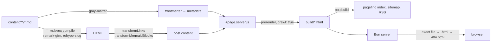

The site you are reading. It began as a small CMS — Postgres for content,
n8n for translation and social posting, an admin editor behind a login — and
it now has none of those things.

## Why it lost most of its architecture

The editor was the problem. Every feature it had assumed I would want to write
in a browser text area, and I never did once. I write in my own editor, in the
repository, next to everything else. So the database was storing markdown that
started life as a file, the login existed to protect an editor nobody opened,
and the translation workflow was a queue for a job I did by hand anyway.

All of it went. What replaced it is a directory:

```
content/blog/<slug>.md        → /blog/<slug>
content/blog/fr/<slug>.md     → /blog/fr/<slug>
content/portfolio/<slug>.md   → /portfolio/<slug>
```

A file's path is its route. Frontmatter is its metadata. Publishing is a
commit.

## What it is now

SvelteKit with `@sveltejs/adapter-static`, prerendering every route at build
time. There is no server-side rendering at runtime, no database, and nothing
to log into.



The pipeline is short enough to hold in your head. `gray-matter` splits
frontmatter from body; `mdsvex` compiles the body with `remark-gfm` for tables
and `rehype-slug` for heading anchors; two small transforms then rewrite
relative links and turn mermaid fences into the bare `<pre class="mermaid">`
that `mermaid.run()` expects, since the highlighted `language-mermaid` block
mdsvex emits is not something mermaid will look at. The adapter runs with
`strict: true`, so if a route ever stops being prerenderable the build fails
loudly instead of quietly shipping an empty SPA shell, and `crawl: true` means
new content is discovered by following links rather than by maintaining a
list. Search is `pagefind`, which indexes the built HTML after the fact —
a static index, no search service.

Serving is seventy lines of Bun. A request resolves to an exact file, then to
`<path>.html` for clean URLs, then to `404.html`; hashed assets under
`/_app/immutable/` get a one-year `immutable` cache header and everything else
must revalidate, because a deploy otherwise leaves a browser holding an index
page that points at chunk filenames the server no longer has — a failure that
is completely silent, since a dynamic import 404s and the feature it was
lazy-loading simply never appears. That server replaced an npm package which
helpfully served `index.html` for unknown paths and so quietly broke the
Kubernetes health check, `/healthz` being a real static file rather than a
route.

Bilingual by directory convention rather than by framework: French posts live
under `fr/`, share a slug with their English twin, and the language toggle
navigates between them or says plainly that a translation does not exist yet.

Design is a two-font argument — mono for anything that is code, metadata or a
label, serif for anything you actually read — with a single accent colour and
no second one, ever.

## Delivery

GitHub Actions builds the image on merge, the tag is bumped in the manifests,
and Argo CD rolls it out on my own cluster. Images come from an in-cluster
registry rather than a public one, so a deployment does not depend on someone
else's rate limit.
