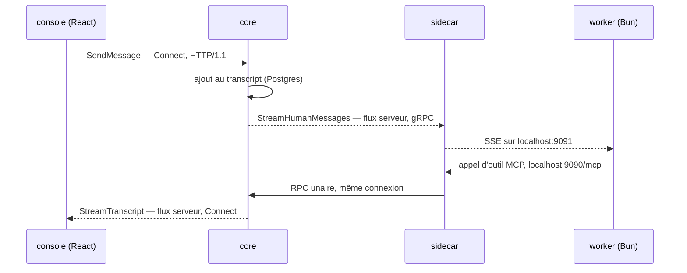

Je voulais des agents de code qui ne tournent pas sur mon PC. Non pas parce
que le PC est lent, mais parce qu'un agent qui s'arrête quand je referme
l'écran n'est pas une infrastructure.

`agent-fleet` exécute des sessions Claude Code comme des workloads Kubernetes
sur du matériel qui m'appartient. Un pod par session, chacun avec un clone
complet d'un repository réel, chacun capable de compiler, tester, committer et
ouvrir une pull request. Je leur parle depuis une console. Quand
l'un se bloque, il s'arrête et le cluster le détecte.

## Forme

Six composants Go et TypeScript, chacun avec une seule responsabilité, et une
règle stricte sur qui a le droit de toucher à quoi.

- **core** — seul détenteur de la connexion Postgres, et seul composant à
  n'avoir aucune permission sur le cluster. Dispatch, API de la console,
  Discord, lecture des logs.
- **provisioner** — seul détenteur du RBAC, limité à un `Role` dans un
  namespace, jamais un `ClusterRole`. Il crée le pod de session et gère le
  cycle de vie git sur le stockage partagé.
- **worker** — TypeScript sur Bun. Une session en streaming, à usage unique :
  il tourne, il ouvre sa pull request, il s'arrête.
- **sidecar** — un second conteneur dans chaque pod, qui expose des outils sur
  localhost et garde exactement une connexion sortante vers core.
- **executor** — un relais Go avec un seul RPC `Exec(argv)` et une liste
  blanche en lecture, pour qu'un pod qui doit consulter le cluster n'ait
  jamais à détenir de quoi le modifier.
- **console** — une SPA React, compilée dans le binaire de core plutôt que
  déployée comme un service à part.

Cette séparation n'est pas une question de propreté. C'est la réponse à une
question posée pour chaque composant : s'il est compromis, ou simplement
défaillant, quel est le pire qu'il puisse faire ?

## Comment les parties se parlent

Un seul schéma, deux transports, et une exception assumée.

Chaque interface est en protobuf, dans un seul package (`agentfleet.v1`, six
fichiers sous `proto/`) généré par `buf` v2 en quatre formes différentes :
`protoc-gen-go` et `protoc-gen-connect-go` pour les services Go,
`protoc-gen-es` pour la console, et `ts-proto` pour le worker avec
`outputClientImpl=false` — les types seulement. C'est ce dernier choix qui est
intéressant : le worker ne parle jamais gRPC, donc lui générer un client
reviendrait à ajouter du code mort et une dépendance avec.

Les deux transports se séparent selon l'appelant :

- **Dans le cluster, `CoreService` en gRPC classique** (HTTP/2, en clair).
  Tout ce que fait un pod passe par là.
- **Côté navigateur, `DashboardService` en ConnectRPC** (HTTP/1.1), qui a
  remplacé une API REST plus un endpoint SSE. Le handler `connect-go` sait
  aussi décoder les trames gRPC et gRPC-Web sur le même chemin, mais le
  serveur qui l'héberge n'a ni h2c ni TLS/ALPN : cette compatibilité est
  nominale, pas un vrai endpoint gRPC. La décision d'architecture le dit avec
  ces mots-là, et c'est la seule raison pour laquelle je fais confiance au
  reste.

Exactement deux flux portent le travail en direct, et le troisième saut n'est
pas un RPC du tout :

Le sidecar garde **une seule** `grpc.ClientConn` vers core et multiplexe tout
dessus : le flux `StreamHumanMessages` qu'il consomme en continu, et chaque
appel unaire de ses outils. Il retermine ensuite ce flux en local sous forme
de Server-Sent Events, parce que le worker tourne sur Bun et que son `fetch()`
natif suffit — pas de bibliothèque cliente gRPC dans le runtime qui exécute du
code à moitié fiable. Le côté SSE émet un commentaire de keep-alive toutes les
quinze secondes, ajouté après un incident réel : un flux inactif et silencieux
sur le fil s'est fait couper en amont, et la session a perdu la capacité de
recevoir des messages humains sans que rien ne signale d'erreur.

`ReportPodEvents` est l'autre flux, et il va dans l'autre sens — flux client,
le provisioner poussant le cycle de vie des pods vers core.

Les outils de l'agent sont du MCP en `localhost` uniquement, servi par le
sidecar (`mark3labs/mcp-go`, HTTP streamable). Rien dans le pod ne compose
directement vers core ; chaque outil transite par cette unique connexion. Les
outils Playwright sont enregistrés à la demande, quand un environnement de
prévisualisation existe vraiment, et annoncés par une notification
`tools/list_changed` plutôt que d'être présents et cassés.

Le chemin privilégié est volontairement minuscule. `ExecutorService` a un seul
RPC, `Exec`, dont le champ de requête est `repeated string args` — un tableau,
jamais une chaîne de commande, pour que les métacaractères du shell soient
inertes par construction au lieu d'être filtrés. Les appels en lecture sont
vérifiés contre une liste blanche de verbes (`get`, `describe`, `logs`, `top`,
`events`…) dont `rollout` est exclu, parce que `rollout restart` modifie ;
les drapeaux d'usurpation et d'identifiants (`--as`, `--kubeconfig`,
`--token`) sont refusés. Le chemin mutant, lui, n'est _pas_ validé, et c'est
délibéré : un humain a déjà approuvé cette liste d'arguments exacte au moment
de la demande de permission, et une seconde liste blanche ne ferait que
restreindre ce qu'un humain a le droit de décider.

Deux détails plus petits qui façonnent le déploiement. La console n'est pas un
service : `//go:embed all:dist` place la SPA compilée dans le binaire de core,
servie par `http.FileServer` avec un repli sur `/` pour les liens profonds
côté client, montée en dernier comme route attrape-tout — le Dockerfile doit
donc construire l'application React dans une étape Bun _avant_ le `go build`,
puisque `go:embed` lit le disque à la compilation. Et core n'applique aucun
schéma : `pgx/v5` pour les requêtes en SQL écrit à la main, `golang-migrate`
livré comme image séparée qui exécute les migrations. L'historique des
migrations est d'ailleurs un bon journal de mes erreurs — une table est créée
en `000005` puis supprimée en `000009`, c'est le service d'agent permanent du
cluster remplacé par une session ordinaire.

## La conception que j'ai ratée

La première version donnait à chaque repository un pod permanent et exécutait
chaque session comme un worktree git à l'intérieur. Chacun des arguments était
réel : garder les dépendances chaudes entre deux tâches, partager un seul
clone au lieu d'en payer un neuf à chaque fois, mettre devant une file
d'attente avec baux et heartbeats pour qu'aucune tâche ne soit perdue si un
pod meurt.

Elle s'est dégradée en silence pendant trois semaines, et le signal était la
forme des réparations, pas leur nombre. Le nettoyage censé récupérer les
worktrees morts n'avait jamais rien supprimé en production — il tournait,
annonçait un succès, ne supprimait rien. Le lecteur de logs cumulait six
défauts indépendants dans un seul chemin que personne ne regardait avant d'en
avoir un besoin urgent. Une session est morte parce que l'image n'avait pas
`ps`. Trois bugs distincts se trompaient sur l'état vivant ou non d'une
session, ce qui est la pire catégorie : le travail continue, mais on ne peut
plus faire confiance à ce qu'on lit.

Chacun de ces correctifs était localement juste, et aucun ne m'a fait
redemander si la chose réparée devait exister. La file n'a jamais été
contendue. La machine à baux récupérait un travail qui n'était jamais perdu.
La colonne `status` avait huit valeurs, dont une que rien n'écrivait nulle
part dans le code. J'avais construit un ordonnanceur pour une charge qui n'en
demandait pas, puis passé des semaines à maintenir l'ordonnanceur.

Le remplacement fut un seul changement qui a supprimé bien plus qu'il n'a
ajouté : une session, un pod, un espace de travail partagé, aucune file, et
l'état vivant réconcilié avec Kubernetes, puisque Kubernetes le sait déjà.
L'agent fait son propre `git checkout -b`, comme le ferait une personne.
Plusieurs décisions antérieures ont été remplacées d'un coup, et près d'un
cinquième du repository a cessé d'exister.

L'article lié raconte cette évolution en détail. C'est ce que j'ai appris de
plus utile en construisant ce système.
