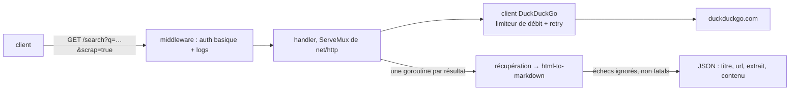

Une API REST légère devant DuckDuckGo. Ajoutez `?scrap=true` et chaque
résultat revient avec la page elle-même convertie en markdown propre, la forme
la plus utile pour ce qui vient ensuite dans une chaîne de traitement — un LLM
en général, qui n'a que faire de votre barre de navigation.

Aucun framework : c'est le `ServeMux` de la bibliothèque standard, deux
handlers et un middleware. Le client DuckDuckGo est derrière un limiteur
`golang.org/x/time/rate` et un retry avec backoff, parce que l'amont est du
HTML scrapé et décide de temps en temps qu'il ne vous aime pas. Le chemin de
scraping lance une goroutine par résultat et convertit chaque page avec
`html-to-markdown`, avec un mutex sur la réponse partagée ; une page qui échoue
est journalisée et ignorée plutôt que de faire échouer toute la requête, ce
qui est le bon arbitrage quand neuf résultats sur dix restent utiles.

L'API elle-même est volontairement petite. Ce qui valait la peine, c'est tout
ce qui l'entoure :

- **Un contrat, pas seulement des endpoints.** Annotée dans les handlers,
  générée en OpenAPI par `swaggo`, et servie comme documentation interactive
  sur `/swagger/` à partir de cette même spécification générée — la
  documentation ne peut donc pas diverger du code sans que le build s'en
  aperçoive.
- **Fermée par défaut.** Authentification basique, identifiants pris dans
  l'environnement et _obligatoires_ — le processus refuse de démarrer sans
  eux, sauf mode local explicite — plus une limitation de débit configurable :
  un relais de recherche ouvert sur Internet sert vite de proxy de scraping
  gratuit à n'importe qui. `pprof` est câblé mais n'est enregistré qu'en mode
  debug, pour la même raison.
- **Observable dès la première requête.** Un middleware émet des logs JSON
  structurés avec statut, latence et chemin — sans étape d'instrumentation
  séparée.
- **Une image minimale.** Build multi-étapes, `CGO_ENABLED=0` pour un binaire
  statique, et une couche finale qui ne contient que lui.
- **Déployée comme tout le reste.** Manifestes Kustomize, versionnage
  sémantique dérivé des messages de commit, un tag d'image poussé par la CI,
  et Argo CD qui réconcilie le cluster avec le repository.

Archivé : le déploiement n'existe plus et l'endpoint ne répond plus. Le
repository reste un exemple compact de la chaîne complète.
