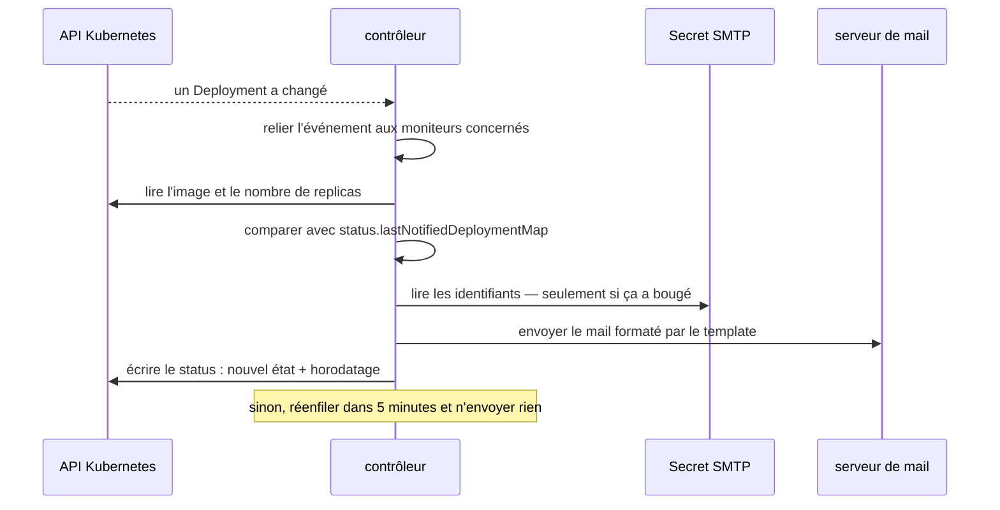

Un opérateur Kubernetes, construit avec Kubebuilder, qui surveille les
ressources `Deployment` dans tous les namespaces et envoie un e-mail quand
l'une des ressources surveillées change.

La configuration est une ressource personnalisée plutôt qu'un fichier de
configuration. Un `DeploymentMonitor` est à portée cluster et nomme les
déploiements à surveiller — par clé/valeur de label ou d'annotation —
l'adresse à prévenir, le `Secret` qui porte les identifiants SMTP, et un
template Go optionnel pour le corps du message, avec `.Namespace`, `.Name`,
`.Image` et `.Replicas` à disposition. Rien de sensible ne se trouve dans la
ressource elle-même.

Le câblage est la partie intéressante. Le contrôleur réconcilie des
`DeploymentMonitor`, mais il _observe_ des `Deployment`, en reliant chaque
événement aux moniteurs qui le sélectionnent — la boucle de réconciliation est
donc pilotée par la ressource qui change vraiment, pas par un sondage de celle
qui la configure.

Et ce qui rend l'ensemble supportable vit dans le sous-objet `status` :
`lastNotifiedDeploymentMap`, indexé par `namespace/nom`, qui garde l'image et
le nombre de replicas au moment du dernier e-mail. Une réconciliation compare
avec cette carte et reste silencieuse tant que rien n'a bougé. Sans elle,
chaque resynchronisation de chaque déploiement du cluster devient une
notification.

Je l'ai écrit pour comprendre les opérateurs en en construisant un qui fasse
quelque chose de réel, plutôt qu'en lisant des explications sur la boucle de
réconciliation. Ce que j'en retiens n'est pas la génération de code des CRD —
Kubebuilder la produit en une minute — c'est qu'une réconciliation est
appelée en permanence, pour des raisons qui n'ont rien à voir avec vous : la
vraie conception d'un opérateur, c'est la comparaison qu'il fait avant d'agir.
« Prévenir à chaque changement » est une fonctionnalité d'une ligne et un
produit inutilisable.

Archivé : remplacé par les alertes de la plateforme. Alertmanager notifie
Discord, et de plus en plus un agent plutôt qu'un humain.
