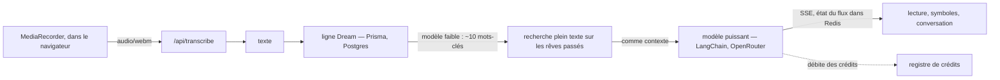

Une application de journal de rêves, construite avec SvelteKit, où la saisie
n'est que la moitié du sujet — l'autre moitié est ce qu'un modèle de langage
en fait.

## Ce qu'elle fait

On enregistre un rêve en le tapant ou en le dictant, parce que le moment
réaliste pour faire cela se situe trente secondes après le réveil et que taper
est déjà trop demander. La dictée passe par `MediaRecorder` dans le
navigateur, qui envoie un blob `webm` à un endpoint de transcription — pas par
la reconnaissance vocale du navigateur, inégale d'un navigateur à l'autre et
inutilisable depuis un téléphone à six heures du matin.

Le modèle renvoie ensuite une interprétation et une liste de symboles.
L'interprétation n'est pas unique : on choisit le cadre d'analyse. Jungien,
pour les archétypes et l'ombre. Freudien, pour le refoulé et le conflit. Un
résumé simple, quand on ne veut que les thèmes. Ou une lecture islamique,
ancrée dans l'herméneutique propre à cette tradition.

À partir de là, c'est une conversation — on peut questionner l'interprétation,
insister sur un symbole, ou demander ce que le modèle ferait du même rêve
raconté autrement.

Les entrées sont indexées par date et, plus utilement, les unes par les
autres : au moment de l'analyse, un modèle bon marché extrait d'abord une
dizaine de mots-clés du rêve, ceux-ci deviennent une requête plein texte
Postgres sur tout ce qui a été écrit avant, et les rêves passés qui
correspondent sont donnés comme contexte au modèle qui interprète. L'archive
se capitalise donc : la lecture du rêve de cette nuit peut renvoyer à celui
d'il y a trois mois, ce qui est toute la raison de tenir un journal plutôt
qu'une note.

## Dessous

SvelteKit de bout en bout, Prisma sur Postgres, sessions basées sur un mot de
passe haché et un JWT. Les appels au modèle passent par LangChain vers
OpenRouter, et il y a délibérément **deux** modèles derrière : un modèle
puissant pour l'interprétation elle-même, et un modèle faible et bon marché
pour les étapes mécaniques — extraire les mots-clés ci-dessus, donner un titre
à un rêve. Payer le prix d'une interprétation pour extraire des mots-clés,
c'est ainsi qu'un projet de loisir se retrouve avec une facture
injustifiable.

Une analyse arrive en flux, mot à mot, et son avancement vit dans Redis plutôt
que dans la requête : on peut fermer l'onglet, revenir, et la page se
raccroche au flux toujours en cours au lieu d'en démarrer un second. Annuler
efface cet état, ce qui est l'autre moitié du même mécanisme.

## La partie ingrate

Un registre de crédits. Une analyse coûte deux crédits, un tour de
conversation en coûte un, et la dotation quotidienne dépend du niveau de
compte — chaque débit est une ligne, donc « pourquoi n'ai-je plus de
crédits » a une réponse plutôt qu'un haussement d'épaules. Un projet personnel
à la facture non plafonnée finit par être éteint ; celui-ci reste peu coûteux
à exploiter, ce qui est la seule raison pour laquelle il tourne encore.

Une note honnête : les rêves sont stockés en clair dans Postgres, derrière une
authentification mais sans chiffrement au repos. Écrire « chiffrées » serait
confortable et faux.
