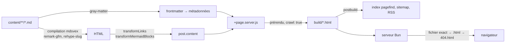

Le site que vous êtes en train de lire. Il a commencé comme un petit CMS —
Postgres pour le contenu, n8n pour la traduction et la publication sur les
réseaux sociaux, un éditeur derrière une authentification — et il n'a plus
rien de tout cela.

## Pourquoi il a perdu la majeure partie de son architecture

L'éditeur était le problème. Chacune de ses fonctionnalités supposait que
j'écrirais dans un champ de texte du navigateur, ce que je n'ai jamais fait.
J'écris dans mon éditeur, dans le repository, à côté du reste du code. La base
stockait donc du markdown qui existait déjà sous forme de fichier,
l'authentification protégeait un éditeur que personne n'ouvrait, et le
workflow de traduction était une file d'attente pour un travail que je faisais
à la main de toute façon.

Tout cela a été supprimé et remplacé par une arborescence de fichiers :

```
content/blog/<slug>.md        → /blog/<slug>
content/blog/fr/<slug>.md     → /blog/fr/<slug>
content/portfolio/<slug>.md   → /portfolio/<slug>
```

Le chemin d'un fichier est sa route. Le frontmatter est ses métadonnées.
Publier, c'est un commit.

## Ce qu'il est aujourd'hui

SvelteKit avec `@sveltejs/adapter-static`, qui prérend chaque route à la
compilation. Aucun rendu serveur à l'exécution, aucune base de données, aucune
authentification.



La chaîne est assez courte pour tenir en tête. `gray-matter` sépare le
frontmatter du corps ; `mdsvex` compile le corps avec `remark-gfm` pour les
tableaux et `rehype-slug` pour les ancres de titres ; deux petites
transformations réécrivent ensuite les liens relatifs et convertissent les
blocs mermaid en `<pre class="mermaid">` nu, celui que `mermaid.run()` attend,
puisque le bloc `language-mermaid` coloré produit par mdsvex n'est pas quelque
chose que mermaid regarde. L'adaptateur tourne en `strict: true` : si une
route cesse un jour d'être prérendable, le build échoue bruyamment au lieu de
livrer en silence une coquille SPA vide, et `crawl: true` fait découvrir le
nouveau contenu en suivant les liens plutôt qu'en maintenant une liste. La
recherche est `pagefind`, qui indexe le HTML compilé après coup — un index
statique, aucun service de recherche.

Le service, c'est soixante-dix lignes de Bun. Une requête est résolue vers un
fichier exact, puis vers `<chemin>.html` pour les URLs propres, puis vers
`404.html` ; les assets hachés sous `/_app/immutable/` reçoivent un cache d'un
an en `immutable` et tout le reste doit se revalider, sinon un déploiement
laisse un navigateur avec une page d'index qui pointe vers des noms de chunks
que le serveur n'a plus — une panne totalement silencieuse, puisque l'import
dynamique renvoie un 404 et que la fonctionnalité chargée à la demande
n'apparaît tout simplement jamais. Ce serveur a remplacé un paquet npm qui
renvoyait `index.html` pour tout chemin inconnu, ce qui cassait silencieusement
la sonde de santé Kubernetes, `/healthz` étant un vrai fichier statique et non
une route.

Le bilinguisme repose sur une convention de répertoires, pas sur un
framework : les articles français vivent sous `fr/`, partagent leur slug avec
leur équivalent anglais, et le sélecteur de langue navigue de l'un à l'autre
ou indique que la traduction n'existe pas encore.

Le design tient en deux polices — mono pour le code, les métadonnées et les
étiquettes, serif pour le texte qui se lit en continu — et une seule couleur
d'accent.

## Livraison

GitHub Actions construit l'image à la fusion de la pull request, le tag est
mis à jour dans les manifestes, et Argo CD déploie sur mon propre cluster. Les
images viennent d'un registre interne au cluster : un déploiement ne dépend
pas des limites de débit d'un registre public.
