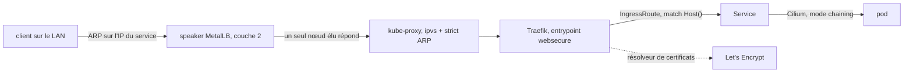

La plateforme sur laquelle tout le reste tourne. Trois hôtes Proxmox, cinq
nœuds — trois de contrôle, deux workers — dont un avec un GPU en passthrough.
Aucun compte cloud, aucun plan de contrôle managé, et aucune étape qui
n'existe que dans ma tête.

## De quoi elle est faite

| Couche          | Choix                                                                            |
| --------------- | -------------------------------------------------------------------------------- |
| Hôtes           | Proxmox VE, trois machines, en cluster                                           |
| Provisionnement | Terraform pour les VMs, Ansible pour les hôtes                                   |
| Kubernetes      | kubespray v2.31.0, cluster en v1.35.4                                            |
| Réseau          | Cilium en mode chaining, MetalLB en L2                                           |
| Ingress         | Traefik et ses IngressRoute, ACME résolu par Traefik lui-même, sans cert-manager |
| Livraison       | Argo CD, un registre d'applications et un ApplicationSet, un chart partagé       |
| Builds          | Runners GitHub Actions auto-hébergés, images construites en interne              |
| Stockage        | Longhorn par défaut, NFS pour le RWX, local-path pour le local                   |
| Registre        | Zot, adossé à un stockage objet compatible S3                                    |
| Données         | Postgres via Pigsty, bascule Patroni sur un quorum etcd à trois membres          |
| Secrets         | Infisical, injectés à l'exécution                                                |
| Observabilité   | Prometheus et Grafana, Loki avec Alloy, Alertmanager vers Discord                |
| Identité        | Authentik, OIDC devant tout ce qui a une interface d'administration              |

## Ce que ce tableau veut dire

Cinq nœuds : `k8s-cp-01/02/03` sont à la fois plan de contrôle, etcd et nœuds
ordonnançables, avec `k8s-worker-01/02` à côté — une topologie dont Terraform
génère l'inventaire Ansible, pour que les deux ne puissent pas diverger.

**Cilium s'enchaîne au lieu de remplacer.** La configuration à la mode est
`kube-proxy-replacement: true`, et je ne la fais pas tourner : un seul des
hôtes a un support eBPF confirmé, et l'activer l'exige sur tous les nœuds.
kube-proxy reste donc, en mode `ipvs` avec `strict_arp: true`, ce qui rend le
comportement ARP de MetalLB correct sur un switch domestique — et l'annonce L2
de Cilium est explicitement désactivée, parce que deux composants qui se
disputent la même plage d'adresses, c'est une course, pas de la redondance.

**Traefik résout ses propres certificats, en deux tentatives.** ACME a
commencé en HTTP-01, puis est passé en TLS-ALPN-01 sur le port 443 après que
les validations de Let's Encrypt vers le port 80 ont commencé à renvoyer des
404 qui n'atteignaient jamais Traefik — quelque chose entre la box de l'opérateur
et le cluster les mangeait, et je n'ai jamais prouvé quoi exactement. Les
certificats wildcard pour les sous-domaines de prévisualisation ont ensuite
demandé du DNS-01, d'où le passage du domaine chez Cloudflare. Le stockage
d'`acme.json` est une petite saga à lui seul : il lui faut `fsGroup: 65532`,
sans quoi Traefik retire silencieusement le résolveur de sa liste, _et_
`fsGroupChangePolicy: OnRootMismatch`, parce que le comportement par défaut
remet récursivement le fichier en 660 à chaque redémarrage alors que lego
exige exactement 600. La stratégie de déploiement doit être `Recreate` : le
volume est ReadWriteOnce, donc une mise à jour progressive se bloque
elle-même.

**La livraison, c'est une liste, un chart, deux sources.**
`gitops/apps/registry.yaml` est la liste des applications côté humain ; un
`ApplicationSet` avec un générateur de liste la transforme en `Application`
Argo CD. Chacune a deux sources : le chart partagé `common-app-chart` de ce
repository, et le repository de l'application comme référence de valeurs — la
CI d'une application incrémente donc son propre tag d'image sans jamais
toucher au repo de la plateforme. Un script de CI n'a qu'un seul rôle :
échouer quand le registre et l'ApplicationSet divergent, parce que cette
duplication est le prix à payer pour que le manifeste reste du YAML valide
avant tout templating.

**Postgres est volontairement en dehors de Kubernetes.** Pigsty l'installe sur
ses propres VMs : un primaire et un réplica en streaming, une VIP flottante
exclue de la plage MetalLB, pgBackRest qui sauvegarde vers un disque sur un
autre hôte. La bascule est celle de Patroni, et son quorum est un etcd à trois
membres — c'est pour cela que le placement du troisième nœud de plan de
contrôle est une décision écrite plutôt qu'un hasard. Cette décision existe
parce que la documentation affirmait qu'il n'y avait _aucune_ bascule
automatique, et qu'un `patronictl list` en direct disait le contraire.

## Comment elle a vraiment été conçue

En refusant. Les premières décisions d'architecture sont surtout des refus, et
ils sont plus nombreux que les choix : pas de Vagrant, pas de Flatcar, pas de
service mesh, pas de multi-région, pas de plan de reprise après sinistre pour
la forme, pas de Postgres managé, pas d'hyperviseur piloté en GitOps, pas de
gestionnaire de secrets promu autorité de certification.

La plupart ont été essayés, ou à moitié construits, avant d'être refusés.
Écrire le refus coûte autant qu'écrire un choix et fait gagner bien plus de
temps ensuite, parce que la prochaine personne à avoir l'idée — très souvent
moi, quelques semaines plus tard — tombe sur le raisonnement au lieu du
silence, et ne repasse pas son week-end à le redécouvrir.

## Ce que je referais en priorité

Rendre la couche de livraison fiable. Argo CD affichait « in sync » alors que
la production lisait une branche de développement, parce que `targetRevision`
valait `HEAD` à des endroits que personne n'avait vérifiés. Un outil qui
affiche un état faux de façon convaincante est plus dangereux qu'un outil qui
échoue franchement, et retrouver tous ces cas a pris plus de temps que
construire le cluster lui-même.
