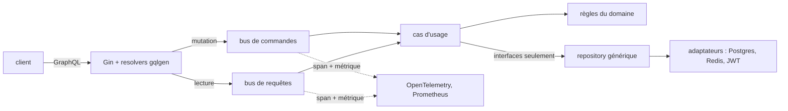

Une application web pour découvrir, organiser et surtout retenir des mots
nouveaux : recherche immédiate, exemples en contexte, répétition espacée et
défis quotidiens.

## Fonctionnalités

- **Recherche** — définitions, étymologie, phonétique et audio, en vue simple
  ou détaillée.
- **Listes et étiquettes** — enregistrer un mot dans une collection en un
  clic, l'étiqueter, y revenir délibérément.
- **Exemples en contexte** — littérature, presse et cinéma, filtrables, parce
  qu'une définition sans exemple se retient mal.
- **Défis quotidiens** — des quiz adaptatifs qui suivent ce qui est réellement
  maîtrisé plutôt que ce qui a simplement été vu.
- **Répétition espacée** — révisions programmées à intervalles croissants, avec
  possibilité de forcer le rythme avant une échéance.

## Architecture

Un seul binaire Go, délibérément. Gin pour le HTTP, gqlgen pour l'API GraphQL
— approche schema-first, donc les resolvers sont générés depuis le schéma
plutôt que le schéma déduit des structures Go — et la Clean Architecture au
milieu : les règles du domaine isolées de l'orchestration des cas d'usage, et
les deux isolées de Postgres, Redis et de la gestion des JWT.

Les commandes et les requêtes sont séparées sur un bus en mémoire : une
commande modifie l'état, une requête le lit, et aucune n'emprunte le chemin de
l'autre. C'est cette séparation qui rend l'observabilité gratuite au lieu d'en
faire une passe d'instrumentation ultérieure : le bus est un point de passage
unique, donc l'envelopper émet un span et une métrique pour chaque opération
du système sans une ligne de code dans le moindre cas d'usage.

Le repository est générique sur l'entité du domaine, ce qui donne un CRUD typé
sans couche de données par entité, et Google Wire fait le câblage des
dépendances à la **compilation** — une fonction générée, pas un conteneur à
l'exécution, donc une dépendance manquante est une erreur de build et non un
pointeur nul à la première requête qui en a besoin. Le gain concret est dans
les tests : substituer un repository en mémoire à celui de Postgres tient en
une ligne dans l'injecteur, et rien au-dessus ne voit la différence.

Logs JSON structurés, métriques Prometheus et traces OpenTelemetry sont émis
par commande et par requête, et arrivent dans la pile d'observabilité de la
plateforme — les mêmes Loki, Prometheus et Grafana que tout le reste du
cluster — plutôt que dans une pile dédiée que seule cette application saurait
lire.

L'application tourne sur le cluster auto-hébergé décrit ailleurs dans ce
portfolio, avec un flux GitOps : fusion, build, tag, et Argo CD réconcilie.
Les déploiements sont passés d'un après-midi à moins de dix minutes, et d'un
échec deux fois sur cinq à presque jamais.
