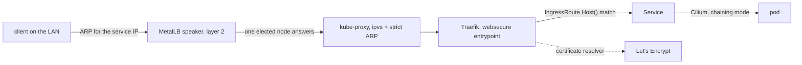

The platform everything else here runs on. Three Proxmox hosts, five nodes —
three control-plane, two workers — one of them with a GPU passed through. No
cloud account, no managed control plane, and no step that only exists in my
head.

## What it is made of

| Layer         | Choice                                                                           |
| ------------- | -------------------------------------------------------------------------------- |
| Hosts         | Proxmox VE, three of them, clustered                                             |
| Provisioning  | Terraform for the VMs, Ansible for the hosts                                     |
| Kubernetes    | kubespray v2.31.0, cluster on v1.35.4                                            |
| Networking    | Cilium in chaining mode, MetalLB in L2                                           |
| Ingress       | Traefik with IngressRoute CRDs, ACME resolved by Traefik itself, no cert-manager |
| Delivery      | Argo CD, an app registry plus an ApplicationSet, one shared chart                |
| Builds        | Self-hosted GitHub Actions runners, images built in-house                        |
| Storage       | Longhorn by default, NFS for RWX, local-path for node-local                      |
| Registry      | Zot, backed by S3-compatible object storage                                      |
| Data          | Postgres via Pigsty, Patroni failover on a three-member etcd quorum              |
| Secrets       | Infisical, injected at runtime                                                   |
| Observability | Prometheus and Grafana, Loki with Alloy, Alertmanager to Discord                 |
| Identity      | Authentik, OIDC in front of everything with an admin surface                     |

## What that table actually means

Five nodes: `k8s-cp-01/02/03` are control plane, etcd _and_ schedulable
workers, with `k8s-worker-01/02` alongside — a topology Terraform generates
the Ansible inventory for, so the two can never disagree.

**Cilium chains rather than replaces.** The fashionable setup is
`kube-proxy-replacement: true`, and I do not run it: only one of the hosts has
confirmed eBPF support, and turning it on demands every node. So kube-proxy
stays, in `ipvs` mode with `strict_arp: true`, which is what makes MetalLB's
layer-2 ARP behave on a domestic switch — and Cilium's own L2 announcement is
explicitly off, because two components fighting over the same address pool is
a race, not redundancy.

**Traefik resolves its own certificates, which took two attempts.** ACME
started on HTTP-01, then moved to TLS-ALPN-01 over port 443 after Let's
Encrypt's validation requests to port 80 started returning 404s that never
reached Traefik at all — something between the ISP box and the cluster was
eating them, and I never proved exactly what. Wildcard certificates for
preview subdomains then needed DNS-01, which is why the domain moved to
Cloudflare. The storage of `acme.json` is its own small saga: it needs
`fsGroup: 65532` or Traefik silently drops the resolver from its list, _and_
`fsGroupChangePolicy: OnRootMismatch`, because the default recursively
re-chmods the file to 660 on every restart and lego insists on exactly 600.
The rollout strategy has to be `Recreate` — the volume is ReadWriteOnce, so a
rolling update deadlocks against itself.

**Delivery is one list, one chart, two sources.** `gitops/apps/registry.yaml`
is the human-facing list of applications; an `ApplicationSet` with a list
generator turns it into Argo CD `Application`s. Each one has two sources: the
shared `common-app-chart` from this repository, and the application's own
repository as a values reference — so an app's CI bumps its own image tag
without ever touching the platform repo. There is a CI script whose only job
is to fail when the registry and the ApplicationSet drift apart, because that
duplication is the price of the manifest having to be valid YAML before
templating runs.

**Postgres deliberately sits outside Kubernetes.** Pigsty provisions it on its
own VMs: a primary and a streaming replica, a floating VIP excluded from
MetalLB's pool, pgBackRest taking backups to a disk on another host. The
failover is Patroni's, and its quorum is a three-member etcd — which is why
the third control-plane node's placement is a decision with a record attached
rather than an accident. That record exists because the docs used to claim
there was _no_ automatic failover, and a live `patronictl list` said
otherwise.

## How it was actually designed

By refusing things. The early architecture decision records are mostly
rejections, and they outnumber the choices: no Vagrant, no Flatcar, no service
mesh, no multi-region, no disaster-recovery theatre, no managed Postgres, no
GitOps-managed hypervisor, no using the secrets manager as a certificate
authority.

Most of those were tried, or at least half-built, before they were refused.
Writing down the rejection costs the same as writing down a choice and saves
considerably more time later, because the next person to have the idea — very
often me, a few weeks on — finds the reasoning instead of the silence, and
does not spend the weekend rediscovering it.

## The part I would not skip again

Making the delivery layer tell the truth. Argo CD reported "in sync" while
production was quietly reading a development branch, because `targetRevision`
was set to `HEAD` in places nobody had looked at. A rendering layer that lies
convincingly is worse than one that fails loudly, and finding all of those
took longer than building the cluster underneath them.
