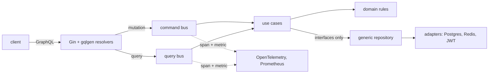

A web application for discovering, organising and actually retaining new
words: instant lookup, contextual examples, spaced repetition and daily
challenges.

## For the reader

- **Lookup** — definitions, etymology, phonetics and audio, in a simple view
  or a detailed one.
- **Lists and tags** — save a word into a collection in one click, label it,
  come back to it deliberately.
- **Examples in context** — from literature, news and film, filterable, because
  a definition without a sentence rarely sticks.
- **Daily challenges** — adaptive quizzes that track what you have actually
  mastered rather than what you have merely seen.
- **Spaced repetition** — reviews scheduled at widening intervals, with the
  schedule overridable when you are cramming for something.

## Under it

A single Go binary, deliberately. Gin for HTTP, gqlgen for the GraphQL API —
schema-first, so the resolvers are generated from the schema rather than the
schema being inferred from Go structs — and Clean Architecture through the
middle: domain rules isolated from use-case orchestration, and both isolated
from Postgres, Redis and JWT handling.

Commands and queries are separated over an in-process bus — a command mutates,
a query reads, and neither reaches the other's code path. That split is what
makes the observability free rather than a later instrumentation pass: the bus
is a single choke point, so wrapping it emits a span and a metric for every
operation in the system without a line of code in any use case.

The repository is generic over the domain entity, which gives type-safe CRUD
without writing a data layer per entity, and Google Wire does the dependency
wiring at **compile** time — a generated function, not a runtime container, so
a missing binding is a build error rather than a nil pointer on the first
request that needs it. The practical payoff is in tests: substituting an
in-memory repository for the Postgres one is one line at the injector, and
nothing above it knows the difference.

Structured JSON logging, Prometheus metrics and OpenTelemetry traces are
emitted per command and query, and land in the platform's own observability
stack — the same Loki, Prometheus and Grafana that everything else on the
cluster reports to — rather than in a bespoke one that only this application
knows how to read.

It runs on the self-hosted cluster described elsewhere in this portfolio, on a
GitOps workflow: merge, build, tag, and Argo CD reconciles. Deployments went
from an afternoon to under ten minutes, and from failing about two times in
five to almost never.
